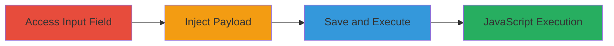

# Stored XSS in Concrete CMS Feature Paragraph for Arbitrary JavaScript Execution

Multi-stage attack chain demonstrating a complete attack workflow exploiting a stored cross-site scripting vulnerability in Concrete CMS.

## Chain Metrics Dashboard

| Metric | Value |
|--------|-------|
| Chain Status | Unverified |
| Total Steps | 3 |
| Execution Time | ~5 minutes |
| Skill Level | Intermediate |
| Complexity | Low |
| Impact Level | High |

## Attack Flow Visualization

## Prerequisites & Requirements

### Required Tools

- Web browser (e.g., Chrome, Firefox)
- Access to Concrete CMS admin or content editing interface

### Target Environment

- Concrete CMS installation (web-based PHP application)
- Required services/ports: HTTP/HTTPS on port 80/443
- Network access requirements: Direct access to the CMS frontend and admin panel

### Initial Access Requirements

- Credential requirements: Valid user account with content editing privileges
- Network position: Internal or authenticated access to the CMS
- Prior access needed: Login to the CMS dashboard

## Detailed Attack Procedures

### Step 1: Access Feature Paragraph Input
procedure: [[procedures/Access-Feature-Paragraph-Input-in-Concrete-CMS]]

**Objective**: Navigate to the content editing interface to locate the vulnerable Feature Paragraph input field.

**Instructions**: Log in to the Concrete CMS admin dashboard and go to the page or block editor where Feature Paragraph blocks can be added. Select or create a new Feature Paragraph block to expose the text input field.

**Expected Output**: The Feature Paragraph input field is visible and editable.

**Success Indicators**:
- Admin or content editing interface loaded successfully
- Feature Paragraph block input field accessible

### Step 2: Inject XSS Payload
procedure: [[procedures/Inject-XSS-Payload-into-Feature-Paragraph]]

**Objective**: Insert a malicious JavaScript payload into the input field to bypass sanitization and store executable code.

**Instructions**: In the Feature Paragraph text input, enter the payload `">`. This payload closes any open HTML attributes and injects an image tag with an onerror handler that executes JavaScript.

**Expected Output**: The payload is accepted without error and appears in the input field.

**Success Indicators**:
- Payload entered successfully without validation errors
- No immediate execution or blocking by the CMS

### Step 3: Save and Execute Stored XSS
procedure: [[procedures/Save-and-Execute-Stored-XSS-in-Concrete-CMS]]

**Objective**: Persist the injected payload and trigger its execution when the page is viewed.

**Instructions**: Submit the form to save the Feature Paragraph content. Then, navigate to or refresh the affected page to render the stored content. The payload should execute, displaying an alert box with '1'.

**Expected Output**: An alert box pops up in the browser, confirming JavaScript execution.

**Success Indicators**:
- Content saved without errors
- Alert triggered on page view, indicating successful XSS

## Attack Chain Summary

### Key Achievements

1. Gained access to the vulnerable input field in Concrete CMS.
2. Injected and stored malicious JavaScript payload.
3. Achieved arbitrary code execution in any user's browser viewing the page, enabling further attacks like session theft.

## Technique & Tactic Coverage

### MITRE ATT&CK Techniques

- [[Exploit Public-Facing Application]]
- [[JavaScript]]

### MITRE ATT&CK Tactics

- [[Execution]]

---
*Last updated: 2023-10-01T00:00:00Z*
