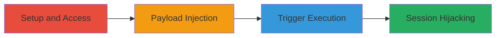

---
tags:
  - xss
  - stored-xss
  - concrete-cms
  - web-vulnerability
  - session-hijacking
type: attack_chain
tools: []
tactics:
  - '[[Execution]]'
verified: false
platforms:
  - Web
submitted: true
complexity: low
created_at: '2023-10-01T12:00:00Z'
procedures:
  - '[[procedures/Setup-and-Access-Concrete-CMS-Admin-Panel]]'
  - '[[procedures/Inject-Malicious-Payload-into-Advanced-File-Search-Filter]]'
  - '[[procedures/Trigger-Stored-XSS-by-Editing-Saved-Filter]]'
step_count: 3
techniques:
  - '[[JavaScript]]'
updated_at: '2025-12-14T03:16:26.155Z'
description: >-
  A multi-stage attack exploiting a stored XSS vulnerability in Concrete CMS
  8.5.2's advanced file search filter to inject and execute malicious
  JavaScript, enabling session theft from privileged users.
skill_level: intermediate
impact_level: high
id: 07e9000b-9e20-481d-8577-04d7a8377d8f
validated: true
mitre_tactics:
  - '[[Execution]]'
mitre_techniques:
  - '[[JavaScript]]'
---
# Stored XSS in Concrete CMS File Search Filter Leading to Session Hijacking

Multi-stage attack chain demonstrating a complete attack workflow exploiting a stored XSS vulnerability in Concrete CMS version 8.5.2.

## Chain Metrics Dashboard

| Metric | Value |
|--------|-------|
| Chain Status | Unverified |
| Total Steps | 3 |
| Execution Time | ~10 minutes |
| Skill Level | Intermediate |
| Complexity | Low |
| Impact Level | High |

## Attack Flow Visualization

## Prerequisites & Requirements

### Required Tools

- Web browser (e.g., Chrome or Firefox with developer tools)

### Target Environment

- Concrete CMS version 8.5.2 installed on a web server
- PHP environment (version compatible with Concrete CMS 8.5.2)
- Access to the target instance via HTTP/HTTPS

### Initial Access Requirements

- Administrative credentials for the Concrete CMS instance
- Direct network access to the web application
- No prior access needed beyond admin login

## Detailed Attack Procedures

### Step 1: Setup and Access
procedure: [[procedures/Setup-and-Access-Concrete-CMS-Admin-Panel]]

**Objective**: Install Concrete CMS, log in as admin, and navigate to the file search interface to prepare for payload injection.

**Instructions**: Download and install Concrete CMS 8.5.2, authenticate as administrator, and access the Dashboard > Files > Search section.

**Expected Output**: Successful login and visibility of the file search interface.

**Success Indicators**:
- Concrete CMS dashboard accessible
- File search page loaded without errors

### Step 2: Payload Injection
procedure: [[procedures/Inject-Malicious-Payload-into-Advanced-File-Search-Filter]]

**Objective**: Access the advanced search filter and inject a malicious JavaScript payload that will be stored without sanitization.

**Instructions**: Click the 'Advanced' button in the file search bar, enter the payload in the phrase field, and save the filter.

**Expected Output**: Filter saved successfully without errors.

**Success Indicators**:
- Advanced filter window opens
- Payload accepted and stored

### Step 3: Trigger Execution
procedure: [[procedures/Trigger-Stored-XSS-by-Editing-Saved-Filter]]

**Objective**: Load the saved filter as another user to execute the stored payload, demonstrating client-side JavaScript execution.

**Instructions**: As a different user or in a new session, click 'Edit' on the filter search bar to trigger the onerror handler in the payload.

**Expected Output**: Alert box or JavaScript execution (e.g., alert(1) pops up).

**Success Indicators**:
- Malicious code executes in the browser
- Potential for session cookie theft if payload is modified

## Attack Chain Summary

### Key Achievements

1. Successful setup of vulnerable Concrete CMS instance
2. Injection and storage of XSS payload in advanced file search filter
3. Execution of stored XSS when editing the filter, enabling attacks like session hijacking

## Technique & Tactic Coverage

### MITRE ATT&CK Techniques

- [[JavaScript]]

### MITRE ATT&CK Tactics

- [[Execution]]

---
*Last updated: 2023-10-01T12:00:00Z*
