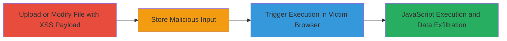

---
id: a1b2c3d4-e5f6-7890-abcd-ef1234567890
name: Stored XSS in Concrete CMS File Upload and Properties for Arbitrary JavaScript Execution
type: attack_chain
description: A multi-stage attack exploiting stored XSS in Concrete CMS 5.7.2.1 via file uploads and properties editing to inject and trigger malicious JavaScript in other users' browsers.
verified: false
submitted: false
step_count: 3
created_at: 2023-10-01T00:00:00Z
updated_at: 2023-10-01T00:00:00Z
procedures: [[procedures/Upload-Malicious-File-with-XSS-Payload-in-Filename]], [[procedures/Modify-File-Properties-Title-with-XSS-Payload]], [[procedures/Trigger-Stored-XSS-Payload-Execution]]
techniques: [[JavaScript]]
tactics: [[Execution]], [[Collection]]
tags: xss, stored-xss, concrete-cms, file-upload, javascript-execution
platforms: Web
tools: []
---

# Stored XSS in Concrete CMS File Upload and Properties for Arbitrary JavaScript Execution

Multi-stage attack chain demonstrating a complete attack workflow exploiting insufficient input sanitization in Concrete CMS 5.7.2.1 to store and execute XSS payloads via file management features.

## Chain Metrics Dashboard

| Metric | Value |
|--------|-------|
| Chain Status | Unverified |
| Total Steps | 3 |
| Execution Time | ~5 minutes |
| Skill Level | Intermediate |
| Complexity | Medium |
| Impact Level | High |

## Attack Flow Visualization

## Prerequisites & Requirements

### Required Tools

- Web browser with developer tools (e.g., Chrome DevTools for payload testing)

### Target Environment

- Concrete CMS 5.7.2.1 running on PHP
- Web platform with file upload permissions enabled
- Access to file manager for authenticated users

### Initial Access Requirements

- Valid user credentials with file upload and edit permissions
- No special network position required; standard web access
- Prior authentication to the CMS dashboard

## Detailed Attack Procedures

### Step 1: Upload Malicious File
procedure: [[procedures/Upload-Malicious-File-with-XSS-Payload-in-Filename]]

**Objective**: Inject a stored XSS payload into a file's filename to persist malicious JavaScript that executes when viewed.

**Instructions**: Navigate to the file upload section in the Concrete CMS dashboard. Select a benign file (e.g., a text file) and rename it during upload to include an XSS payload, such as `'>.txt`. Complete the upload process.

**Expected Output**: The file appears in the file manager with the malicious filename, but the payload is not yet executed.

**Success Indicators**:
- File successfully uploaded and visible in file manager
- Filename reflects the injected payload when inspected

### Step 2: Modify File Properties
procedure: [[procedures/Modify-File-Properties-Title-with-XSS-Payload]]

**Objective**: Exploit the file properties editing feature to inject an alternative XSS payload into the file's title field.

**Instructions**: In the file manager, select the uploaded file and open its properties page. Edit the title field to include a payload like `<svg onload=confirm(document.cookie)>`. Save the changes.

**Expected Output**: The file properties update with the malicious title, storing the payload for later execution.

**Success Indicators**:
- Properties page saves without error
- Title change is persisted and viewable

### Step 3: Trigger Payload Execution
procedure: [[procedures/Trigger-Stored-XSS-Payload-Execution]]

**Objective**: Cause the stored XSS payload to execute in another user's browser by accessing the affected file's delete or properties page.

**Instructions**: Have a victim user (or simulate by logging in as another user) navigate to the file manager, locate the malicious file, and open either the delete confirmation page or properties page. The payload will automatically execute upon page load due to unsanitized output.

**Expected Output**: JavaScript alert or action (e.g., confirm dialog showing cookies) appears in the victim's browser.

**Success Indicators**:
- JavaScript executes, demonstrating arbitrary code control
- Potential for cookie theft or session hijacking confirmed

## Attack Chain Summary

### Key Achievements

1. Successful injection of XSS payloads via file upload and properties editing in Concrete CMS 5.7.2.1
2. Persistence of payloads despite partial fix in version 5.7.0.4
3. Execution of arbitrary JavaScript in victim browsers, enabling client-side attacks like session hijacking

## Technique & Tactic Coverage

### MITRE ATT&CK Techniques

- [[JavaScript]]

### MITRE ATT&CK Tactics

- [[Execution]]
- [[Collection]]

---
*Last updated: 2023-10-01T00:00:00Z*
