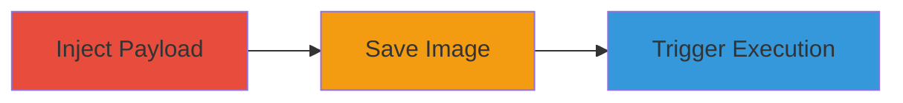

# Stored XSS in Concrete CMS Image Alt Text for Arbitrary JavaScript Execution

Multi-stage attack chain demonstrating a complete attack workflow exploiting insufficient input validation in Concrete CMS.

## Chain Metrics Dashboard

| Metric | Value |
|--------|-------|
| Chain Status | Unverified |
| Total Steps | 3 |
| Execution Time | ~5 minutes |
| Skill Level | Intermediate |
| Complexity | Medium |
| Impact Level | High |

## Attack Flow Visualization

## Prerequisites & Requirements

### Required Tools

- Web browser (e.g., Chrome with developer tools)

### Target Environment

- Concrete CMS instance (PHP-based web application)
- Access to image upload/edit functionality
- No specific ports required beyond standard HTTP/HTTPS (80/443)

### Initial Access Requirements

- Authenticated user account with permissions to upload or edit images
- Direct access to the Concrete CMS dashboard
- No prior network compromise needed

## Detailed Attack Procedures

### Step 1: Inject Malicious Payload
procedure: [[procedures/Inject-Malicious-Payload-into-Image-Alt-Text]]

**Objective**: Introduce unsanitized JavaScript into the image alt text field to prepare for persistent storage.

**Instructions**: Navigate to the image upload or edit section in Concrete CMS. In the alt text input field, enter the payload: `"><b onmouseover=alert('Wufff!')>click me!</b><"`. This breaks out of the attribute context and injects HTML/JavaScript.

**Expected Output**: The payload is accepted without validation errors.

**Success Indicators**:
- Payload entered successfully in the form
- No immediate sanitization or rejection observed

### Step 2: Save the Image
procedure: [[procedures/Save-Image-with-Malicious-Alt-Text]]

**Objective**: Persist the malicious payload in the database for storage as a stored XSS vector.

**Instructions**: Complete the image upload or edit process by clicking save. The alt text, including the payload, is stored without escaping, as evidenced by database persistence (refer to screenshots conalt1.png and conalt2.png for verification).

**Expected Output**: Image saved successfully with the alt text intact.

**Success Indicators**:
- Image appears in the media library
- Alt text retrieval shows no sanitization applied

### Step 3: Trigger the XSS
procedure: [[procedures/Trigger-XSS-by-Viewing-Image]]

**Objective**: Execute the injected JavaScript in the browser of any user viewing the page containing the image.

**Instructions**: Insert the image into a page or view the page where the image is displayed. Hover over the image to trigger the onmouseover event, executing `alert('Wufff!')`.

**Expected Output**: JavaScript alert box pops up displaying 'Wufff!'.

**Success Indicators**:
- Alert executes on hover
- Potential for further payloads to steal cookies or session data

## Attack Chain Summary

### Key Achievements

1. Successful injection and storage of XSS payload in alt text
2. Persistent execution across all users viewing the image
3. Demonstration of high-impact risks like session hijacking and data theft

## Technique & Tactic Coverage

### MITRE ATT&CK Techniques

- [[JavaScript]]

### MITRE ATT&CK Tactics

- [[Execution]]

---
*Last updated: 2023-10-01T00:00:00Z*
