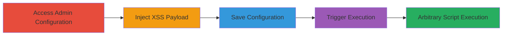

---
tags:
  - stored-xss
  - concrete-cms
  - web-vulnerability
  - script-injection
type: attack_chain
tools: []
tactics:
  - '[[Execution]]'
verified: false
platforms:
  - Web
submitted: true
complexity: medium
created_at: '2023-10-01T00:00:00Z'
procedures:
  - '[[procedures/Access-Concrete-CMS-Admin-Configuration]]'
  - '[[procedures/Inject-XSS-Payload-into-Message-Field]]'
  - '[[procedures/Save-Malicious-Configuration-in-Concrete-CMS]]'
  - '[[procedures/Trigger-Stored-XSS-in-No-Pages-View]]'
step_count: 4
techniques:
  - '[[JavaScript]]'
updated_at: '2025-12-14T03:15:35.396Z'
description: >-
  A multi-step attack exploiting a stored XSS vulnerability in Concrete CMS by
  injecting malicious JavaScript into the 'Message to Display When No Pages
  Listed' configuration, leading to persistent script execution on affected
  views.
skill_level: intermediate
impact_level: high
id: f004d69b-3ce7-4bfc-8d5a-b6ef1c670c58
validated: true
mitre_tactics:
  - '[[Execution]]'
mitre_techniques:
  - '[[JavaScript]]'
---
# Stored XSS in Concrete CMS No-Pages Message for Arbitrary Script Execution

Multi-stage attack chain demonstrating a complete attack workflow exploiting a stored XSS vulnerability in Concrete CMS.

## Chain Metrics Dashboard

| Metric | Value |
|--------|-------|
| Chain Status | Unverified |
| Total Steps | 4 |
| Execution Time | ~5 minutes |
| Skill Level | Intermediate |
| Complexity | Medium |
| Impact Level | High |

## Attack Flow Visualization

## Prerequisites & Requirements

### Required Tools

- Web browser (e.g., Chrome or Firefox with developer tools)
- Access to Concrete CMS admin interface

### Target Environment

- Concrete CMS instance (any version prior to patch for this vuln)
- Web platform
- Admin privileges or ability to access configuration settings

### Initial Access Requirements

- Authenticated access to the Concrete CMS admin panel
- No special network position required; local or remote access to the web interface
- Prior knowledge of the target site's sitemap or page listing features

## Detailed Attack Procedures

### Step 1: Access Admin Configuration
procedure: [[procedures/Access-Concrete-CMS-Admin-Configuration]]

**Objective**: Navigate to the configuration setting for the 'Message to Display When No Pages Listed' to prepare for payload injection.

**Instructions**: Log in to the Concrete CMS admin dashboard and locate the sitemap or site-wide settings section. This step gains access to the vulnerable input field without executing any code yet.

**Expected Output**: The configuration form for no-pages message is visible and editable.

**Success Indicators**:
- Admin panel loaded successfully
- Input field for custom message accessed

### Step 2: Inject XSS Payload
procedure: [[procedures/Inject-XSS-Payload-into-Message-Field]]

**Objective**: Insert a malicious JavaScript payload into the message field to break out of HTML context and enable script execution.

**Instructions**: In the text input field, enter the payload `` (or a more advanced payload like `` for cookie theft). This exploits the lack of sanitization by using an HTML break-out technique.

**Expected Output**: Payload entered in the field without immediate errors.

**Success Indicators**:
- Payload accepted in the input without validation warnings
- No immediate script execution (as it's stored, not reflected)

### Step 3: Save Malicious Configuration
procedure: [[procedures/Save-Malicious-Configuration-in-Concrete-CMS]]

**Objective**: Persist the injected payload in the CMS database to make the XSS stored and permanent.

**Instructions**: Submit the form to save the configuration. The unsanitized input is stored directly in the backend without escaping.

**Expected Output**: Confirmation message that settings have been saved; no errors on submission.

**Success Indicators**:
- Configuration saved successfully
- Database updated with malicious payload (verifiable via backend if accessible)

### Step 4: Trigger Stored XSS Execution
procedure: [[procedures/Trigger-Stored-XSS-in-No-Pages-View]]

**Objective**: Render the vulnerable view to execute the stored script, demonstrating arbitrary code execution.

**Instructions**: Navigate to a sitemap, page listing, or section in Concrete CMS where no pages are listed. The custom message is rendered as HTML, triggering the onerror event or script tag.

**Expected Output**: Alert box pops up (for test payload) or malicious actions occur, such as session hijacking attempts.

**Success Indicators**:
- JavaScript alert or console error indicating execution
- Potential data exfiltration or defacement visible to any user viewing the page

## Attack Chain Summary

### Key Achievements

1. Gained persistent access to inject and store malicious JavaScript in Concrete CMS configuration.
2. Achieved arbitrary script execution in the browser context of any user accessing no-pages views.
3. Enabled potential follow-on attacks like session theft, phishing, or site defacement without further interaction.

## Technique & Tactic Coverage

### MITRE ATT&CK Techniques

- [[JavaScript]]

### MITRE ATT&CK Tactics

- [[Execution]]

---
*Last updated: 2023-10-01T00:00:00Z*
