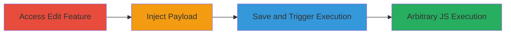

---
tags:
  - xss
  - stored-xss
  - concrete-cms
  - javascript
  - web-vulnerability
type: attack_chain
tools: []
tactics:
  - '[[Execution]]'
verified: false
platforms:
  - Web
submitted: true
complexity: medium
procedures:
  - '[[procedures/Access-Edit-Page-List-Feature-in-Concrete-CMS]]'
  - '[[procedures/Inject-XSS-Payload-into-Page-List-Title]]'
  - '[[procedures/Save-and-Trigger-Stored-XSS-in-Page-List]]'
step_count: 3
techniques:
  - '[[JavaScript]]'
description: >-
  A multi-step attack exploiting a stored XSS vulnerability in the Concrete CMS
  edit page list feature to inject and execute malicious JavaScript, enabling
  session hijacking or client-side attacks for authenticated users.
skill_level: intermediate
impact_level: high
id: aa66541e-f461-448a-b649-ed5e9f3ad4be
created_at: '2025-12-14T03:15:35.641Z'
updated_at: '2025-12-14T03:15:35.641Z'
validated: true
mitre_tactics:
  - '[[Execution]]'
mitre_techniques:
  - '[[JavaScript]]'
---
# Stored XSS in Concrete CMS Page List Title for Arbitrary JavaScript Execution

Multi-stage attack chain demonstrating a complete attack workflow exploiting a stored XSS vulnerability in Concrete CMS.

## Chain Metrics Dashboard

| Metric | Value |
|--------|-------|
| Chain Status | Unverified |
| Total Steps | 3 |
| Execution Time | ~5 minutes |
| Skill Level | Intermediate |
| Complexity | Medium |
| Impact Level | High |

## Attack Flow Visualization

## Prerequisites & Requirements

### Required Tools

- Web browser for navigation and payload injection

### Target Environment

- Concrete CMS instance (web-based)
- Authenticated access to admin or editing features
- No specific ports required beyond standard HTTP/HTTPS (80/443)

### Initial Access Requirements

- Valid user credentials with permissions to edit page lists
- Direct access to the Concrete CMS dashboard
- No prior network compromise needed

## Detailed Attack Procedures

### Step 1: Access Edit Page List Feature
procedure: [[procedures/Access-Edit-Page-List-Feature-in-Concrete-CMS]]

**Objective**: Gain access to the vulnerable editing interface to prepare for payload injection.

**Instructions**: Log in to the Concrete CMS dashboard as an authenticated user with editing privileges. Navigate to the page management section and select the option to edit or create a page list. Locate the 'Title of Page List' input field, which is vulnerable due to lack of sanitization.

**Expected Output**: The edit page list interface loads, displaying the title field ready for input.

**Success Indicators**:
- Dashboard accessible without errors
- Edit page list form visible

### Step 2: Inject XSS Payload
procedure: [[procedures/Inject-XSS-Payload-into-Page-List-Title]]

**Objective**: Insert a malicious JavaScript payload into the title field to store it persistently.

**Instructions**: In the 'Title of Page List' field, enter the payload `` wrapped appropriately to break out of any context, such as `">'`. This payload uses an invalid image source to trigger an onerror event executing JavaScript.

**Expected Output**: Payload entered into the field without immediate errors or sanitization.

**Success Indicators**:
- Payload accepted in the input field
- No validation errors on entry

### Step 3: Save and Trigger Stored XSS
procedure: [[procedures/Save-and-Trigger-Stored-XSS-in-Page-List]]

**Objective**: Persist the payload and execute it upon viewing the page list, demonstrating arbitrary code execution.

**Instructions**: Submit the form to save the page list configuration. Then, navigate to view the page list where the title is rendered. The unsanitized payload will execute, popping an alert box with '1' to confirm XSS.

**Expected Output**: Alert dialog appears on page load, confirming JavaScript execution.

**Success Indicators**:
- Page list saves successfully
- JavaScript alert triggers on view

## Attack Chain Summary

### Key Achievements

1. Accessed vulnerable editing interface in Concrete CMS
2. Injected and stored malicious JavaScript payload
3. Achieved arbitrary code execution for viewers, enabling potential session hijacking

## Technique & Tactic Coverage

### MITRE ATT&CK Techniques

- [[JavaScript]]

### MITRE ATT&CK Tactics

- [[Execution]]

---
*Last updated: 2023-10-01*
