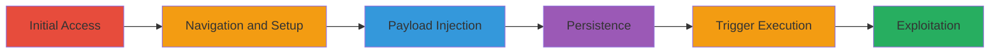

---
tags:
  - xss
  - stored-xss
  - concrete-cms
  - session-hijacking
type: attack_chain
tools: []
tactics:
  - '[[Execution]]'
verified: false
platforms:
  - Web
submitted: true
complexity: medium
created_at: '2023-10-01T00:00:00Z'
procedures:
  - '[[procedures/Inject-Stored-XSS-in-SEO-Name-Field]]'
step_count: 7
techniques:
  - '[[JavaScript]]'
updated_at: '2025-12-14T03:16:37.329Z'
description: >-
  A multi-step attack exploiting a stored XSS vulnerability in the Name field of
  the Pages SEO dialog in Concrete CMS 8.1.0 to inject JavaScript payloads that
  execute when admins view affected pages, enabling session theft or
  unauthorized actions.
skill_level: intermediate
impact_level: high
id: ddadc368-5665-49eb-8947-1491828f5c87
validated: true
mitre_tactics:
  - '[[Execution]]'
mitre_techniques:
  - '[[JavaScript]]'
---
# Stored XSS in Concrete CMS Pages SEO Dialog for Admin Privilege Escalation

Multi-stage attack chain demonstrating exploitation of a stored XSS vulnerability in Concrete CMS 8.1.0 to inject malicious JavaScript via the SEO dialog's Name field, leading to execution in admin contexts for potential session hijacking or privilege escalation.

## Chain Metrics Dashboard

| Metric | Value |
|--------|-------|
| Chain Status | Unverified |
| Total Steps | 7 |
| Execution Time | ~5 minutes |
| Skill Level | Intermediate |
| Complexity | Medium |
| Impact Level | High |

## Attack Flow Visualization

## Prerequisites & Requirements

### Required Tools

- Web browser (e.g., Chrome with developer tools for payload testing)

### Target Environment

- Concrete CMS 8.1.0 running on PHP 5.6.30
- Apache HTTP Server 2.4.25
- MySQL 5.7.13
- Access to /dashboard/sitemap/full endpoint

### Initial Access Requirements

- Valid low-privileged user credentials for login
- Network access to the Concrete CMS instance
- No prior admin access needed, but admin interaction required for trigger

## Detailed Attack Procedures

### Step 1: Login to the Concrete CMS Instance

procedure: [[procedures/Inject-Stored-XSS-in-SEO-Name-Field]]

**Objective**: Gain authenticated access to the admin dashboard to perform subsequent navigation and injection.

**Instructions**: Open a web browser and navigate to the Concrete CMS login page. Enter valid credentials for a low-privileged user account.

**Expected Output**: Successful redirection to the dashboard upon authentication.

**Success Indicators**:
- Dashboard loads without errors
- User session established

### Step 2: Navigate to Dashboard Full Sitemap

procedure: [[procedures/Inject-Stored-XSS-in-SEO-Name-Field]]

**Objective**: Access the sitemap management interface to select a target page for SEO modification.

**Instructions**: From the dashboard, click on "Dashboard" in the top menu, then select "Full Sitemap" to load the page list at /dashboard/sitemap/full.

**Expected Output**: Sitemap interface displays list of pages.

**Success Indicators**:
- Sitemap loads successfully
- Pages are visible and selectable

### Step 3: Select a Page and Open Popup Options

procedure: [[procedures/Inject-Stored-XSS-in-SEO-Name-Field]]

**Objective**: Target a specific page to access its configuration options.

**Instructions**: In the sitemap, click on any page entry to open the popup options dialog.

**Expected Output**: Popup menu appears with options like Edit, SEO, etc.

**Success Indicators**:
- Popup dialog opens
- Options menu is interactive

### Step 4: Open the SEO Dialog

procedure: [[procedures/Inject-Stored-XSS-in-SEO-Name-Field]]

**Objective**: Load the SEO configuration form for the selected page to access the vulnerable Name field.

**Instructions**: From the popup menu, select the "SEO" option to open the Pages SEO dialog.

**Expected Output**: SEO form loads with fields including the Name (cName) field.

**Success Indicators**:
- SEO dialog displays
- Name field is editable

### Step 5: Inject Payload into the Name Field

procedure: [[procedures/Inject-Stored-XSS-in-SEO-Name-Field]]

**Objective**: Append a malicious JavaScript payload to the page name to bypass sanitization and store it in the database.

**Instructions**: In the Name field (cName), append the payload to the existing name, e.g., "Page Name\" onmouseover=\"alert('Stored XSS in SEO Name field')\" autofocus=". Submit the form via POST to update the metadata. For automatic execution, use onfocus with autofocus.

**Expected Output**: Form submits without errors; payload is stored.

**Success Indicators**:
- No validation errors on submit
- Page metadata updates successfully

### Step 6: Save Changes

procedure: [[procedures/Inject-Stored-XSS-in-SEO-Name-Field]]

**Objective**: Persist the injected payload to the database using the update method.

**Instructions**: Click the "Save changes" button in the SEO dialog to trigger the Page::update() method.

**Expected Output**: Confirmation message or redirect indicating save success.

**Success Indicators**:
- Changes saved without errors
- Payload persists in database (verifiable via direct DB query if accessible)

### Step 7: Trigger the XSS Payload

procedure: [[procedures/Inject-Stored-XSS-in-SEO-Name-Field]]

**Objective**: Execute the stored JavaScript in an admin's browser context to demonstrate exploitation, such as session theft.

**Instructions**: Reopen the SEO dialog for the affected page or navigate to Page Search at /dashboard/sitemap/search. Hover over the Name field to trigger onmouseover, or use the autofocus version for immediate execution on load. In a real attack, social engineer an admin to view the page.

**Expected Output**: JavaScript alert or payload executes (e.g., alert box pops up).

**Success Indicators**:
- Payload executes in browser
- Admin session potentially compromised if payload steals cookies

## Attack Chain Summary

### Key Achievements

1. Successful injection of unsanitized HTML attributes into the SEO Name field
2. Persistence of the payload in the database via Page::update()
3. Execution of JavaScript in admin context upon viewing affected interfaces

## Technique & Tactic Coverage

### MITRE ATT&CK Techniques

- [[JavaScript]]

### MITRE ATT&CK Tactics

- [[Execution]]

---
*Last updated: 2023-10-01T00:00:00Z*
