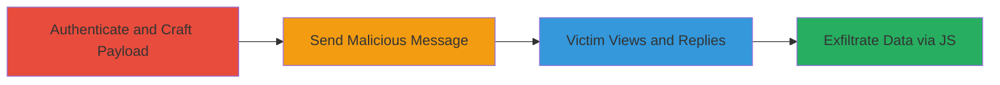

---
tags:
  - xss
  - stored-xss
  - concrete-cms
  - javascript-execution
  - cookie-theft
  - client-side-attack
type: attack_chain
tools:
  - '[[tools/000webhost]]'
  - '[[tools/Chrome]]'
  - '[[tools/Chromium]]'
  - '[[tools/Opera]]'
tactics:
  - '[[Execution]]'
  - '[[Collection]]'
verified: false
platforms:
  - Web
submitted: true
complexity: medium
created_at: '2023-10-01T00:00:00Z'
procedures:
  - '[[procedures/Authenticate-and-Craft-Malicious-Private-Message]]'
  - '[[procedures/Send-Malicious-Message-to-Target]]'
  - '[[procedures/Trigger-XSS-via-Victim-Reply]]'
  - '[[procedures/Verify-Cookie-Exfiltration-on-Attacker-Server]]'
step_count: 4
techniques:
  - '[[JavaScript]]'
updated_at: '2025-12-14T03:16:30.695Z'
description: >-
  A multi-stage attack exploiting a stored XSS vulnerability in Concrete CMS's
  Private Messages 'Reply' feature to inject and execute malicious JavaScript
  when a victim replies to a crafted message, enabling cookie theft and
  client-side attacks.
skill_level: intermediate
impact_level: high
id: 9cb33544-2b5e-48f3-9e34-4ea183e66970
validated: true
mitre_tactics:
  - '[[Execution]]'
  - '[[Collection]]'
mitre_techniques:
  - '[[JavaScript]]'
---
# Stored XSS in Concrete CMS Private Messages Reply for Arbitrary JavaScript Execution and Cookie Theft

Multi-stage attack chain demonstrating exploitation of a stored XSS vulnerability in Concrete CMS 8.2.0 RC2's Private Messages 'Reply' feature. An attacker sends a malicious private message containing a payload that closes the reply form's textarea and injects executable JavaScript. The payload is sanitized on view but executes when the victim replies, allowing arbitrary JS in the victim's browser context to steal cookies or perform other client-side attacks. HttpOnly flags may mitigate full session hijacking, but data exfiltration remains possible.

## Chain Metrics Dashboard

| Metric | Value |
|--------|-------|
| Chain Status | Unverified |
| Total Steps | 4 |
| Execution Time | ~5 minutes |
| Skill Level | Intermediate |
| Complexity | Medium |
| Impact Level | High |

## Attack Flow Visualization

## Prerequisites & Requirements

### Required Tools

- [[tools/Chrome]]
- [[tools/000webhost]]

### Target Environment

- Concrete CMS 8.2.0 RC2 on PHP 5.6.30, Apache 2.4.25, MySQL 5.7.13
- Web platform with private messaging enabled
- Attacker access to a hosting service for receiver script

### Initial Access Requirements

- Valid user credentials for Concrete CMS (any non-admin user to send message)
- Target user ID (e.g., admin ID=1)
- Network access to the CMS instance

## Detailed Attack Procedures

### Step 1: Authenticate and Craft Malicious Private Message
procedure: [[procedures/Authenticate-and-Craft-Malicious-Private-Message]]

**Objective**: Log in as an attacker user and compose a private message with a stored XSS payload that will execute on reply.

**Instructions**: Authenticate to the CMS dashboard, navigate to the private messages write page for the target user, and insert the payload into the message content. The payload closes the textarea in the reply form and injects a script to exfiltrate cookies.

**Expected Output**: Malicious message composed but not yet sent.

**Success Indicators**:
- Successfully logged in and accessed message composition page
- Payload visible in the message editor without immediate execution

### Step 2: Send Malicious Message to Target
procedure: [[procedures/Send-Malicious-Message-to-Target]]

**Objective**: Deliver the malicious private message to the target user (e.g., admin).

**Instructions**: Submit the form to send the message. The payload is stored but sanitized on initial view.

**Expected Output**: Message sent successfully; confirmation in sender's outbox.

**Success Indicators**:
- Message appears in target's inbox
- No immediate JS execution when sender views their sent message

### Step 3: Trigger XSS via Victim Reply
procedure: [[procedures/Trigger-XSS-via-Victim-Reply]]

**Objective**: Simulate or induce the victim to reply, causing the unsanitized quoting of the original message to execute the payload.

**Instructions**: Log in as the target user, access the inbox, open the malicious message (sanitized view), and select 'Reply'. The original content is auto-quoted into the reply textarea without escaping, allowing the payload to break out and run the script.

**Expected Output**: JavaScript executes in the victim's browser, sending cookies to the attacker's server.

**Success Indicators**:
- Reply form loads with quoted content
- Network request to attacker's server with cookie data

### Step 4: Verify Cookie Exfiltration on Attacker Server
procedure: [[procedures/Verify-Cookie-Exfiltration-on-Attacker-Server]]

**Objective**: Confirm successful data theft by checking the receiver script's log.

**Instructions**: Access the hosted PHP script on the attacker's server to view appended cookie data in cookies.txt.

**Expected Output**: Victim's document.cookie value logged in cookies.txt.

**Success Indicators**:
- New entry in cookies.txt containing victim's session data
- Potential for further attacks like phishing or keylogging based on stolen info

## Attack Chain Summary

### Key Achievements

1. Injected stored XSS payload via private message without detection on view
2. Executed arbitrary JavaScript in victim context during reply composition
3. Exfiltrated sensitive client-side data like cookies for potential session attacks

## Technique & Tactic Coverage

### MITRE ATT&CK Techniques

- [[JavaScript]]

### MITRE ATT&CK Tactics

- [[Execution]]
- [[Collection]]

---

*Last updated: 2023-10-01T00:00:00Z*
