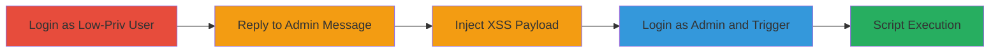

---
tags:
  - xss
  - stored-xss
  - concrete-cms
  - private-messaging
  - script-injection
type: attack_chain
tools: []
tactics:
  - '[[Execution]]'
commands: []
platforms:
  - Web
complexity: medium
procedures:
  - '[[procedures/Login-as-Low-Privileged-User-to-Concrete-CMS]]'
  - '[[procedures/Reply-to-Admin-Message-in-Private-Messaging]]'
  - '[[procedures/Inject-XSS-Payload-in-Message-Body]]'
  - '[[procedures/Trigger-XSS-as-Administrator]]'
step_count: 4
techniques:
  - '[[JavaScript]]'
description: >-
  A multi-stage attack exploiting a stored XSS vulnerability in Concrete CMS
  8.5.2 private messaging to inject and execute malicious JavaScript in an
  administrator's browser.
skill_level: intermediate
impact_level: high
id: c5b263d6-3192-486f-94ae-998adc94584e
created_at: '2025-12-14T03:46:38.250Z'
updated_at: '2025-12-14T03:46:38.250Z'
verified: false
validated: true
submitted: true
mitre_tactics:
  - '[[Execution]]'
mitre_techniques:
  - '[[JavaScript]]'
---
# Stored-XSS-in-Concrete-CMS-Private-Messaging-for-Admin-Script-Execution

Multi-stage attack chain demonstrating a complete attack workflow exploiting stored XSS in Concrete CMS version 8.5.2 private messaging feature.

## Chain Metrics Dashboard

| Metric | Value |
|--------|-------|
| Chain Status | Unverified |
| Total Steps | 4 |
| Execution Time | ~5 minutes |
| Skill Level | Intermediate |
| Complexity | Medium |
| Impact Level | High |

## Attack Flow Visualization

## Prerequisites & Requirements

### Required Tools

- Web browser (e.g., Chrome, Firefox)

### Target Environment

- Concrete CMS version 8.5.2 running on a web server
- Access to private messaging feature
- No specific ports required beyond standard HTTP/HTTPS (80/443)

### Initial Access Requirements

- Valid low-privileged user credentials with private messaging access
- Valid administrator credentials for verification
- Network access to the Concrete CMS instance

## Detailed Attack Procedures

### Step 1: Login as Low-Privileged User
procedure: [[procedures/Login-as-Low-Privileged-User-to-Concrete-CMS]]

**Objective**: Gain authenticated access as a basic user to initiate the attack.

**Instructions**: Open a web browser and navigate to the Concrete CMS login page. Enter basic user credentials that have access to private messaging.

**Expected Output**: Successful login redirect to the dashboard, with private messaging accessible.

**Success Indicators**:
- User dashboard loads without errors
- Private messages section is visible

### Step 2: Reply to Admin Message
procedure: [[procedures/Reply-to-Admin-Message-in-Private-Messaging]]

**Objective**: Locate an existing message from the administrator to target for payload injection.

**Instructions**: Navigate to the private messaging section in the user dashboard. Select and open a conversation containing a message from the administrator, then initiate a reply.

**Expected Output**: Reply form opens with fields for message body.

**Success Indicators**:
- Conversation with admin message is found
- Reply interface is functional

### Step 3: Inject XSS Payload
procedure: [[procedures/Inject-XSS-Payload-in-Message-Body]]

**Objective**: Insert malicious JavaScript into the message body to store and execute on admin view.

**Instructions**: In the message body field (msgBody parameter), enter a payload such as `<input>` or `Bar`. Submit the reply form.

**Expected Output**: Message submits successfully without validation errors, stored in the conversation.

**Success Indicators**:
- Reply is sent and appears in the conversation history
- No sanitization errors occur

### Step 4: Trigger XSS as Administrator
procedure: [[procedures/Trigger-XSS-as-Administrator]]

**Objective**: View the injected message as admin to execute the payload.

**Instructions**: Log out of the low-priv account, then log in as administrator. Navigate to private messages, open the conversation, and hover over the injected message body to trigger the onmouseover event.

**Expected Output**: Payload executes, showing an alert or redirecting to the malicious site.

**Success Indicators**:
- JavaScript alert pops up or browser redirects
- Arbitrary script runs in admin's browser context

## Attack Chain Summary

### Key Achievements

1. Authenticated access as low-priv user to inject payload
2. Successful storage of unsanitized XSS in private message
3. Execution of script in high-priv admin session
4. Potential for session hijacking or phishing via browser compromise

## Technique & Tactic Coverage

### MITRE ATT&CK Techniques

- [[JavaScript]]

### MITRE ATT&CK Tactics

- [[Execution]]

---
*Last updated: 2023-10-01T00:00:00Z*
