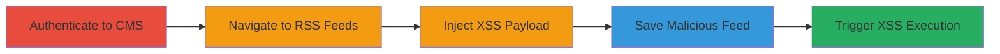

---
tags:
  - xss
  - stored-xss
  - concrete-cms
  - session-hijacking
type: attack_chain
tools: []
tactics:
  - '[[Execution]]'
  - '[[Credential Access]]'
verified: false
platforms:
  - Web
submitted: true
complexity: medium
created_at: '2023-10-01T00:00:00Z'
procedures:
  - '[[procedures/Exploit-Stored-XSS-in-Concrete-CMS-RSS-Feeds]]'
step_count: 5
techniques:
  - '[[JavaScript]]'
updated_at: '2025-12-14T03:16:37.314Z'
description: >-
  A multi-step attack exploiting a stored XSS vulnerability in the RSS Feeds
  Description field of Concrete CMS 8.2.0 RC2, allowing injection of malicious
  JavaScript that executes when authenticated users view the feed, potentially
  leading to session hijacking or client-side attacks.
skill_level: intermediate
impact_level: high
id: 1791fcc9-f04c-41e5-b945-2284b5bd7d03
validated: true
mitre_tactics:
  - '[[Execution]]'
  - '[[Credential Access]]'
mitre_techniques:
  - '[[JavaScript]]'
---
# Stored XSS in Concrete CMS RSS Feeds Description Field for Session Hijacking

Multi-stage attack chain demonstrating a complete stored XSS exploitation workflow in Concrete CMS 8.2.0 RC2.

## Chain Metrics Dashboard

| Metric | Value |
|--------|-------|
| Chain Status | Unverified |
| Total Steps | 5 |
| Execution Time | ~5 minutes |
| Skill Level | Intermediate |
| Complexity | Medium |
| Impact Level | High |

## Attack Flow Visualization



## Prerequisites & Requirements

### Required Tools

- Web browser (e.g., Chrome with developer tools for payload testing)

### Target Environment

- Concrete CMS 8.2.0 RC2 running on PHP 5.6.30, Apache 2.4.25, MySQL 5.7.13
- Web platform accessible via HTTP/HTTPS
- No specific ports beyond standard web (80/443)

### Initial Access Requirements

- Valid credentials for an authenticated user with permissions to manage RSS Feeds
- Direct network access to the CMS instance
- No prior access needed beyond authentication

## Detailed Attack Procedures

### Step 1: Authenticate to Concrete CMS
procedure: [[procedures/Exploit-Stored-XSS-in-Concrete-CMS-RSS-Feeds]]

**Objective**: Gain access to the CMS dashboard to reach RSS management features.

**Instructions**: Open a web browser and navigate to the Concrete CMS login page. Enter valid credentials for a user with RSS Feeds management permissions. Upon successful login, you will be redirected to the dashboard.

**Expected Output**: Dashboard loads, confirming authenticated session.

**Success Indicators**:
- Login successful without errors
- Access to site administration menu visible

### Step 2: Navigate to RSS Feeds and Initiate New Feed Creation
procedure: [[procedures/Exploit-Stored-XSS-in-Concrete-CMS-RSS-Feeds]]

**Objective**: Access the RSS Feeds management interface to prepare for payload injection.

**Instructions**: From the dashboard, navigate to "Extend" > "RSS Feeds" (or equivalent path in the admin menu). Click the "Add Feed" button to open the form for creating a new RSS feed.

**Expected Output**: New RSS Feed form loads with fields including Title, URL, and Description textarea.

**Success Indicators**:
- RSS Feeds list or add form visible
- Description textarea present and editable

### Step 3: Inject Malicious Payload into Description Field
procedure: [[procedures/Exploit-Stored-XSS-in-Concrete-CMS-RSS-Feeds]]

**Objective**: Insert a payload that escapes the textarea and injects executable JavaScript.

**Instructions**: In the Description textarea, enter the following payload to break out and inject script:

```html
</textarea><script>alert("XSS!")</script>
```

Fill other required fields (e.g., a dummy Title and RSS URL) to complete the form.

**Expected Output**: Payload entered without immediate errors in the form.

**Success Indicators**:
- Payload visible in textarea
- Form validation passes for other fields

### Step 4: Save the Malicious Feed
procedure: [[procedures/Exploit-Stored-XSS-in-Concrete-CMS-RSS-Feeds]]

**Objective**: Store the unsanitized input in the database for later rendering.

**Instructions**: Click the "Add" or "Save" button to submit the form. The CMS will process and store the feed, including the injected payload, without proper sanitization.

**Expected Output**: Confirmation message that the feed was added successfully; feed appears in the RSS Feeds list without visible errors.

**Success Indicators**:
- Feed listed in RSS Feeds dashboard
- No server-side errors on submission

### Step 5: Trigger XSS by Viewing the Feed
procedure: [[procedures/Exploit-Stored-XSS-in-Concrete-CMS-RSS-Feeds]]

**Objective**: Render the Description field to execute the injected JavaScript in the viewer's browser.

**Instructions**: From the RSS Feeds list, select and view the newly added feed. The Description field will be rendered, executing the script in the context of the authenticated user's session.

**Expected Output**: Alert box or other JS effects (e.g., alert("XSS!")), confirming execution; in a real attack, this could steal cookies via more advanced payloads.

**Success Indicators**:
- JavaScript executes (e.g., alert pops up)
- Browser console shows no blocking errors; potential for session data exfiltration

## Attack Chain Summary

### Key Achievements

1. Successful authentication and navigation to vulnerable interface
2. Injection and storage of XSS payload without sanitization
3. Execution of arbitrary JavaScript in victim browsers, enabling session hijacking or phishing

## Technique & Tactic Coverage

### MITRE ATT&CK Techniques

- [[JavaScript]]

### MITRE ATT&CK Tactics

- [[Execution]]
- [[Credential Access]]

---

*Last updated: 2023-10-01T00:00:00Z*
