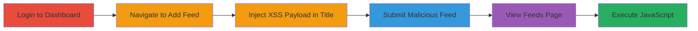

# Stored XSS in Concrete CMS RSS Feeds Title for Client-Side Execution

Multi-stage attack chain demonstrating a complete attack workflow for exploiting stored XSS in Concrete CMS RSS feeds.

## Chain Metrics Dashboard

| Metric | Value |
|--------|-------|
| Chain Status | Unverified |
| Total Steps | 6 |
| Execution Time | ~5 minutes |
| Skill Level | Intermediate |
| Complexity | Medium |
| Impact Level | High |

## Attack Flow Visualization



## Prerequisites & Requirements

### Required Tools

- [[tools/Firefox]]

### Target Environment

- Concrete CMS v8.1.0 running on a web server (e.g., PHP-based)
- Required services/ports: HTTP/HTTPS on port 80/443
- Network access requirements: Direct access to the target web application

### Initial Access Requirements

- Valid user credentials for the Concrete CMS dashboard
- Network position: External or internal access to the login endpoint
- Prior access needed: None, assuming authenticated user role

## Detailed Attack Procedures

### Step 1: Open Browser
procedure: [[procedures/Exploit-Stored-XSS-in-Concrete-CMS-RSS-Feed]]

**Objective**: Launch a web browser to interact with the target application.

**Instructions**: Use [[tools/Firefox]] to open the browser for manual testing.

**Expected Output**: Firefox browser window is open and ready for navigation.

**Success Indicators**:
- Browser launches successfully
- No errors in browser console

### Step 2: Login to the Application
procedure: [[procedures/Exploit-Stored-XSS-in-Concrete-CMS-RSS-Feed]]

**Objective**: Authenticate to gain access to the dashboard where RSS feed management is available.

**Instructions**: Navigate to `/index.php/login` and enter valid credentials to authenticate.

**Expected Output**: Successful login redirect to the dashboard.

**Success Indicators**:
- User is redirected to the dashboard
- Session cookies (e.g., CONCRETE5) are set

### Step 3: Visit the Add RSS Feed Page
procedure: [[procedures/Exploit-Stored-XSS-in-Concrete-CMS-RSS-Feed]]

**Objective**: Access the form for adding a new RSS feed to prepare for payload injection.

**Instructions**: From the dashboard, navigate to `/index.php/dashboard/pages/feeds/add`.

**Expected Output**: The add RSS feed form loads without errors.

**Success Indicators**:
- Form fields for title, handle, description, etc., are visible
- No authentication errors

### Step 4: Enter the XSS Payload in the Title Field
procedure: [[procedures/Exploit-Stored-XSS-in-Concrete-CMS-RSS-Feed]]

**Objective**: Inject a malicious JavaScript payload into the pfTitle parameter to store XSS.

**Instructions**: In the pfTitle field, enter the payload `"><svg/onload=confirm(document.domain)>`.

**Expected Output**: Payload is entered in the form field.

**Success Indicators**:
- Payload text appears in the title input
- Form accepts the input without immediate validation errors

### Step 5: Fill Other Fields and Submit the Form
procedure: [[procedures/Exploit-Stored-XSS-in-Concrete-CMS-RSS-Feed]]

**Objective**: Complete the form submission to store the injected payload in the database.

**Instructions**: Fill pfHandle with a value like "cdl", pfDescription with "cdl", set other fields to defaults (e.g., iconFID=0, cParentID=0), and submit via POST to `/index.php/dashboard/pages/feeds/add_feed`. Use [[commands/curl-add-xss-rss-feed]] for automated submission if needed:

```bash
curl -X POST 'http://target.com/index.php/dashboard/pages/feeds/add_feed' \
  -H 'Content-Type: application/x-www-form-urlencoded' \
  -H 'Cookie: CONCRETE5=your_session; CONCRETE5_LOGIN=1' \
  -d 'ccm_token=1492345382%3A9f0e473b3d4455fe197861e0fa77d671&pfTitle=%22%3E%3Csvg%2Fonload%3Dconfirm%28document.domain%29%3E&pfHandle=cdl&pfDescription=cdl&iconFID=0&cParentID=0&ptID=0&customTopicAttributeKeyHandle=&customTopicTreeNodeID=0&pfIncludeAllDescendents=0&pfDisplayAliases=0&pfDisplayFeaturedOnly=0&pfContentToDisplay=S&pfAreaHandleToDisplay=Main'
```

**Expected Output**: The feed is added successfully, and a confirmation message appears.

**Success Indicators**:
- HTTP 200 response or redirect to feeds list
- No form validation errors on submission

### Step 6: Visit the RSS Feeds Page to Trigger the Payload
procedure: [[procedures/Exploit-Stored-XSS-in-Concrete-CMS-RSS-Feed]]

**Objective**: Load the page where the stored payload executes in the viewer's browser.

**Instructions**: Navigate to `/index.php/dashboard/pages/feeds` to view the list of feeds.

**Expected Output**: The injected JavaScript executes, displaying a confirm dialog with the document domain.

**Success Indicators**:
- Alert or confirm dialog pops up showing the domain
- Browser console shows JavaScript execution
- Potential for further exploitation like cookie theft

## Attack Chain Summary

### Key Achievements

1. Successful authentication and access to RSS feed management
2. Storage of malicious XSS payload without sanitization
3. Execution of JavaScript in any user's browser viewing the feeds page, demonstrating potential for session hijacking

## Technique & Tactic Coverage

### MITRE ATT&CK Techniques

- [[JavaScript]]

### MITRE ATT&CK Tactics

- [[Execution]]

---
*Last updated: 2023-10-01T00:00:00Z*
