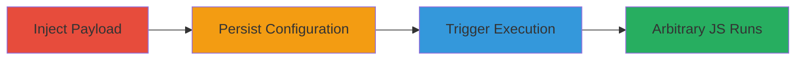

# Stored XSS in Concrete CMS Search Title for Arbitrary JavaScript Execution

Multi-stage attack chain demonstrating a complete workflow for exploiting a Stored XSS vulnerability in Concrete CMS's Search Title feature, allowing persistent injection of malicious JavaScript that executes for any user viewing the search results page.

## Chain Metrics Dashboard

| Metric | Value |
|--------|-------|
| Chain Status | Unverified |
| Total Steps | 3 |
| Execution Time | ~5 minutes |
| Skill Level | Intermediate |
| Complexity | Medium |
| Impact Level | High |

## Attack Flow Visualization

## Prerequisites & Requirements

### Required Tools

- Web browser (e.g., Chrome with developer tools)

### Target Environment

- Concrete CMS instance (version vulnerable to CVE or similar, e.g., pre-8.5 patches)
- Web platform with PHP backend
- Authenticated access to admin or search configuration panel

### Initial Access Requirements

- Valid user credentials for Concrete CMS (admin or editor role)
- Direct network access to the CMS site
- No prior access needed beyond login

## Detailed Attack Procedures

### Step 1: Inject Payload
procedure: [[procedures/Inject-Malicious-Payload-into-Search-Title-Field]]

**Objective**: Introduce unsanitized malicious JavaScript into the Search Title input field to bypass validation.

**Instructions**: Navigate to the Concrete CMS admin dashboard, access the Search feature configuration, and enter the payload into the Search Title field. Use a simple test payload like ">" to verify execution potential.

**Expected Output**: The payload is accepted without error and displayed in the input field.

**Success Indicators**:
- Payload entered successfully without sanitization warnings
- Field reflects the injected HTML/JavaScript

### Step 2: Persist Configuration
procedure: [[procedures/Persist-XSS-Payload-by-Saving-Search-Configuration]]

**Objective**: Store the malicious payload persistently in the CMS database or configuration files.

**Instructions**: After injecting the payload, submit or save the search configuration form. This action stores the title with the embedded script for future use.

**Expected Output**: Configuration saves successfully, with a confirmation message from the CMS.

**Success Indicators**:
- Save operation completes without errors
- No immediate execution (payload is stored, not rendered yet)

### Step 3: Trigger Execution
procedure: [[procedures/Execute-Stored-XSS-on-Search-Results-Page]]

**Objective**: Render the search results page to trigger the stored script, executing JavaScript in the victim's browser context.

**Instructions**: Log out or use another user account to access the search results page. The unsanitized title will render the payload, causing the onerror event to fire and execute alert(1) or more malicious code.

**Expected Output**: JavaScript alert box appears, or in a real attack, session data theft occurs.

**Success Indicators**:
- Script executes (e.g., alert pops up)
- Browser console shows JavaScript errors or execution traces

## Attack Chain Summary

### Key Achievements

1. Successful injection and persistence of XSS payload in Concrete CMS Search Title
2. Arbitrary JavaScript execution for any viewing user, bypassing authentication
3. Potential for session hijacking, phishing, or data exfiltration via client-side attacks

## Technique & Tactic Coverage

### MITRE ATT&CK Techniques

- [[JavaScript]]

### MITRE ATT&CK Tactics

- [[Execution]]

---
*Last updated: 2023-10-01T00:00:00Z*
