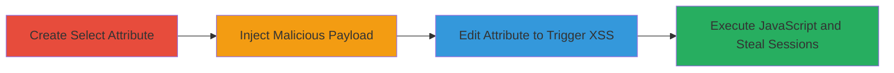

---
tags:
  - xss
  - stored-xss
  - concrete-cms
  - php
  - web
type: attack_chain
tools: []
tactics:
  - '[[Execution]]'
commands: []
platforms:
  - Web
  - PHP
complexity: medium
procedures:
  - '[[procedures/Create-Malicious-Select-Attribute-in-Concrete-CMS]]'
  - '[[procedures/Inject-XSS-Payload-into-Attribute-Option]]'
  - '[[procedures/Trigger-Stored-XSS-by-Editing-Attribute]]'
step_count: 3
techniques:
  - '[[JavaScript]]'
description: >-
  A multi-step attack exploiting a stored XSS vulnerability in Concrete CMS by
  injecting malicious JavaScript into select attribute options, leading to
  execution in admin interfaces and potentially via Express Forms.
skill_level: intermediate
impact_level: high
id: 668ab463-51c0-4925-abc7-c203fca16b4a
created_at: '2025-12-14T00:11:09.654Z'
updated_at: '2025-12-14T00:11:09.654Z'
verified: false
validated: true
submitted: true
mitre_tactics:
  - '[[Execution]]'
mitre_techniques:
  - '[[JavaScript]]'
---
# Stored XSS in Concrete CMS Select Attribute Options

Multi-stage attack chain demonstrating a complete attack workflow exploiting a stored Cross-Site Scripting (XSS) vulnerability in Concrete CMS select attribute options.

## Chain Metrics Dashboard

| Metric | Value |
|--------|-------|
| Chain Status | Unverified |
| Total Steps | 3 |
| Execution Time | ~5 minutes |
| Skill Level | Intermediate |
| Complexity | Medium |
| Impact Level | High |

## Attack Flow Visualization

## Prerequisites & Requirements

### Required Tools

- Web browser with developer tools (e.g., Chrome DevTools for payload testing)

### Target Environment

- Concrete CMS instance (version vulnerable to this issue, e.g., pre-patch for CVE if applicable)
- PHP-based web server
- Admin access to the dashboard for authenticated exploitation

### Initial Access Requirements

- Authenticated admin credentials for dashboard access
- For unauthenticated: Access to Express Forms that allow user-added attributes
- Network access to the target CMS site

## Detailed Attack Procedures

### Step 1: Create Select Attribute
procedure: [[procedures/Create-Malicious-Select-Attribute-in-Concrete-CMS]]

**Objective**: Set up a new select attribute in the Concrete CMS dashboard to prepare for payload injection.

**Instructions**: Log in to the Concrete CMS admin dashboard. Navigate to the attribute management section, typically under Dashboard > System & Settings > Attributes. Select to create a new attribute and choose the 'Select' type. Configure basic details like name and handle, then proceed to the options configuration without adding options yet.

**Expected Output**: A new select attribute is created and saved, ready for option configuration.

**Success Indicators**:
- Attribute appears in the list of available attributes
- No errors during creation

### Step 2: Inject XSS Payload into Attribute Option
procedure: [[procedures/Inject-XSS-Payload-into-Attribute-Option]]

**Objective**: Add a malicious JavaScript payload as an option value in the select attribute, which will be stored without sanitization.

**Instructions**: In the attribute edit interface, add a new option. Set the option value to a payload like ``. Optionally, set a benign label like 'Test Option'. Save the attribute configuration. This stores the unsanitized input in the database.

**Expected Output**: The attribute saves successfully, with the payload stored as an option value.

**Success Indicators**:
- Attribute updates without validation errors
- Payload is persisted (verifiable by checking database if accessible)

### Step 3: Trigger Stored XSS by Editing Attribute
procedure: [[procedures/Trigger-Stored-XSS-by-Editing-Attribute]]

**Objective**: Revisit the attribute edit page to render the stored payload, executing the JavaScript in the admin context.

**Instructions**: Navigate to edit the previously created attribute via Dashboard > Pages > Attributes > Edit (or similar path like /index.php/dashboard/pages/attributes/edit/xxx). The payload will be rendered unsanitized in the options list, triggering execution (e.g., alert dialog). For broader impact, apply the attribute to an Express Form block and view/edit it, potentially affecting unauthenticated users if forms allow additions.

**Expected Output**: JavaScript alert or other payload executes, such as stealing session cookies via document.cookie.

**Success Indicators**:
- Alert dialog or console errors indicating JS execution
- In dev tools, observe the payload in the HTML without escaping
- Potential session hijacking if payload exfiltrates data

## Attack Chain Summary

### Key Achievements

1. Successful creation and configuration of a vulnerable select attribute
2. Injection and storage of arbitrary JavaScript payload
3. Triggering of stored XSS for session theft or persistent defacement in admin and form views

## Technique & Tactic Coverage

### MITRE ATT&CK Techniques

- [[JavaScript]]

### MITRE ATT&CK Tactics

- [[Execution]]

---
*Last updated: 2023-10-01*
