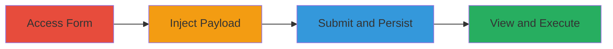

---
tags:
  - xss
  - stored-xss
  - concrete-cms
  - javascript-injection
  - web-vulnerability
type: attack_chain
tools: []
tactics:
  - '[[Execution]]'
commands: []
platforms:
  - Web
complexity: medium
procedures:
  - '[[procedures/Access-Testimonial-Submission-Form-in-Concrete-CMS]]'
  - '[[procedures/Inject-Malicious-Payload-into-Testimonial-Field]]'
  - '[[procedures/Submit-and-Persist-XSS-Payload-in-Concrete-CMS]]'
  - '[[procedures/Trigger-XSS-Execution-by-Viewing-Testimonial]]'
step_count: 4
techniques:
  - '[[JavaScript]]'
description: >-
  A multi-stage attack exploiting insufficient input sanitization in the
  Concrete CMS testimonial feature to inject and persist malicious JavaScript,
  leading to execution in victims' browsers.
skill_level: intermediate
impact_level: high
id: 57beff5c-a73b-4feb-9620-79ec56242438
created_at: '2025-12-14T03:15:35.525Z'
updated_at: '2025-12-14T03:15:35.525Z'
verified: false
validated: true
submitted: true
mitre_tactics:
  - '[[Execution]]'
mitre_techniques:
  - '[[JavaScript]]'
---
# Stored XSS in Concrete CMS Testimonial Feature for Arbitrary JavaScript Execution

Multi-stage attack chain demonstrating a complete attack workflow exploiting a stored cross-site scripting vulnerability in the Concrete CMS testimonial 'Company' feature.

## Chain Metrics Dashboard

| Metric | Value |
|--------|-------|
| Chain Status | Unverified |
| Total Steps | 4 |
| Execution Time | ~5 minutes |
| Skill Level | Intermediate |
| Complexity | Medium |
| Impact Level | High |

## Attack Flow Visualization

## Prerequisites & Requirements

### Required Tools

- Web browser (e.g., Chrome, Firefox)

### Target Environment

- Concrete CMS instance (web platform)
- Access to public-facing testimonial submission form
- No special services or ports required beyond standard HTTP/HTTPS (ports 80/443)

### Initial Access Requirements

- No credentials needed for public submission
- Direct network access to the CMS site
- No prior access required

## Detailed Attack Procedures

### Step 1: Access Testimonial Submission Form
procedure: [[procedures/Access-Testimonial-Submission-Form-in-Concrete-CMS]]

**Objective**: Locate and navigate to the input area for submitting testimonials to prepare for payload injection.

**Instructions**: Open a web browser and navigate to the Concrete CMS site's testimonial submission page, typically under a contact or feedback section labeled 'Testimonial Company' or similar.

**Expected Output**: The form fields for entering testimonial details are visible and accessible.

**Success Indicators**:
- Form loads without errors
- Input field for testimonial text is present

### Step 2: Inject Malicious Payload
procedure: [[procedures/Inject-Malicious-Payload-into-Testimonial-Field]]

**Objective**: Insert a JavaScript payload into the testimonial input to break out of HTML context and enable execution.

**Instructions**: In the testimonial input field, enter the payload `">` to close any surrounding HTML tags and trigger JavaScript via an image error event.

**Expected Output**: The payload is entered into the field without immediate validation errors.

**Success Indicators**:
- Payload text appears in the input field
- No client-side blocking occurs

### Step 3: Submit and Persist XSS Payload
procedure: [[procedures/Submit-and-Persist-XSS-Payload-in-Concrete-CMS]]

**Objective**: Save the injected payload to the backend, where it is stored unsanitized for later display.

**Instructions**: Complete any required fields (e.g., name, email if present) and submit the form. The payload is now persisted in the database or storage without proper escaping.

**Expected Output**: Submission confirmation message; payload saved server-side.

**Success Indicators**:
- Form submits successfully
- No server-side rejection of the input

### Step 4: Trigger XSS Execution by Viewing Testimonial
procedure: [[procedures/Trigger-XSS-Execution-by-Viewing-Testimonial]]

**Objective**: Load the page displaying the testimonial to execute the injected JavaScript in the viewer's browser context.

**Instructions**: Navigate to the page or section where testimonials are publicly displayed. The payload executes automatically upon rendering.

**Expected Output**: Alert box with '1' appears, confirming JavaScript execution.

**Success Indicators**:
- JavaScript alert triggers
- Potential for further exploitation like session hijacking observed

## Attack Chain Summary

### Key Achievements

1. Successful injection and persistence of XSS payload in Concrete CMS
2. Arbitrary JavaScript execution in victim browsers
3. Potential for session theft, data exfiltration, or site defacement

## Technique & Tactic Coverage

### MITRE ATT&CK Techniques

- [[JavaScript]]

### MITRE ATT&CK Tactics

- [[Execution]]

---
*Last updated: 2023-10-01*
