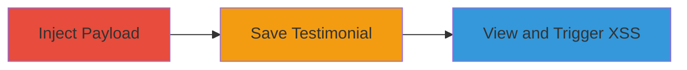

# Stored XSS in Concrete CMS Testimonial Name Field for Persistent Script Execution

Multi-stage attack chain demonstrating a complete attack workflow exploiting a stored cross-site scripting vulnerability in Concrete CMS.

## Chain Metrics Dashboard

| Metric | Value |
|--------|-------|
| Chain Status | Unverified |
| Total Steps | 3 |
| Execution Time | ~2 minutes |
| Skill Level | Beginner |
| Complexity | Low |
| Impact Level | High |

## Attack Flow Visualization

## Prerequisites & Requirements

### Required Tools

- Web browser (e.g., Chrome or Firefox with developer tools)

### Target Environment

- Concrete CMS instance (version vulnerable to this issue, e.g., pre-patch releases)
- Access to the admin dashboard for creating/editing testimonials
- PHP-based web server hosting the CMS

### Initial Access Requirements

- Authenticated access to the Concrete CMS admin panel (user with testimonial creation privileges)
- No special network position required; standard HTTP access
- Prior knowledge of the testimonial feature endpoint

## Detailed Attack Procedures

### Step 1: Inject XSS Payload
procedure: [[procedures/Inject-XSS-Payload-into-Testimonial-Name-Field]]

**Objective**: Introduce malicious JavaScript into the testimonial name field to bypass sanitization.

**Instructions**: Navigate to the testimonial creation or editing form in the Concrete CMS dashboard. In the name input field, enter the payload `` to simulate script execution on load failure.

**Expected Output**: The payload is accepted without error and visible in the form preview.

**Success Indicators**:
- Payload enters the field without immediate rejection
- Form allows proceeding to save

### Step 2: Save the Testimonial
procedure: [[procedures/Save-Malicious-Testimonial-in-Concrete-CMS]]

**Objective**: Persist the injected payload in the database for long-term storage.

**Instructions**: Submit the testimonial form to store the unsanitized input. The CMS saves the name field directly to the backend without proper escaping.

**Expected Output**: Confirmation of testimonial creation or update, with the payload now stored server-side.

**Success Indicators**:
- Testimonial saves successfully
- No validation errors on submission

### Step 3: Trigger the XSS
procedure: [[procedures/Trigger-Stored-XSS-by-Viewing-Testimonial]]

**Objective**: Execute the stored script in the victim's browser by rendering the testimonial.

**Instructions**: Access the page or section displaying the testimonial. The name field renders the payload, triggering the `onerror` handler to execute `alert(1)` due to the invalid `src` attribute.

**Expected Output**: JavaScript alert box pops up with '1', confirming execution.

**Success Indicators**:
- Alert dialog appears on page load
- Browser console shows script execution errors or logs

## Attack Chain Summary

### Key Achievements

1. Successful injection of arbitrary JavaScript via the testimonial name field
2. Persistent storage without sanitization, affecting all viewers
3. Client-side execution enabling session hijacking, data exfiltration, or further attacks

## Technique & Tactic Coverage

### MITRE ATT&CK Techniques

- [[JavaScript]]

### MITRE ATT&CK Tactics

- [[Execution]]
- [[Collection]]

---
*Last updated: 2023-10-01T12:00:00Z*
