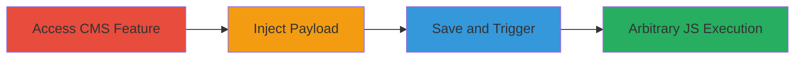

# Stored XSS in Concrete CMS Testimonial Position

Multi-stage attack chain demonstrating a complete workflow for exploiting a Stored XSS vulnerability in the Testimonial Position feature of Concrete CMS. An attacker with access to the CMS admin interface can inject malicious JavaScript into a testimonial field, which is stored without proper sanitization and executed in the browsers of users who view the testimonial page. This can lead to session hijacking, data theft, or phishing attacks on site visitors.

## Chain Metrics Dashboard

| Metric | Value |
|--------|-------|
| Chain Status | Unverified |
| Total Steps | 3 |
| Execution Time | ~5 minutes |
| Skill Level | Intermediate |
| Complexity | Medium |
| Impact Level | High |

## Attack Flow Visualization

## Prerequisites & Requirements

### Required Tools

- Web browser for manual testing
- Access to Concrete CMS admin interface

### Target Environment

- Concrete CMS (PHP-based web application)
- Web platform with admin/content management access
- No specific ports required beyond standard HTTP/HTTPS (80/443)

### Initial Access Requirements

- Valid credentials for CMS admin or content editor role
- Direct network access to the target site
- No prior access needed beyond login

## Detailed Attack Procedures

### Step 1: Access the Testimonial Position Feature
procedure: [[procedures/Access-Concrete-CMS-Testimonial-Feature]]

**Objective**: Gain entry to the vulnerable input area in the CMS to prepare for payload injection.

**Instructions**: Log in to the Concrete CMS admin dashboard and navigate to the section for managing testimonials or content positions. Locate the Testimonial Position configuration, typically under content blocks or page elements.

**Expected Output**: The input form for the testimonial position field is visible and editable.

**Success Indicators**:
- Admin dashboard accessible
- Testimonial editing interface loaded

### Step 2: Inject XSS Payload
procedure: [[procedures/Inject-Stored-XSS-Payload]]

**Objective**: Insert a malicious JavaScript payload into the unsanitized input field to break out of HTML context.

**Instructions**: In the testimonial position input field, enter the payload `'>`. This closes any open HTML attributes and injects an image tag that triggers JavaScript on error.

**Expected Output**: The payload is accepted without validation errors.

**Success Indicators**:
- Payload entered successfully
- No immediate sanitization blocks the input

### Step 3: Save and Trigger XSS Payload
procedure: [[procedures/Save-and-Trigger-XSS-Payload]]

**Objective**: Persist the payload in the database and observe its execution when the testimonial is rendered.

**Instructions**: Submit the form to save the testimonial. Then, navigate to a page or view where the testimonial is displayed to trigger the payload.

**Expected Output**: An alert box with '1' appears in the viewer's browser, confirming JavaScript execution.

**Success Indicators**:
- Testimonial saved without errors
- Alert or script execution on page load

## Attack Chain Summary

### Key Achievements

1. Successful injection and storage of malicious JavaScript in Concrete CMS.
2. Demonstration of arbitrary code execution in victim browsers.
3. Highlighted risks of session hijacking and data exfiltration for site visitors.

## Technique & Tactic Coverage

### MITRE ATT&CK Techniques

- [[JavaScript]]
- [[Exploit Public-Facing Application]]

### MITRE ATT&CK Tactics

- [[Execution]]
- [[Collection]]

---
*Last updated: 2023-10-01T00:00:00Z*
