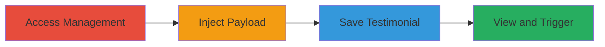

---
tags:
  - xss
  - stored-xss
  - concrete-cms
  - javascript-injection
type: attack_chain
tools: []
tactics:
  - '[[Execution]]'
verified: false
platforms:
  - Web
submitted: true
complexity: low
created_at: '2023-10-01T00:00:00Z'
procedures:
  - '[[procedures/Access-Concrete-CMS-Testimonial-Management]]'
  - '[[procedures/Inject-XSS-Payload-into-Bio-Quote-Field]]'
  - '[[procedures/Save-Malicious-Testimonial]]'
  - '[[procedures/Trigger-Stored-XSS-by-Viewing-Testimonial]]'
step_count: 4
techniques:
  - '[[JavaScript]]'
updated_at: '2025-12-14T03:15:35.368Z'
description: >-
  A multi-step attack exploiting insufficient input sanitization in the
  Bio/Quote field of Concrete CMS testimonials to inject and persist malicious
  JavaScript, leading to execution on page views.
skill_level: beginner
impact_level: high
id: b734ef3f-55cc-4959-a070-a5040ddb5bf8
validated: true
mitre_tactics:
  - '[[Execution]]'
mitre_techniques:
  - '[[JavaScript]]'
---
# Stored XSS in Concrete CMS Testimonials Bio/Quote Field

Multi-stage attack chain demonstrating a complete workflow for exploiting a Stored XSS vulnerability in Concrete CMS by injecting malicious JavaScript into the Bio/Quote field of testimonials, which persists and executes for any viewing user.

## Chain Metrics Dashboard

| Metric | Value |
|--------|-------|
| Chain Status | Unverified |
| Total Steps | 4 |
| Execution Time | ~5 minutes |
| Skill Level | Beginner |
| Complexity | Low |
| Impact Level | High |

## Attack Flow Visualization

## Prerequisites & Requirements

### Required Tools

- Web browser (e.g., Chrome with developer tools for payload testing)

### Target Environment

- Concrete CMS instance (PHP-based web application)
- Access to testimonial management feature, typically requiring authenticated user privileges (e.g., editor or admin role)
- No specific ports required beyond standard HTTP/HTTPS (80/443)

### Initial Access Requirements

- Valid credentials for a user account that can create or edit testimonials
- Direct network access to the CMS web interface
- No prior access needed beyond authentication

## Detailed Attack Procedures

### Step 1: Access Testimonial Management
procedure: [[procedures/Access-Concrete-CMS-Testimonial-Management]]

**Objective**: Gain entry to the testimonial creation or editing interface to prepare for payload injection.

**Instructions**: Log in to the Concrete CMS dashboard using valid credentials. Navigate to the testimonials section, typically under Content > Testimonials or a similar admin/content management area. If creating a new testimonial, select the 'Add Testimonial' option; if editing, choose an existing one.

**Expected Output**: The form for entering testimonial details, including the Bio/Quote field, is loaded and editable.

**Success Indicators**:
- Dashboard accessible without errors
- Testimonial form visible and fields editable

### Step 2: Inject XSS Payload
procedure: [[procedures/Inject-XSS-Payload-into-Bio-Quote-Field]]

**Objective**: Insert a malicious JavaScript payload into the vulnerable Bio/Quote field to bypass sanitization.

**Instructions**: In the Bio/Quote input field, enter the payload `">`. This closes any open HTML tags and injects an image element with an onerror handler that executes JavaScript. Use browser developer tools (F12) to inspect the field if needed for confirmation.

**Expected Output**: The payload is accepted in the field without immediate errors or sanitization.

**Success Indicators**:
- Payload entered successfully
- No form validation blocks the input

### Step 3: Save the Testimonial
procedure: [[procedures/Save-Malicious-Testimonial]]

**Objective**: Persist the injected payload in the CMS database for stored execution.

**Instructions**: Complete any required fields (e.g., name, image) and submit the form by clicking 'Save' or 'Publish'. The CMS will store the unsanitized input, embedding the JavaScript in the testimonial data.

**Expected Output**: Confirmation message indicating the testimonial was saved successfully.

**Success Indicators**:
- Testimonial saved without errors
- Payload not stripped during submission

### Step 4: Trigger Stored XSS
procedure: [[procedures/Trigger-Stored-XSS-by-Viewing-Testimonial]]

**Objective**: Load the page displaying the testimonial to execute the injected JavaScript in the viewer's browser context.

**Instructions**: Navigate to the page where testimonials are displayed (e.g., frontend testimonial section). The payload will render as HTML, triggering the onerror event and executing `alert(1)` as a proof-of-concept.

**Expected Output**: An alert box pops up displaying '1' in the browser.

**Success Indicators**:
- JavaScript executes (e.g., alert fires)
- Page source shows the injected `` tag unescaped

## Attack Chain Summary

### Key Achievements

1. Successful injection and storage of arbitrary JavaScript via the Bio/Quote field
2. Persistent execution on any user viewing the testimonial page
3. Potential for session hijacking, defacement, or data theft for affected users

## Technique & Tactic Coverage

### MITRE ATT&CK Techniques

- [[JavaScript]]

### MITRE ATT&CK Tactics

- [[Execution]]

---
*Last updated: 2023-10-01T00:00:00Z*
