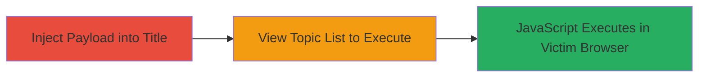

---
tags:
  - xss
  - stored-xss
  - concrete-cms
  - javascript-injection
  - web-vulnerability
type: attack_chain
tools: []
tactics:
  - '[[Initial Access]]'
  - '[[Execution]]'
  - '[[Collection]]'
verified: false
platforms:
  - Web
submitted: true
complexity: low
created_at: '2024-10-01'
procedures:
  - '[[procedures/Inject-Stored-XSS-Payload-in-Topic-Title]]'
  - '[[procedures/Trigger-Stored-XSS-in-Topic-List]]'
step_count: 2
techniques:
  - '[[Exploit Public-Facing Application]]'
  - '[[JavaScript]]'
updated_at: '2025-12-14T03:15:35.563Z'
description: >-
  A multi-step attack exploiting a stored XSS vulnerability in the Concrete CMS
  topic list title field to inject and trigger malicious JavaScript, enabling
  session hijacking or data theft for viewers.
skill_level: intermediate
impact_level: high
id: d261551b-91af-4305-91e8-d3574e79d9ab
validated: true
mitre_tactics:
  - '[[Initial Access]]'
  - '[[Execution]]'
  - '[[Collection]]'
mitre_techniques:
  - '[[Exploit Public-Facing Application]]'
  - '[[JavaScript]]'
---
# Stored XSS in Concrete CMS Topic List Title Leading to Arbitrary JavaScript Execution

Multi-stage attack chain demonstrating a complete stored XSS workflow in Concrete CMS.

## Chain Metrics Dashboard

| Metric | Value |
|--------|-------|
| Chain Status | Unverified |
| Total Steps | 2 |
| Execution Time | ~2 minutes |
| Skill Level | Intermediate |
| Complexity | Low |
| Impact Level | High |

## Attack Flow Visualization

## Prerequisites & Requirements

### Required Tools

- Web browser (e.g., Chrome with developer tools)

### Target Environment

- Concrete CMS instance (PHP-based web application)
- Web platform with topic list functionality enabled
- No specific ports required beyond standard HTTP/HTTPS (80/443)

### Initial Access Requirements

- Authenticated access to create topics in Concrete CMS (user account with topic creation permissions)
- Network access to the target CMS instance
- No prior access needed beyond standard user privileges

## Detailed Attack Procedures

### Step 1: Payload Injection
procedure: [[procedures/Inject-Stored-XSS-Payload-in-Topic-Title]]

**Objective**: Inject a malicious JavaScript payload into the topic list title field, which is stored without proper sanitization, setting up persistent execution for future viewers.

**Instructions**: Navigate to the topic creation interface in Concrete CMS. In the title field, enter the payload to break out of HTML context and inject script: `'>`. Submit the topic to store the payload server-side.

**Expected Output**: The topic is created successfully, and the payload is stored in the database without escaping.

**Success Indicators**:
- Topic appears in the list with the injected title (may render partially broken in admin view)
- No errors during submission

### Step 2: Payload Triggering
procedure: [[procedures/Trigger-Stored-XSS-in-Topic-List]]

**Objective**: Access the topic list page to render the stored payload, executing the JavaScript in the viewer's browser context and demonstrating arbitrary code execution.

**Instructions**: As any user (authenticated or unauthenticated, depending on access controls), navigate to the topic list page. The unsanitized title will render the injected script, triggering the onerror handler.

**Expected Output**: An alert box pops up with '1' in the browser, confirming JavaScript execution.

**Success Indicators**:
- Alert or other JS effect (e.g., console log, cookie access) occurs on page load
- Payload executes without errors in browser console

## Attack Chain Summary

### Key Achievements

1. Successful injection of stored XSS payload in Concrete CMS title field
2. Persistent storage allowing execution for all viewers of the topic list
3. Demonstration of arbitrary JavaScript execution, enabling further impacts like session hijacking or data exfiltration

## Technique & Tactic Coverage

### MITRE ATT&CK Techniques

- [[Exploit Public-Facing Application]]
- [[JavaScript]]

### MITRE ATT&CK Tactics

- [[Initial Access]]
- [[Execution]]
- [[Collection]]

---
*Last updated: 2024-10-01*
