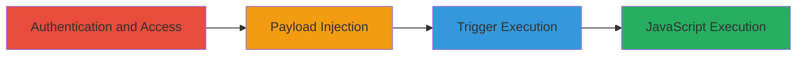

# Stored XSS in Concrete CMS User Groups Name Field Leading to JavaScript Execution

Multi-stage attack chain demonstrating a complete attack workflow exploiting a stored XSS vulnerability in Concrete CMS 8.2.0 RC2.

## Chain Metrics Dashboard

| Metric | Value |
|--------|-------|
| Chain Status | Unverified |
| Total Steps | 7 |
| Execution Time | ~5 minutes |
| Skill Level | Intermediate |
| Complexity | Medium |
| Impact Level | Low |

## Attack Flow Visualization

## Prerequisites & Requirements

### Required Tools

- Web browser (e.g., Chrome with developer tools for payload testing)

### Target Environment

- Concrete CMS 8.2.0 RC2 running on PHP 5.6.30, Apache 2.4.25, MySQL 5.7.13
- Web platform accessible via HTTP/HTTPS
- No specific ports beyond standard web (80/443)

### Initial Access Requirements

- Valid credentials for a user with permissions to access and edit User Groups (e.g., admin or group manager role)
- Direct network access to the Concrete CMS instance
- No prior access needed beyond authentication

## Detailed Attack Procedures

### Step 1: Authenticate to Concrete CMS
procedure: [[procedures/Authenticate-and-Access-User-Groups-in-Concrete-CMS]]

**Objective**: Gain authenticated access to the User Groups management interface.

**Instructions**: Log in using valid credentials and navigate to the Members section to access User Groups.

**Expected Output**: Successful login and visibility of the User Groups list.

**Success Indicators**:
- Dashboard loads without errors
- User Groups menu item is accessible

### Step 2: Select or Create a Group
procedure: [[procedures/Authenticate-and-Access-User-Groups-in-Concrete-CMS]]

**Objective**: Locate an existing group for editing or create a new one to prepare for payload injection.

**Instructions**: From the User Groups screen, select an existing group or click to create a new one.

**Expected Output**: Group details page loads.

**Success Indicators**:
- Group selected or created successfully
- Edit option available

### Step 3: Initiate Group Editing
procedure: [[procedures/Authenticate-and-Access-User-Groups-in-Concrete-CMS]]

**Objective**: Open the edit interface for the target group.

**Instructions**: Click the dropdown menu on the group and select 'Edit Group'.

**Expected Output**: Edit form loads with current group details.

**Success Indicators**:
- Name field and other details editable
- Update button visible

### Step 4: Inject Malicious Payload
procedure: [[procedures/Inject-Stored-XSS-Payload-into-Group-Name]]

**Objective**: Insert a JavaScript payload into the Name field to store the XSS.

**Instructions**: In the Name field, enter the payload: `locals" onclick=alert('XSS!') "'>` and fill other fields as needed.

**Expected Output**: Payload entered without immediate errors.

**Success Indicators**:
- Payload visible in the input field
- No client-side validation blocks submission

### Step 5: Save the Changes
procedure: [[procedures/Inject-Stored-XSS-Payload-into-Group-Name]]

**Objective**: Persist the malicious payload in the database.

**Instructions**: Click the 'Update Group' button to submit the form.

**Expected Output**: Confirmation message that the group was updated.

**Success Indicators**:
- Group list refreshes with the modified name (payload may be partially displayed)
- No server-side errors

### Step 6: Perform Search for the Group
procedure: [[procedures/Trigger-XSS-Execution-via-Search-Results]]

**Objective**: Trigger the rendering of the unsanitized group name in search results.

**Instructions**: Return to the User Groups screen, enter 'locals' in the search field, and press Enter.

**Expected Output**: Search results display including the injected group.

**Success Indicators**:
- Search results load with the group listed
- Name field appears in the results (potentially escaped visually but not sanitized)

### Step 7: Click Search Result to Execute
procedure: [[procedures/Trigger-XSS-Execution-via-Search-Results]]

**Objective**: Execute the stored JavaScript by interacting with the rendered results.

**Instructions**: Click the link for the search result group.

**Expected Output**: Alert box pops up with 'XSS!' confirming execution.

**Success Indicators**:
- JavaScript alert triggers
- Browser console shows no blocking errors
- Potential for further payload like session theft if escalated

## Attack Chain Summary

### Key Achievements

1. Successful storage of XSS payload in group name without sanitization
2. Rendering of payload in admin search results leading to execution
3. Demonstration of arbitrary JavaScript execution in authenticated context, enabling session hijacking or data theft for internal users

## Technique & Tactic Coverage

### MITRE ATT&CK Techniques

- [[JavaScript]]

### MITRE ATT&CK Tactics

- [[Execution]]

---
*Last updated: 2023-10-01T12:00:00Z*
