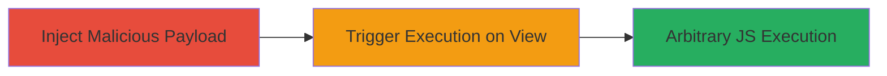

# Stored XSS in ContactNow Agent Status Leading to Arbitrary JavaScript Execution

Multi-stage attack chain demonstrating a complete attack workflow exploiting stored XSS in the user status field of the ContactNow application.

## Chain Metrics Dashboard

| Metric | Value |
|--------|-------|
| Chain Status | Unverified |
| Total Steps | 2 |
| Execution Time | ~5 minutes |
| Skill Level | Intermediate |
| Complexity | Low |
| Impact Level | High |

## Attack Flow Visualization

## Prerequisites & Requirements

### Required Tools

- Browser with developer tools (e.g., Chrome DevTools)

### Target Environment

- ContactNow web application
- Access to an authenticated user account within an organization
- No specific ports required; operates over standard HTTPS (port 443)

### Initial Access Requirements

- Valid user credentials for the ContactNow application
- Network access to the ContactNow web interface
- No prior elevated access needed; standard user privileges suffice

## Detailed Attack Procedures

### Step 1: Inject Malicious Payload into Status Field
procedure: [[procedures/Exploit-Stored-XSS-in-Agent-Status]]

**Objective**: Introduce a stored XSS payload into the agent status field that persists and executes when viewed by other users.

**Instructions**: Log in to the ContactNow application as an authenticated user. Navigate to the user status setting functionality, typically found in the profile or dashboard section. Enter a malicious JavaScript payload in the status input field, such as ``, and save the changes. This payload is not encoded and will be stored server-side.

**Expected Output**: The status is updated successfully without errors, and the payload is saved for display to other organization users.

**Success Indicators**:
- Status update confirmation message appears
- Payload is reflected in your own status view without immediate execution (due to context)

### Step 2: Trigger Execution by Viewing Status
procedure: [[procedures/Exploit-Stored-XSS-in-Agent-Status]]

**Objective**: Cause the injected payload to execute in the browser context of another user within the same organization, leading to arbitrary JavaScript execution.

**Instructions**: Have another organization user (or simulate by logging in as a different user) navigate to a view that displays user statuses, such as the organization dashboard or user list. Upon viewing the affected status, the unencoded payload executes automatically in the viewer's browser.

**Expected Output**: JavaScript alert or other payload effects (e.g., document.cookie access) trigger in the viewer's browser console or UI.

**Success Indicators**:
- Alert box or console log appears in the victim's browser
- Potential for further actions like session cookie theft via payload modification (e.g., ``)

## Attack Chain Summary

### Key Achievements

1. Successful injection of persistent XSS payload into shared user status
2. Arbitrary JavaScript execution in victim browsers, enabling session hijacking or data theft
3. Demonstration of intra-organization impact without direct access to victims

## Technique & Tactic Coverage

### MITRE ATT&CK Techniques

- [[JavaScript]]

### MITRE ATT&CK Tactics

- [[Execution]]

---
*Last updated: 2023-10-01T00:00:00Z*
