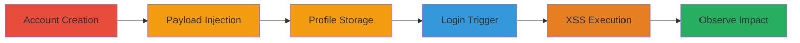

---
tags:
  - xss
  - stored-xss
  - coursera
  - web-vulnerability
type: attack_chain
tools: []
tactics:
  - '[[Execution]]'
verified: false
platforms:
  - Web
submitted: true
complexity: low
created_at: '2023-10-01T00:00:00Z'
procedures:
  - '[[procedures/Exploit-Stored-XSS-in-Coursera-Registration]]'
step_count: 6
techniques:
  - '[[JavaScript]]'
updated_at: '2025-12-13T23:52:24.901Z'
description: >-
  A multi-step attack exploiting a stored XSS vulnerability in the Coursera user
  registration process by injecting malicious JavaScript into the first name
  field, leading to execution in the attacker's own session upon login.
skill_level: beginner
impact_level: medium
id: a911fe82-6026-4a2d-ae35-16f46a0af8f9
validated: true
mitre_tactics:
  - '[[Execution]]'
mitre_techniques:
  - '[[JavaScript]]'
---
# Stored XSS in Coursera User Registration First Name Field

Multi-stage attack chain demonstrating a complete attack workflow exploiting a stored XSS vulnerability in Coursera's user registration first name field. The payload is stored in the user's profile and executes JavaScript in the context of the user's session when viewing the login or profile page, though it only affects the user themselves as the data is not displayed to others.

## Chain Metrics Dashboard

| Metric | Value |
|--------|-------|
| Chain Status | Unverified |
| Total Steps | 6 |
| Execution Time | ~5 minutes |
| Skill Level | Beginner |
| Complexity | Low |
| Impact Level | Medium |

## Attack Flow Visualization

## Prerequisites & Requirements

### Required Tools

- Web browser (e.g., Chrome, Firefox)

### Target Environment

- Coursera web application
- No specific services or ports required beyond standard HTTPS (443)
- Internet access to coursera.org

### Initial Access Requirements

- No prior credentials needed
- Public access to the registration page
- No network position restrictions

## Detailed Attack Procedures

### Step 1: Create an Account
procedure: [[procedures/Exploit-Stored-XSS-in-Coursera-Registration]]

**Objective**: Register a new user account to access the vulnerable registration form.

**Instructions**: Navigate to the Coursera registration page at https://www.coursera.org/signup and fill in basic details like email and password, leaving the first name field for the next step.

**Expected Output**: Successful account creation prompt or email verification.

**Success Indicators**:
- Account registered successfully
- Redirect to login or profile setup

### Step 2: Inject the XSS Payload
procedure: [[procedures/Exploit-Stored-XSS-in-Coursera-Registration]]

**Objective**: Insert a malicious JavaScript payload into the first name field to store it in the user's profile.

**Instructions**: In the first name input field during registration, enter the payload: ``. Complete the form submission.

**Expected Output**: Form submits without errors, storing the payload.

**Success Indicators**:
- No validation errors on payload entry
- Account details saved

### Step 3: Save the Account Details
procedure: [[procedures/Exploit-Stored-XSS-in-Coursera-Registration]]

**Objective**: Submit the registration to persist the injected payload in the backend.

**Instructions**: Click the submit button on the registration form to finalize account creation.

**Expected Output**: Confirmation of account creation, possibly with a welcome email.

**Success Indicators**:
- Account created and payload stored
- Ability to proceed to login

### Step 4: Navigate to the Login Page
procedure: [[procedures/Exploit-Stored-XSS-in-Coursera-Registration]]

**Objective**: Access the login endpoint to prepare for triggering the stored payload.

**Instructions**: After registration, go to https://www.coursera.org/login or the profile page where the first name is displayed.

**Expected Output**: Login page loads.

**Success Indicators**:
- Login page accessible
- No immediate errors

### Step 5: Attempt Login
procedure: [[procedures/Exploit-Stored-XSS-in-Coursera-Registration]]

**Objective**: Log in with the created account to trigger the display and execution of the stored first name payload.

**Instructions**: Enter the registered email and password, then submit the login form.

**Expected Output**: Upon submission, the page renders the profile or welcome message, executing the XSS.

**Success Indicators**:
- Login successful
- Payload triggers during rendering

### Step 6: Observe XSS Execution
procedure: [[procedures/Exploit-Stored-XSS-in-Coursera-Registration]]

**Objective**: Verify the arbitrary JavaScript execution in the user's session.

**Instructions**: After login, observe the page for the prompt dialog box displaying '1337' from the onerror handler.

**Expected Output**: A JavaScript alert or prompt pops up with the number 1337.

**Success Indicators**:
- Prompt executed
- Confirmation of JavaScript injection success

## Attack Chain Summary

### Key Achievements

1. Successful injection and storage of XSS payload in user profile
2. Triggering of payload execution upon login without affecting other users
3. Demonstration of potential for session-based impacts like data theft in self-context

## Technique & Tactic Coverage

### MITRE ATT&CK Techniques

- [[JavaScript]]

### MITRE ATT&CK Tactics

- [[Execution]]

---
*Last updated: 2023-10-01T00:00:00Z*
