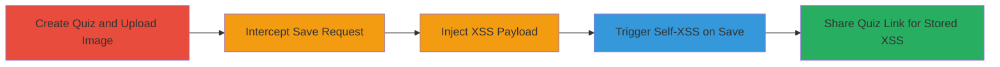

# Stored XSS in Crowdsignal Quiz Photo Upload via Media Code Injection

Multi-stage attack chain demonstrating exploitation of a stored XSS vulnerability in the Photo Insert App on Crowdsignal during quiz creation, allowing arbitrary JavaScript execution for the quiz creator (self-XSS) and any users viewing the shared quiz.

## Chain Metrics Dashboard

| Metric | Value |
|--------|-------|
| Chain Status | Unverified |
| Total Steps | 4 |
| Execution Time | ~5 minutes |
| Skill Level | Intermediate |
| Complexity | Medium |
| Impact Level | High |

## Attack Flow Visualization

## Prerequisites & Requirements

### Required Tools

- [[tools/Burp-Suite]]

### Target Environment

- Web platform
- Access to https://app.crowdsignal.com/dashboard
- Authenticated user account on Crowdsignal

### Initial Access Requirements

- Valid Crowdsignal account credentials
- Network access to intercept HTTP traffic (local proxy setup)
- No prior access needed beyond login

## Detailed Attack Procedures

### Step 1: Create Quiz and Upload Image
procedure: [[procedures/Create-Crowdsignal-Quiz-and-Upload-Image]]

**Objective**: Set up the quiz environment and prepare for payload injection by adding a multiple-choice element and uploading an image.

**Instructions**: Log in to the Crowdsignal dashboard, create a new quiz, add a multiple-choice question, and upload an image to trigger the media_code parameter in the save request.

**Expected Output**: Quiz editor opens with the uploaded image displayed, ready for the save action.

**Success Indicators**:
- New quiz created successfully
- Image upload completes without errors

### Step 2: Intercept and Inject XSS Payload with Burp Suite
procedure: [[procedures/Intercept-and-Inject-XSS-Payload-with-Burp-Suite]]

**Objective**: Capture the save request and modify the media_code parameter to inject a malicious JavaScript payload.

**Instructions**: Configure Burp Suite as a proxy, click the Save button in the quiz editor, intercept the request, locate the media_code parameter (initially containing the photo ID), replace its value with the payload `"><svg/onload=alert(document.domain)>`, and forward the request.

**Expected Output**: Modified request forwarded, quiz saves with the injected payload.

**Success Indicators**:
- Request intercepted and modified successfully
- No server-side rejection of the payload

### Step 3: Trigger Self-XSS on Save
procedure: [[procedures/Trigger-Self-XSS-on-Save]]

**Objective**: Observe immediate JavaScript execution upon saving the quiz, confirming self-XSS for the creator.

**Instructions**: After forwarding the modified request, view the quiz editor to see the alert popup executing the payload.

**Expected Output**: Alert box displays the document domain, indicating successful self-XSS.

**Success Indicators**:
- JavaScript alert triggers on save
- Payload executes in the creator's browser

### Step 4: Trigger Stored XSS via Quiz Share Link
procedure: [[procedures/Trigger-Stored-XSS-via-Quiz-Share-Link]]

**Objective**: Share the quiz link and verify stored XSS execution for any viewer, enabling potential data theft or actions on behalf of victims.

**Instructions**: Copy the generated quiz link after saving, open it in a new tab or share with another user, and observe the payload execution.

**Expected Output**: Alert triggers in the viewer's browser upon accessing the quiz.

**Success Indicators**:
- Quiz link generates successfully
- Payload executes for non-creator users

## Attack Chain Summary

### Key Achievements

1. Successful injection of XSS payload via unsanitized media_code parameter
2. Immediate self-XSS execution for the quiz creator
3. Persistent stored XSS affecting all quiz viewers, enabling session hijacking or data exfiltration
4. Demonstration of impact through alert on document domain

## Technique & Tactic Coverage

### MITRE ATT&CK Techniques

- [[JavaScript]]
- [[Exploit Public-Facing Application]]

### MITRE ATT&CK Tactics

- [[Execution]]
- [[Collection]]

---

*Last updated: 2023-10-01T00:00:00Z*
