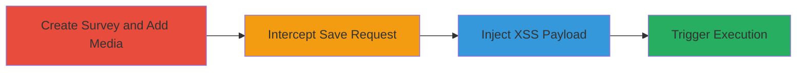

# Stored XSS in Crowdsignal Survey Media Embedding for Cookie Theft

Multi-stage attack chain demonstrating exploitation of a stored XSS vulnerability in Crowdsignal's survey feature to inject and execute malicious JavaScript, enabling cookie theft in shared team environments.

## Chain Metrics Dashboard

| Metric | Value |
|--------|-------|
| Chain Status | Unverified |
| Total Steps | 4 |
| Execution Time | ~10 minutes |
| Skill Level | Intermediate |
| Complexity | Medium |
| Impact Level | High |

## Attack Flow Visualization

## Prerequisites & Requirements

### Required Tools

- [[tools/Burp-Suite]]

### Target Environment

- Web platform
- Crowdsignal service at app.crowdsignal.com
- Valid user account with survey creation privileges (team plan for maximum impact)

### Initial Access Requirements

- Authenticated session to Crowdsignal dashboard
- Browser configured to proxy traffic through Burp Suite
- No special network access beyond internet connectivity

## Detailed Attack Procedures

### Step 1: Create Survey and Add Media
procedure: [[procedures/Create-Survey-and-Add-Media-in-Crowdsignal]]

**Objective**: Set up a survey question with embedded media to prepare for payload injection during the save process.

**Instructions**: Log in to the Crowdsignal dashboard, create a new survey, add a multiple-choice question, and embed a benign media shortcode to trigger the save request.

**Expected Output**: Survey question editor with media insertion ready, save button available.

**Success Indicators**:
- New survey created successfully
- Question added with media embed option visible

### Step 2: Intercept Save Request
procedure: [[procedures/Intercept-Save-Request-with-Burp-Suite]]

**Objective**: Capture the HTTP POST request sent when saving the survey question to allow modification.

**Instructions**: With Burp Suite proxy active, click the save button in the question editor to intercept the request in Burp's Proxy or Repeater tab.

**Expected Output**: Intercepted POST request to /quizzes/{survey-id}/question endpoint visible in Burp.

**Success Indicators**:
- Request captured without errors
- Media parameters present in request body

### Step 3: Inject XSS Payload
procedure: [[procedures/Inject-XSS-Payload-in-Media-Parameter]]

**Objective**: Modify the media shortcode parameter to include a malicious XSS payload that evades sanitization.

**Instructions**: In Burp Suite, edit the media parameter (e.g., media[11111111]) to append JavaScript execution, then forward the request.

**Expected Output**: Modified request sent to server, survey saved without immediate errors.

**Success Indicators**:
- Request forwarded successfully
- No server-side rejection of payload

### Step 4: Trigger and Verify Stored XSS Execution
procedure: [[procedures/Trigger-and-Verify-Stored-XSS-Execution]]

**Objective**: Refresh the page to load the stored payload and confirm JavaScript execution for cookie theft.

**Instructions**: Reload the survey question page and observe the alert or payload execution; extend to steal cookies via additional JS.

**Expected Output**: JavaScript alert (e.g., prompt(document.domain)) or cookie exfiltration on page load.

**Success Indicators**:
- Alert box appears on refresh
- In team plans, payload executes for invited users viewing the dashboard

## Attack Chain Summary

### Key Achievements

1. Successful injection of stored XSS via unsanitized media shortcodes
2. Arbitrary JavaScript execution on page refresh
3. Potential for session hijacking through cookie theft in shared environments

## Technique & Tactic Coverage

### MITRE ATT&CK Techniques

- [[JavaScript]]
- [[Drive-by Compromise]]

### MITRE ATT&CK Tactics

- [[Execution]]
- [[Collection]]

---

*Last updated: 2024-09-18T00:00:00Z*
