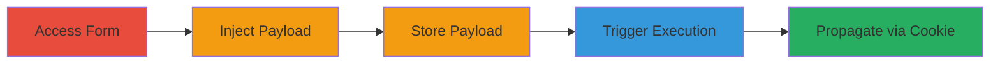

---
tags:
  - xss
  - stored-xss
  - javascript
  - cookie-theft
  - web
type: attack_chain
tools: []
tactics:
  - '[[Execution]]'
  - '[[Collection]]'
verified: false
platforms:
  - Web
submitted: true
complexity: medium
created_at: '2023-10-01T00:00:00Z'
procedures:
  - '[[procedures/Access-Direct-Debit-Mandate-Form]]'
  - '[[procedures/Inject-XSS-Payload-into-Owners-Name]]'
  - '[[procedures/Submit-Form-to-Store-Payload]]'
  - '[[procedures/Observe-XSS-Execution-on-Affected-Pages]]'
  - '[[procedures/Trigger-Suspend-to-Set-Malicious-Cookie]]'
step_count: 5
techniques:
  - '[[JavaScript]]'
updated_at: '2025-12-14T03:15:35.844Z'
description: >-
  A multi-step attack exploiting a stored XSS vulnerability in the direct debit
  owner's name field on Mobile Vikings website, allowing JavaScript execution on
  user-facing pages and propagation via signed cookies.
skill_level: intermediate
impact_level: high
id: 3a7611ae-77a3-49ce-adfe-b2c222536a60
validated: true
mitre_tactics:
  - '[[Execution]]'
  - '[[Collection]]'
mitre_techniques:
  - '[[JavaScript]]'
---
# Stored XSS in Direct Debit Owner's Name Leading to Cookie Theft and Propagation

Multi-stage attack chain demonstrating a complete attack workflow exploiting insufficient input sanitization in the direct debit owner's name field on the Mobile Vikings website. The payload is stored and reflected on multiple user-facing pages, enabling arbitrary JavaScript execution for cookie theft and potential further exploitation via signed cookies set during actions like suspending a mandate.

## Chain Metrics Dashboard

| Metric | Value |
|--------|-------|
| Chain Status | Unverified |
| Total Steps | 5 |
| Execution Time | ~5 minutes |
| Skill Level | Intermediate |
| Complexity | Medium |
| Impact Level | High |

## Attack Flow Visualization

## Prerequisites & Requirements

### Required Tools

- Web browser (e.g., Chrome with developer tools)

### Target Environment

- Web platform
- Access to authenticated Mobile Vikings account
- No specific ports or services beyond standard HTTPS (443)

### Initial Access Requirements

- Valid user credentials for Mobile Vikings account
- Network access to https://mobilevikings.be
- No prior access needed beyond login

## Detailed Attack Procedures

### Step 1: Access the Direct Debit Form
procedure: [[procedures/Access-Direct-Debit-Mandate-Form]]

**Objective**: Navigate to the form for creating or editing a direct debit mandate to prepare for payload injection.

**Instructions**: Log in to the Mobile Vikings account and navigate to the relevant page, such as https://mobilevikings.be/en/account/easypay/correct-direct-debit-mandate/111366/.

**Expected Output**: The direct debit mandate form is loaded, displaying fields including the owner's name.

**Success Indicators**:
- Form fields are editable
- URL matches the mandate edit or create endpoint

### Step 2: Inject Payload into Owner's Name Field
procedure: [[procedures/Inject-XSS-Payload-into-Owners-Name]]

**Objective**: Insert a JavaScript payload into the owner's name field to exploit the lack of sanitization.

**Instructions**: In the owner's name field, enter the payload: `asdf'>`.

**Expected Output**: The payload is accepted in the field without immediate error or sanitization.

**Success Indicators**:
- Payload text appears in the field
- No validation errors on input

### Step 3: Submit Form to Store Payload
procedure: [[procedures/Submit-Form-to-Store-Payload]]

**Objective**: Save the form to store the unsanitized payload in the backend.

**Instructions**: Submit the form by clicking the save or update button.

**Expected Output**: Confirmation of successful update, with the payload now stored in the mandate data.

**Success Indicators**:
- Form submission succeeds
- No errors related to the name field

### Step 4: Observe XSS Execution on Affected Pages
procedure: [[procedures/Observe-XSS-Execution-on-Affected-Pages]]

**Objective**: View pages where the stored payload is reflected, triggering JavaScript execution.

**Instructions**: Navigate to affected pages such as https://mobilevikings.be/en/account/easypay/, https://mobilevikings.be/en/account/easypay/history/111366/, https://mobilevikings.be/en/account/easypay/auto-sms-topup/?req_subscription=1030418, or https://mobilevikings.be/en/sims/settings/?req_subscription=1030418.

**Expected Output**: Alert box pops up displaying document.cookie, confirming XSS execution.

**Success Indicators**:
- JavaScript alert executes
- Potential for cookie theft if payload is modified (e.g., to exfiltrate to attacker server)

### Step 5: Trigger Suspend to Set Malicious Cookie
procedure: [[procedures/Trigger-Suspend-to-Set-Malicious-Cookie]]

**Objective**: Perform an action like suspending the mandate to set a signed cookie containing the payload for further propagation.

**Instructions**: Click the suspend link, e.g., https://mobilevikings.be/en/account/easypay/287740/suspend/.

**Expected Output**: A Set-Cookie header is set with the payload embedded, e.g., `Set-Cookie: messages="e052df5f3af892c7a61d74d0d9a6ab14c7f1631c$[[\"__json_message\",0,25,\"Successfully suspended asdf'\"> BE61310126985517\"]]"); Path=/`.

**Success Indicators**:
- Cookie is set with the injected payload
- Payload could enable exploitation in other contexts like subdomain XSS or CRLF injection

## Attack Chain Summary

### Key Achievements

1. Successful storage of XSS payload in owner's name field
2. Arbitrary JavaScript execution on multiple account pages, enabling session hijacking
3. Propagation of payload via signed cookie during mandate suspension, increasing attack surface

## Technique & Tactic Coverage

### MITRE ATT&CK Techniques

- [[JavaScript]]

### MITRE ATT&CK Tactics

- [[Execution]]
- [[Collection]]

---
*Last updated: 2023-10-01T00:00:00Z*
