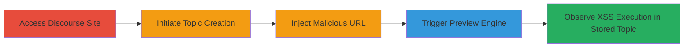

# Stored XSS in Discourse via Malicious Bandcamp Preview URL

Multi-stage attack chain demonstrating a complete attack workflow exploiting improper URL matching and OpenGraph metadata sanitization in Discourse's Bandcamp preview engine.

## Chain Metrics Dashboard

| Metric | Value |
|--------|-------|
| Chain Status | Unverified |
| Total Steps | 5 |
| Execution Time | ~2 minutes |
| Skill Level | Intermediate |
| Complexity | Medium |
| Impact Level | High |

## Attack Flow Visualization

## Prerequisites & Requirements

### Required Tools

- Web browser (e.g., Chrome, Firefox)

### Target Environment

- Discourse forum instance (Ruby on Rails-based)
- Public access to topic creation (no authentication required for demo sites like try.discourse.org)
- Attacker-controlled server hosting malicious OpenGraph metadata

### Initial Access Requirements

- Internet access to the target Discourse site
- Control over a server to host the fake Bandcamp page with XSS payload in OpenGraph tags
- No prior credentials needed for public forums

## Detailed Attack Procedures

### Step 1: Access Discourse Site
procedure: [[procedures/Access-Discourse-Topic-Creation]]

**Objective**: Navigate to the target Discourse instance to begin the attack surface exploration.

**Instructions**: Open a web browser and load the Discourse demo or target site.

**Expected Output**: The homepage of the Discourse forum loads successfully.

**Success Indicators**:
- Site accessible without errors
- 'New topic' button visible

### Step 2: Initiate Topic Creation
procedure: [[procedures/Access-Discourse-Topic-Creation]]

**Objective**: Open the composer interface to prepare for payload injection.

**Instructions**: Click the 'New topic' button to enter the topic creation form.

**Expected Output**: The composer window opens with title and body fields.

**Success Indicators**:
- Title field placeholder 'Type title or paste a link here' appears
- No authentication prompts

### Step 3: Inject Malicious URL
procedure: [[procedures/Inject-Malicious-Bandcamp-URL]]

**Objective**: Craft and paste a URL that evades the Bandcamp regex matcher while pointing to an attacker-controlled server.

**Instructions**: In the title field, paste a URL like `https://89.223.28.48/bandcamp.com/album/index.html?XSSa2`, where the IP address hosts a page with malicious OpenGraph metadata containing JavaScript (e.g., `<meta property="og:title" content="">`).

**Expected Output**: The URL is accepted in the title field without validation errors.

**Success Indicators**:
- URL pasted successfully
- No immediate rejection by the form

### Step 4: Trigger Preview Engine
procedure: [[procedures/Trigger-Preview-and-Observe-XSS]]

**Objective**: Activate the preview mechanism to fetch and render the malicious OpenGraph data.

**Instructions**: Allow the composer to auto-trigger the preview by waiting or interacting with the form; the engine fetches metadata from the injected URL.

**Expected Output**: Preview pane shows rendered content with injected JavaScript executing.

**Success Indicators**:
- Alert or JavaScript payload fires in the preview
- DOM inspection reveals unsanitized OpenGraph injection

### Step 5: Save and Verify Stored XSS
procedure: [[procedures/Trigger-Preview-and-Observe-XSS]]

**Objective**: Save the topic to persist the XSS for all viewers.

**Instructions**: Complete the topic (add body if needed) and click 'Create Topic'; view the saved post to confirm XSS execution.

**Expected Output**: Topic saves, and viewing it triggers the JavaScript payload for any user.

**Success Indicators**:
- Topic visible at a URL like https://try.discourse.org/t/tha-last-topic-to-test/581
- Payload executes on load

## Attack Chain Summary

### Key Achievements

1. Evaded Bandcamp URL regex using IP-based path mimicking the domain structure
2. Injected and executed arbitrary JavaScript via unsanitized OpenGraph metadata
3. Achieved stored XSS impacting all topic viewers, enabling session hijacking or defacement

## Technique & Tactic Coverage

### MITRE ATT&CK Techniques

- [[Exploit Public-Facing Application]] Exploit Public-Facing Application
- [[JavaScript]] JavaScript

### MITRE ATT&CK Tactics

- [[Initial Access]] Initial Access
- [[Execution]] Execution

---
*Last updated: 2023-10-01T00:00:00Z*
