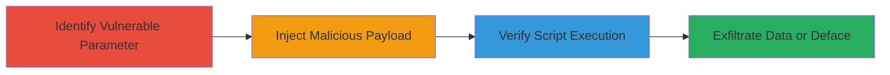

---
tags:
  - xss
  - stored-xss
  - web-vulnerability
  - script-injection
  - cookie-theft
type: attack_chain
tools: []
tactics:
  - '[[Execution]]'
  - '[[Collection]]'
verified: false
platforms:
  - Web
submitted: true
complexity: medium
created_at: '2023-10-01T00:00:00Z'
procedures:
  - '[[procedures/Identify-Vulnerable-Input-Parameter]]'
  - '[[procedures/Inject-Stored-XSS-Payload]]'
  - '[[procedures/Verify-XSS-Payload-Execution]]'
step_count: 3
techniques:
  - '[[JavaScript]]'
updated_at: '2025-12-14T03:16:25.811Z'
description: >-
  A multi-step attack exploiting a stored XSS vulnerability in a U.S. Department
  of Defense web application to inject and execute malicious JavaScript,
  enabling session hijacking and data exfiltration.
skill_level: intermediate
impact_level: high
id: 47203c5a-5026-42db-b994-e7e17ffde76a
validated: true
mitre_tactics:
  - '[[Execution]]'
  - '[[Collection]]'
mitre_techniques:
  - '[[JavaScript]]'
---
# Stored XSS in DoD Application Parameter for Script Execution and Cookie Theft

Multi-stage attack chain demonstrating exploitation of a stored cross-site scripting (XSS) vulnerability in a U.S. Department of Defense web application. The attack involves identifying a vulnerable input parameter, injecting a malicious payload, and verifying execution to enable impacts like cookie stealing, unauthorized requests, malware prompts, and defacement.

## Chain Metrics Dashboard

| Metric | Value |
|--------|-------|
| Chain Status | Unverified |
| Total Steps | 3 |
| Execution Time | ~5 minutes |
| Skill Level | Intermediate |
| Complexity | Medium |
| Impact Level | High |

## Attack Flow Visualization

## Prerequisites & Requirements

### Required Tools

- Web browser or proxy tool like Burp Suite for testing inputs

### Target Environment

- Web application on https://██████████ (DoD platform)
- Access to input forms or search fields
- No special ports or services required beyond standard HTTP/HTTPS

### Initial Access Requirements

- Public or authenticated access to the application
- Ability to submit and view stored data
- No prior credentials needed for initial injection

## Detailed Attack Procedures

### Step 1: Identify Vulnerable Input Parameter
procedure: [[procedures/Identify-Vulnerable-Input-Parameter]]

**Objective**: Locate unsanitized input parameters in the application that allow storage of malicious scripts.

**Instructions**: Review the application's input fields, such as search or form parameters (e.g., q_13779). Test for lack of sanitization by submitting simple payloads like '' and checking if they are reflected or stored without encoding. Reference related reports (e.g., #1636345) for known vulnerable parameters.

**Expected Output**: Confirmation that input like q_13779 accepts and stores raw input without sanitization.

**Success Indicators**:
- Input is stored and retrievable without HTML escaping
- No error on submission of special characters

### Step 2: Inject Malicious Payload
procedure: [[procedures/Inject-Stored-XSS-Payload]]

**Objective**: Submit a URL-encoded JavaScript payload into the vulnerable parameter to store executable code.

**Instructions**: Use a tool like a browser or curl to submit the payload '%22%27%3e%3csvg%2fonload%3dconfirm(666)%3e' (decodes to '"'><svg onload=confirm(666)>') into parameter q_13779 via the application's form or API endpoint.

**Expected Output**: Payload successfully stored in the application's database or backend without modification.

**Success Indicators**:
- Submission succeeds without validation errors
- Payload appears in stored data when retrieved

### Step 3: Verify Payload Execution
procedure: [[procedures/Verify-XSS-Payload-Execution]]

**Objective**: Confirm that the stored payload executes JavaScript in the browser of any user viewing the content.

**Instructions**: Access the page or view where the stored data is rendered. Observe if the payload triggers a confirm dialog displaying '666'. In a real attack, replace confirm(666) with code to steal cookies (e.g., document.cookie) or send requests.

**Expected Output**: JavaScript execution, such as a popup dialog or network request from the victim's browser.

**Success Indicators**:
- Confirm dialog appears on render
- Browser console shows script execution (video POC can confirm)

## Attack Chain Summary

### Key Achievements

1. Identified and exploited unsanitized input in q_13779 for stored XSS
2. Injected SVG-based JavaScript payload that evades basic filters
3. Demonstrated execution leading to potential session hijacking and defacement

## Technique & Tactic Coverage

### MITRE ATT&CK Techniques

- [[JavaScript]]

### MITRE ATT&CK Tactics

- [[Execution]]
- [[Collection]]

---
*Last updated: 2023-10-01T00:00:00Z*
