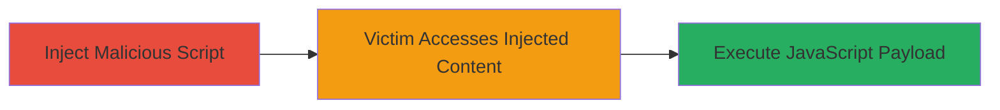

# Stored XSS in DoD Application for Cookie Theft and Defacement

Multi-stage attack chain demonstrating a complete attack workflow.

## Chain Metrics Dashboard

| Metric | Value |
|--------|-------|
| Chain Status | Unverified |
| Total Steps | 1 |
| Execution Time | ~5 minutes |
| Skill Level | Intermediate |
| Complexity | Low |
| Impact Level | High |

## Attack Flow Visualization

## Prerequisites & Requirements

### Required Tools

- Web browser with developer tools

### Target Environment

- Web application at https://█████████
- Vulnerable input field allowing stored data without sanitization

### Initial Access Requirements

- Authorized or public access to the DoD application
- Ability to submit user input (e.g., comments, forms)
- No special credentials required for injection if publicly accessible

## Detailed Attack Procedures

### Step 1: Exploit Stored XSS
procedure: [[procedures/Exploit-Stored-XSS-for-Cookie-Theft]]

**Objective**: Inject a malicious JavaScript payload into the application to execute arbitrary code when viewed by victims, leading to cookie theft, unauthorized requests, malware prompts, or defacement.

**Instructions**: Identify the vulnerable parameter (referenced in related report #1636345), craft a payload such as a script to steal cookies, and submit it via the application's input form. Verify execution by accessing the stored content.

**Expected Output**: Alert or network request confirming payload execution; stolen cookies sent to attacker-controlled server.

**Success Indicators**:
- Payload executes without errors (e.g., alert pops up)
- Cookies or session data exfiltrated
- Site defacement visible to users

## Attack Chain Summary

### Key Achievements

1. Successful injection of stored XSS payload in DoD application
2. Potential for unauthorized access via cookie theft
3. Ability to prompt trusted malware downloads or deface the site

## Technique & Tactic Coverage

### MITRE ATT&CK Techniques

- [[JavaScript]]

### MITRE ATT&CK Tactics

- [[Execution]]
- [[Collection]]

---
*Last updated: 2023-10-01T12:00:00Z*
