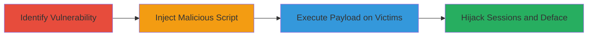

# Stored XSS in DoD Application for Session Hijacking and Defacement

Multi-stage attack chain demonstrating a complete attack workflow exploiting a stored XSS vulnerability in a U.S. Department of Defense web application.

## Chain Metrics Dashboard

| Metric | Value |
|--------|-------|
| Chain Status | Unverified |
| Total Steps | 1 |
| Execution Time | ~5 minutes |
| Skill Level | Intermediate |
| Complexity | Medium |
| Impact Level | High |

## Attack Flow Visualization

## Prerequisites & Requirements

### Required Tools

- Browser developer tools for script injection
- JavaScript payload generator (e.g., manual crafting)

### Target Environment

- Web platform
- Vulnerable DoD application at https://███
- User input fields that store and reflect content without sanitization

### Initial Access Requirements

- Access to the application (authenticated or public)
- Ability to submit input via forms or parameters
- No prior credentials needed beyond basic user access

## Detailed Attack Procedures

### Step 1: Identify and Exploit Stored XSS
procedure: [[procedures/Inject-and-Exploit-Stored-XSS]]

**Objective**: Discover the stored XSS vulnerability, inject a malicious JavaScript payload, and achieve persistence for victim execution leading to session hijacking and defacement.

**Instructions**: Begin by testing input fields in the DoD application for lack of sanitization. Use browser developer tools to craft and submit a payload like `` in a form field that stores data (e.g., comments or profiles). Verify persistence by accessing the page as another user or refreshing. Escalate by replacing the alert with a payload to steal cookies: ``. For defacement, inject ``. Monitor attacker server for exfiltrated data.

**Expected Output**: Script executes in victim's browser, alerting or redirecting; cookies sent to attacker; page defaced on load.

**Success Indicators**:
- Payload executes without errors in console
- Cookies or requests received on attacker endpoint
- Visual defacement observed on affected pages

## Attack Chain Summary

### Key Achievements

1. Persistent script injection bypassing input validation
2. Session hijacking via cookie theft enabling unauthorized access
3. Site defacement and potential malware distribution

## Technique & Tactic Coverage

### MITRE ATT&CK Techniques

- [[JavaScript]]

### MITRE ATT&CK Tactics

- [[Execution]]
- [[Collection]]

---
*Last updated: 2023-10-01T00:00:00Z*
