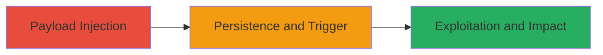

# Stored XSS in DoD Application for Session Hijacking and Site Defacement

Multi-stage attack chain demonstrating exploitation of a stored cross-site scripting vulnerability in a U.S. Department of Defense web application at https://███, allowing persistent injection of malicious JavaScript that executes in users' browsers, enabling session theft, unauthorized actions, and site manipulation.

## Chain Metrics Dashboard

| Metric | Value |
|--------|-------|
| Chain Status | Unverified |
| Total Steps | 3 |
| Execution Time | ~5 minutes |
| Skill Level | Intermediate |
| Complexity | Medium |
| Impact Level | High |

## Attack Flow Visualization

## Prerequisites & Requirements

### Required Tools

- Browser developer tools for payload crafting and testing
- Proxy tool like Burp Suite for intercepting and modifying requests

### Target Environment

- Web application platform
- Vulnerable input field or parameter (e.g., comment or form field) that stores unsanitized user input
- Access to the application for authenticated or unauthenticated injection

### Initial Access Requirements

- Valid user account or public access to the injection point
- Network access to https://███
- No prior privileges needed beyond basic user access

## Detailed Attack Procedures

### Step 1: Payload Injection
procedure: [[procedures/Inject-Stored-XSS-Payload]]

**Objective**: Inject a malicious JavaScript payload into the vulnerable stored input field to persist it in the application's database or storage.

**Instructions**: Identify the vulnerable parameter (referenced in report #1636345, likely a form input). Craft a basic payload like `` for testing, then escalate to malicious ones. Submit via the web form or API endpoint using browser or proxy.

**Expected Output**: Payload stored without sanitization; no immediate error on submission.

**Success Indicators**:
- Payload appears in the application's stored content (e.g., comments or posts)
- No server-side filtering detected

### Step 2: Trigger XSS Execution on View
procedure: [[procedures/Trigger-XSS-Execution-on-View]]

**Objective**: Cause the stored payload to execute in the browser of any user who views the affected page, leveraging the persistence of stored XSS.

**Instructions**: Navigate to the page displaying the injected content (e.g., a dashboard or public view). The script executes automatically upon page load in the victim's browser.

**Expected Output**: JavaScript runs client-side, such as an alert popup or network request to attacker-controlled server.

**Success Indicators**:
- Script execution confirmed via browser console or network tab
- Payload affects multiple users viewing the content

### Step 3: Exploit XSS for Session Hijacking and Defacement
procedure: [[procedures/Exploit-XSS-for-Session-Hijacking-and-Defacement]]

**Objective**: Use the executing script to steal session cookies, perform unauthorized actions, prompt malware downloads, or alter the page appearance.

**Instructions**: Replace alert with advanced payloads, e.g., for cookie theft: ``. For defacement: ``. Observe impacts like session replay on attacker site or site changes.

**Expected Output**: Cookies exfiltrated to attacker server; unauthorized requests sent; page visually altered or malware prompted.

**Success Indicators**:
- Attacker receives stolen cookies via webhook or log
- Victim's browser performs actions as if attacker-controlled
- Site defacement visible to all viewers

## Attack Chain Summary

### Key Achievements

1. Persistent injection of malicious JavaScript bypassing input validation
2. Execution in browsers of unsuspecting users, enabling broad impact
3. Achievement of high-impact goals like session theft and defacement without direct server access

## Technique & Tactic Coverage

### MITRE ATT&CK Techniques

- [[JavaScript]]
- [[Steal Web Session Cookie]]
- [[Endpoint Denial of Service]]

### MITRE ATT&CK Tactics

- [[Initial Access]]
- [[Execution]]
- [[Collection]]

---
*Last updated: 2023-10-01T00:00:00Z*
