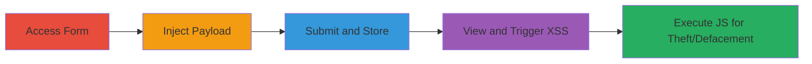

---
tags:
  - xss
  - stored-xss
  - javascript
  - web
  - coldfusion
  - dod
type: attack_chain
tools: []
tactics:
  - '[[Initial Access]]'
  - '[[Execution]]'
verified: false
platforms:
  - Web
submitted: true
complexity: low
created_at: '2023-10-01T00:00:00Z'
procedures:
  - '[[procedures/Access-DoD-Registration-Form]]'
  - '[[procedures/Inject-XSS-Payload-into-Form]]'
  - '[[procedures/Submit-Form-to-Store-Payload]]'
  - '[[procedures/Trigger-Stored-XSS-on-View]]'
step_count: 4
techniques:
  - '[[Exploit Public-Facing Application]]'
  - '[[JavaScript]]'
updated_at: '2025-12-14T03:15:53.544Z'
description: >-
  A multi-step attack exploiting a stored XSS vulnerability in the U.S.
  Department of Defense student registration update form, allowing injection of
  malicious JavaScript that executes when victims view the stored data, enabling
  cookie theft, arbitrary requests, malware prompts, and defacement.
skill_level: intermediate
impact_level: high
id: c1185cba-ee3e-44b3-a2b5-f63d5c187f8f
validated: true
mitre_tactics:
  - '[[Initial Access]]'
  - '[[Execution]]'
mitre_techniques:
  - '[[Exploit Public-Facing Application]]'
  - '[[JavaScript]]'
---
# Stored XSS in DoD Registration Form for JavaScript Execution and Data Theft

Multi-stage attack chain demonstrating exploitation of a stored cross-site scripting vulnerability in a U.S. Department of Defense web application, specifically the 'Registration Update NON-CAC Students' form built on ColdFusion.

## Chain Metrics Dashboard

| Metric | Value |
|--------|-------|
| Chain Status | Unverified |
| Total Steps | 4 |
| Execution Time | ~5 minutes |
| Skill Level | Intermediate |
| Complexity | Low |
| Impact Level | High |

## Attack Flow Visualization

## Prerequisites & Requirements

### Required Tools

- Web browser (e.g., Chrome, Firefox)
- No specialized tools required; manual injection via form.

### Target Environment

- Web platform running ColdFusion
- Publicly accessible DoD application at https://█████████/forms/gen_cf/inq_app_exec_screen.cfm
- No specific ports or services beyond standard HTTPS (443).

### Initial Access Requirements

- No credentials required for initial form access (public-facing).
- Network access to the internet and the target URL.
- No prior access needed.

## Detailed Attack Procedures

### Step 1: Access the Registration Update Form
procedure: [[procedures/Access-DoD-Registration-Form]]

**Objective**: Navigate to the vulnerable form to prepare for payload injection.

**Instructions**: Open a web browser and directly access the target URL for the 'Registration Update NON-CAC Students' form.

**Expected Output**: The form loads, displaying fields including the additional information section with parameter q_13774.

**Success Indicators**:
- Form page renders without errors.
- Additional information field is visible and editable.

### Step 2: Inject Payload into the Additional Information Section
procedure: [[procedures/Inject-XSS-Payload-into-Form]]

**Objective**: Insert the malicious XSS payload into the vulnerable form parameter to enable storage and later execution.

**Instructions**: In the additional information section, locate the q_13774 parameter (noted initially as q_13794 but corrected) and enter the URL-encoded payload `%22%27%3e%3csvg%2fonload%3dconfirm(666)%3e`, which decodes to "'><svg onload=confirm(666)>". This payload uses an SVG element with an onload handler to execute JavaScript.

**Expected Output**: Payload entered into the form field without immediate execution or validation errors.

**Success Indicators**:
- Payload is accepted in the field.
- No client-side sanitization blocks the input.

### Step 3: Submit the Form to Store the Payload
procedure: [[procedures/Submit-Form-to-Store-Payload]]

**Objective**: Submit the form data to the server, storing the unsanitized payload for persistence.

**Instructions**: Complete any required fields if necessary and submit the form via the standard submission mechanism.

**Expected Output**: Form submits successfully, and the data (including payload) is stored in the backend without sanitization.

**Success Indicators**:
- Submission confirmation or redirect to success page.
- No server-side errors rejecting the payload.

### Step 4: View the Stored Data to Trigger XSS
procedure: [[procedures/Trigger-Stored-XSS-on-View]]

**Objective**: Access the page displaying the stored data to execute the injected JavaScript in the victim's browser context.

**Instructions**: As a victim (or attacker simulating), navigate back to the form or related view that renders the stored additional information. The payload executes automatically upon rendering.

**Expected Output**: JavaScript alert with confirm(666) pops up, demonstrating execution. In a real attack, this could be replaced with code for cookie theft (e.g., via document.cookie) or other malicious actions.

**Success Indicators**:
- JavaScript executes (e.g., alert dialog appears).
- Browser console shows no blocking; impacts like defacement or requests occur.

## Attack Chain Summary

### Key Achievements

1. Successful injection and storage of XSS payload in a government application.
2. Triggering of JavaScript execution leading to potential session hijacking via cookie theft.
3. Demonstration of broader impacts including arbitrary victim requests, trusted malware downloads, and site defacement.

## Technique & Tactic Coverage

### MITRE ATT&CK Techniques

- [[Exploit Public-Facing Application]] Exploit Public-Facing Application
- [[JavaScript]] JavaScript

### MITRE ATT&CK Tactics

- [[Initial Access]] Initial Access
- [[Execution]] Execution

---
*Last updated: 2023-10-01T00:00:00Z*
