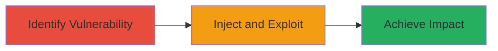

---
tags:
  - xss
  - stored-xss
  - web
  - defense
  - cookie-theft
  - defacement
type: attack_chain
tools: []
tactics:
  - '[[Execution]]'
  - '[[Collection]]'
commands: []
platforms:
  - Web
complexity: medium
procedures:
  - '[[procedures/Identify-Stored-XSS-Vulnerability]]'
  - '[[procedures/Exploit-Stored-XSS-for-Impact]]'
step_count: 2
techniques:
  - '[[JavaScript]]'
description: >-
  A stored cross-site scripting attack exploiting a U.S. Department of Defense
  web application to inject malicious JavaScript, enabling cookie theft,
  arbitrary request execution, malware prompts, and defacement.
skill_level: intermediate
impact_level: high
id: ce99c4a5-2cba-4cab-9350-288b9177b0bf
created_at: '2025-12-14T03:16:08.284Z'
updated_at: '2025-12-14T03:16:08.284Z'
verified: false
validated: true
submitted: true
mitre_tactics:
  - '[[Execution]]'
  - '[[Collection]]'
mitre_techniques:
  - '[[JavaScript]]'
---
# Stored XSS in DoD Web Application for Cookie Theft and Site Defacement

Multi-stage attack chain demonstrating a complete attack workflow.

## Chain Metrics Dashboard

| Metric | Value |
|--------|-------|
| Chain Status | Unverified |
| Total Steps | 2 |
| Execution Time | ~5 minutes |
| Skill Level | Intermediate |
| Complexity | Medium |
| Impact Level | High |

## Attack Flow Visualization

## Prerequisites & Requirements

### Required Tools

- Browser developer tools for payload testing
- Proxy tool like Burp Suite for interception (optional)

### Target Environment

- Web application at https://██████████
- Required services/ports: HTTP/HTTPS on standard ports
- Network access requirements: Direct access to the public-facing DoD application

### Initial Access Requirements

- No credentials required for initial observation
- Network position: External internet access
- Prior access needed: None, as it's a public-facing app

## Detailed Attack Procedures

### Step 1: Identify Stored XSS Vulnerability
procedure: [[procedures/Identify-Stored-XSS-Vulnerability]]

**Objective**: Observe and confirm the presence of a stored XSS flaw in the application's input parameters.

**Instructions**: Access the DoD web application at https://██████████ and monitor input fields or URL parameters for unsanitized script injection. Focus on parameters like q_21671=, testing with a benign payload such as  to check if it executes when the page loads for other users.

**Expected Output**: Alert box or script execution confirming reflection/storage of input without sanitization.

**Success Indicators**:
- Payload executes in the victim's browser session
- Reference to related report #1636345 for similar parameters

### Step 2: Exploit Stored XSS for Impact
procedure: [[procedures/Exploit-Stored-XSS-for-Impact]]

**Objective**: Inject malicious JavaScript to steal cookies, execute requests, prompt malware, or deface the site.

**Instructions**: Once the vulnerability is confirmed, craft and submit a payload via the vulnerable parameter, such as , to exfiltrate session data. For defacement, use . Verify execution by viewing the stored content in another session.

**Expected Output**: Stolen cookies sent to attacker server, arbitrary requests fired, or visible site changes.

**Success Indicators**:
- Unauthorized access via stolen cookies
- Malware download initiated from trusted domain
- Site defacement visible to users

## Attack Chain Summary

### Key Achievements

1. Identified stored XSS in DoD application parameter q_21671=
2. Demonstrated impacts including cookie theft and defacement
3. Highlighted risks of unsanitized inputs leading to broad user compromise

## Technique & Tactic Coverage

### MITRE ATT&CK Techniques

- [[JavaScript]]

### MITRE ATT&CK Tactics

- [[Execution]]
- [[Collection]]

---
*Last updated: 2023-10-01*
