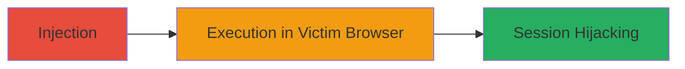

---
tags:
  - xss
  - stored-xss
  - web-vulnerability
  - session-hijacking
type: attack_chain
tools: []
tactics:
  - '[[Execution]]'
  - '[[Collection]]'
commands: []
platforms:
  - Web
complexity: medium
procedures:
  - '[[procedures/Inject-Malicious-Script-via-Stored-XSS]]'
step_count: 1
techniques:
  - '[[JavaScript]]'
  - '[[Exploit Public-Facing Application]]'
description: >-
  A stored cross-site scripting attack targeting a U.S. Department of Defense
  web application, allowing injection of malicious JavaScript that executes in
  victims' browsers to steal cookies and hijack sessions.
skill_level: intermediate
impact_level: high
id: f3f50c43-1692-49b8-8619-3fc4075af8fa
created_at: '2025-12-14T03:16:31.306Z'
updated_at: '2025-12-14T03:16:31.306Z'
verified: false
validated: true
submitted: true
mitre_tactics:
  - '[[Execution]]'
  - '[[Collection]]'
mitre_techniques:
  - '[[JavaScript]]'
  - '[[Exploit Public-Facing Application]]'
---
# Stored XSS in DoD Web Application for Session Hijacking

## Overview

This attack chain exploits a stored cross-site scripting (XSS) vulnerability in a U.S. Department of Defense web application at https://███. An attacker injects malicious JavaScript into user input fields that are stored and later displayed to other users without proper sanitization. When victims view the affected content, the script executes in their browsers, enabling session hijacking via cookie theft, arbitrary request forgery, malware prompts, or defacement. The vulnerability was reported on HackerOne (#1660611) with a proof-of-concept and video demonstration, linked to a specific parameter possibly related to report #1636345.

## Chain Metrics Dashboard

| Metric | Value |
|--------|-------|
| Chain Status | Unverified |
| Total Steps | 1 |
| Execution Time | ~5 minutes |
| Skill Level | Intermediate |
| Complexity | Medium |
| Impact Level | High |

## Attack Flow Visualization

## Prerequisites & Requirements

### Required Tools

- Web browser with developer tools (e.g., Chrome DevTools)
- Optional: Proxy tool like Burp Suite for payload crafting

### Target Environment

- Web application platform
- Access to authenticated or public input fields
- No specific ports required; operates over HTTPS

### Initial Access Requirements

- Ability to submit input to the vulnerable application
- No prior credentials needed for injection, but authentication may be required for certain fields
- Network access to https://███

## Detailed Attack Procedures

### Step 1: Inject Malicious Payload
procedure: [[procedures/Inject-Malicious-Script-via-Stored-XSS]]

**Objective**: Identify a vulnerable input field and inject a stored XSS payload that persists and executes when viewed by other users.

**Instructions**: Navigate to the DoD application at https://███ and locate the input field vulnerable to stored XSS (specific parameter referenced in report #1636345, e.g., a comment or profile field). Craft a payload such as `` or a more advanced one for cookie theft like ``. Submit the payload via the web form. Verify by logging out and viewing the stored content in another session or incognito window.

**Expected Output**: The injected script executes, displaying an alert or redirecting to the attacker's site with stolen cookies.

**Success Indicators**:
- Script alert pops up in victim's browser
- Cookies transmitted to attacker's server (check access logs)
- No sanitization errors on submission

## Attack Chain Summary

### Key Achievements

1. Successful injection of persistent malicious JavaScript
2. Execution in multiple victim browsers leading to session hijacking
3. Potential for broader impacts like defacement or malware distribution

## Technique & Tactic Coverage

### MITRE ATT&CK Techniques

- [[JavaScript]]
- [[Exploit Public-Facing Application]]

### MITRE ATT&CK Tactics

- [[Execution]]
- [[Collection]]

---
*Last updated: 2023-10-01*
