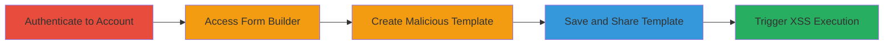

---
tags:
  - xss
  - stored-xss
  - reflected-xss
  - javascript
  - web-vulnerability
type: attack_chain
tools: []
tactics:
  - '[[Execution]]'
  - '[[Initial Access]]'
verified: false
platforms:
  - Web
submitted: true
complexity: medium
created_at: '2024-10-01T00:00:00Z'
procedures:
  - '[[procedures/Authenticate-to-Drchrono-Account]]'
  - '[[procedures/Access-Advanced-Form-Builder]]'
  - '[[procedures/Create-Malicious-Template-with-XSS-Payload]]'
  - '[[procedures/Save-and-Share-Template-to-Library]]'
  - '[[procedures/Trigger-XSS-Execution-via-Shared-Link-or-Search]]'
step_count: 5
techniques:
  - '[[JavaScript]]'
  - '[[Exploit Public-Facing Application]]'
updated_at: '2025-12-14T03:16:07.938Z'
description: >-
  Multi-stage attack exploiting a stored XSS vulnerability in Drchrono's
  advanced form builder to inject and execute malicious JavaScript via shared
  templates, with an additional reflected XSS in the search functionality.
skill_level: intermediate
impact_level: high
id: 5db535ed-6a78-4158-9a2d-3663ddc9fd69
validated: true
mitre_tactics:
  - '[[Execution]]'
  - '[[Initial Access]]'
mitre_techniques:
  - '[[JavaScript]]'
  - '[[Exploit Public-Facing Application]]'
---
# Stored XSS in Drchrono Template Field Names Leading to Arbitrary JavaScript Execution

Multi-stage attack chain demonstrating exploitation of a stored XSS in Drchrono's template field names and a reflected XSS in the search query, enabling arbitrary JavaScript execution in victims' browsers to steal session data or perform unauthorized actions.

## Chain Metrics Dashboard

| Metric | Value |
|--------|-------|
| Chain Status | Unverified |
| Total Steps | 5 |
| Execution Time | ~10 minutes |
| Skill Level | Intermediate |
| Complexity | Medium |
| Impact Level | High |

## Attack Flow Visualization

## Prerequisites & Requirements

### Required Tools

- Web browser (e.g., Chrome with developer tools for payload testing)

### Target Environment

- Drchrono web application
- Access to a valid user account with permissions to create and share templates
- Public internet access to view shared forms

### Initial Access Requirements

- Valid Drchrono credentials (username/password)
- No special privileges needed beyond standard user access
- Network access to https://*.drchrono.com

## Detailed Attack Procedures

### Step 1: Authenticate to Drchrono Account
procedure: [[procedures/Authenticate-to-Drchrono-Account]]

**Objective**: Gain authenticated access to the Drchrono platform to enable template creation.

**Instructions**: Open a web browser and navigate to the Drchrono login page. Enter valid credentials to log in, establishing a session for subsequent actions.

**Expected Output**: Successful login redirect to the dashboard, with session cookies set.

**Success Indicators**:
- User dashboard loads without errors
- Account permissions confirmed for form builder access

### Step 2: Access Advanced Form Builder
procedure: [[procedures/Access-Advanced-Form-Builder]]

**Objective**: Navigate to the interface where templates can be created and edited.

**Instructions**: From the dashboard, locate and click on the clinical or forms section, then select the advanced form builder option, loading the URL https://%your_domain%.drchrono.com/clinical/advanced_form_builder.

**Expected Output**: The form builder interface appears, ready for template creation.

**Success Indicators**:
- Form builder page loads successfully
- Interface elements for adding fields are visible

### Step 3: Create Malicious Template with XSS Payload
procedure: [[procedures/Create-Malicious-Template-with-XSS-Payload]]

**Objective**: Inject a malicious payload into a template field name to store XSS script.

**Instructions**: In the form builder, add a new field and set its name to a payload like `<svg onload=alert(document.domain)>`. Configure other template details as needed, but ensure the payload is in the field name.

**Expected Output**: The payload is accepted without sanitization errors.

**Success Indicators**:
- Field added with the exact payload string
- No immediate JavaScript execution during creation (stored for later trigger)

### Step 4: Save and Share Template to Library
procedure: [[procedures/Save-and-Share-Template-to-Library]]

**Objective**: Persist the malicious template and make it publicly accessible for execution.

**Instructions**: Save the template within the builder, then share it to the public library, generating a shareable URL like https://www.drchrono.com/medical-forms/1460752/aaabbbcccdddeee.

**Expected Output**: Confirmation of save and share, with a public URL provided.

**Success Indicators**:
- Template saved without validation errors
- Public URL generated and accessible

### Step 5: Trigger XSS Execution via Shared Link or Search
procedure: [[procedures/Trigger-XSS-Execution-via-Shared-Link-or-Search]]

**Objective**: Execute the stored XSS by viewing the shared form or using reflected XSS in search.

**Instructions**: Visit the shared URL to trigger the onload script; alternatively, navigate to https://www.drchrono.com/medical-forms/?query=aaa%22bbb%27ccc%3Cddd%3Eeee for reflected XSS on mouseover. If the victim is logged in, the link may redirect to their subdomain like https://%user%.drchrono.com/medical-forms/... for session-specific attacks.

**Expected Output**: Alert box pops up showing document.domain, or other JS execution.

**Success Indicators**:
- JavaScript alert or console output confirms execution
- Potential cookie theft or session hijacking if extended payload used

## Attack Chain Summary

### Key Achievements

1. Successful injection and storage of XSS payload in template field names
2. Public sharing enabling arbitrary JS execution on any viewer
3. Additional reflected XSS via search for broader impact
4. Potential for account takeover via subdomain redirects

## Technique & Tactic Coverage

### MITRE ATT&CK Techniques

- [[JavaScript]]
- [[Exploit Public-Facing Application]]

### MITRE ATT&CK Tactics

- [[Execution]]
- [[Initial Access]]

---
*Last updated: 2024-10-01T00:00:00Z*
