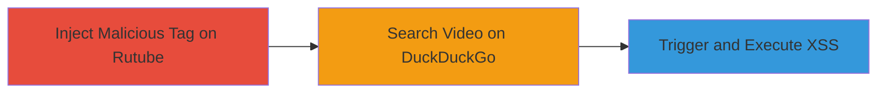

---
tags:
  - xss
  - stored-xss
  - web-vulnerability
  - duckduckgo
  - rutube
type: attack_chain
tools: []
tactics:
  - '[[Execution]]'
verified: false
platforms:
  - Web
submitted: true
complexity: medium
created_at: '2023-10-01T00:00:00Z'
procedures:
  - '[[procedures/Inject-Malicious-User-Tag-on-Rutube]]'
  - '[[procedures/Search-and-Trigger-XSS-on-DuckDuckGo]]'
  - '[[procedures/Observe-XSS-Execution]]'
step_count: 3
techniques:
  - '[[JavaScript]]'
updated_at: '2025-12-13T23:52:55.436Z'
description: >-
  A multi-stage attack exploiting insufficient sanitization of user tags from
  external video sites like Rutube in DuckDuckGo's video search, leading to
  stored XSS and arbitrary JavaScript execution.
skill_level: intermediate
impact_level: high
id: f87041f9-ee55-4526-88d9-8ac1ee5e2567
validated: true
mitre_tactics:
  - '[[Execution]]'
mitre_techniques:
  - '[[JavaScript]]'
---
# Stored XSS in DuckDuckGo Video Search via Rutube User Tags

Multi-stage attack chain demonstrating a complete attack workflow exploiting a stored XSS vulnerability in DuckDuckGo's video search feature through unsanitized user tags from Rutube.

## Chain Metrics Dashboard

| Metric | Value |
|--------|-------|
| Chain Status | Unverified |
| Total Steps | 3 |
| Execution Time | ~5 minutes |
| Skill Level | Intermediate |
| Complexity | Medium |
| Impact Level | High |

## Attack Flow Visualization

## Prerequisites & Requirements

### Required Tools

- Web browser for account creation and searching
- No specialized tools required

### Target Environment

- Web platform
- Access to Rutube.ru for account creation
- Access to DuckDuckGo.com video search

### Initial Access Requirements

- No credentials required for DuckDuckGo
- Rutube account creation (free)
- Internet access to external video sites

## Detailed Attack Procedures

### Step 1: Inject Malicious User Tag on Rutube
procedure: [[procedures/Inject-Malicious-User-Tag-on-Rutube]]

**Objective**: Create a user account on Rutube and set a malicious tag containing an XSS payload to store the vulnerability for later reflection.

**Instructions**: Register a new account on Rutube.ru and associate a video with a user tag that includes the XSS payload `"> `. Upload or select a video like https://rutube.ru/video/83a4775f020b3fd68efd3dc9a73031e8/ and edit the user profile tag to inject the payload.

**Expected Output**: The malicious tag is saved and associated with the video on Rutube.

**Success Indicators**:
- Account created successfully
- Video details show the injected tag

### Step 2: Search and Trigger XSS on DuckDuckGo
procedure: [[procedures/Search-and-Trigger-XSS-on-DuckDuckGo]]

**Objective**: Search for the tainted video on DuckDuckGo to cause the unsanitized tag to be fetched and reflected in the video detail page.

**Instructions**: Navigate to DuckDuckGo's video search and query for the Rutube video URL with the encoded payload, such as https://duckduckgo.com/?q=%22%2F%3E%22%2F%3E%3Cimg+src%3Dxss+onerror%3Dalert(2)%3E&t=hk&iar=videos&iax=videos&ia=videos&iai=https%3A%2F%2Frutube.ru%2Fvideo%2F83a4775f020b3fd68efd3dc9a73031e8%2F. Click into the video details to load the page where the tag is rendered.

**Expected Output**: The video detail page loads with the reflected payload in the `c-detail__user` class.

**Success Indicators**:
- Search results include the video
- Detail page renders without errors

### Step 3: Observe XSS Execution
procedure: [[procedures/Observe-XSS-Execution]]

**Objective**: Verify arbitrary JavaScript execution by observing the payload trigger on the DuckDuckGo video detail page.

**Instructions**: View the video detail page in a browser; the onerror event in the injected img tag should execute, displaying an alert box with the payload value (e.g., alert(2)).

**Expected Output**: JavaScript alert pops up, confirming execution.

**Success Indicators**:
- Alert dialog appears
- No sanitization blocks the script

## Attack Chain Summary

### Key Achievements

1. Successfully stored malicious payload in Rutube user tag
2. Reflected and executed XSS on DuckDuckGo without direct input
3. Demonstrated potential for session hijacking or phishing on affected users

## Technique & Tactic Coverage

### MITRE ATT&CK Techniques

- [[JavaScript]]

### MITRE ATT&CK Tactics

- [[Execution]]

---
*Last updated: 2023-10-01T00:00:00Z*
