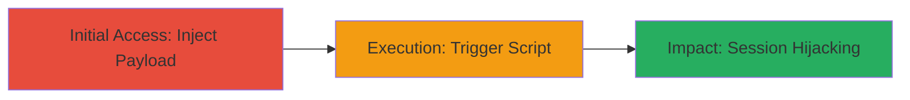

# Stored XSS in ExpressionEngine Admin Panel via Site Index Parameter

Multi-stage attack chain demonstrating a complete attack workflow exploiting a stored cross-site scripting vulnerability in the ExpressionEngine CMS admin interface.

## Chain Metrics Dashboard

| Metric | Value |
|--------|-------|
| Chain Status | Unverified |
| Total Steps | 2 |
| Execution Time | ~5 minutes |
| Skill Level | Intermediate |
| Complexity | Medium |
| Impact Level | High |

## Attack Flow Visualization



## Prerequisites & Requirements

### Required Tools

- Browser or HTTP client like curl
- Access to the admin panel (authenticated session)

### Target Environment

- ExpressionEngine CMS (version vulnerable to this issue, e.g., pre-patch)
- Web platform with PHP backend
- Admin access to /admin.php?/cp/admin_system/general_configuration

### Initial Access Requirements

- Valid admin credentials or session
- Network access to the target web application
- CSRF token from the form (obtain via prior GET request)

## Detailed Attack Procedures

### Step 1: Inject Malicious Payload
procedure: [[procedures/Inject-Stored-XSS-Payload-into-ExpressionEngine-General-Configuration]]

**Objective**: Submit a POST request to the general configuration endpoint with a malicious JavaScript payload in the site_index parameter, bypassing sanitization to store the script persistently.

**Instructions**: Authenticate to the admin panel and obtain the CSRF token. Then, use [[commands/curl-inject-xss-payload]] to send the POST request with the payload:

```bash
curl -X POST 'http://target/admin.php?/cp/admin_system/general_configuration&S=98be920eacf52890b4b159431a7da8cf' \
  -d 'csrf_token=your_csrf_token' \
  -d 'site_name=Example Site' \
  -d 'site_index=index.php958f7"><script>alert("stored xss")</script>ab44a' \
  -d 'other_params=values'
```

Replace placeholders with actual values from the target. Submit the form to persist the payload.

**Expected Output**: HTTP 200 response indicating successful form submission, with the configuration updated.

**Success Indicators**:
- Form submission succeeds without errors
- Payload is stored in the database or session

### Step 2: Trigger and Observe Payload Execution
procedure: [[procedures/Inject-Stored-XSS-Payload-into-ExpressionEngine-General-Configuration]]

**Objective**: Visit any admin panel page to render and execute the injected script, demonstrating persistence and potential for cookie theft or unauthorized actions.

**Instructions**: After injection, navigate to an admin page like http://target/cp/admin_system/general_configuration&S=98be920eacf52890b4b159431a7da8cf using a browser. The payload should execute automatically, e.g., displaying an alert.

For testing, use [[commands/curl-trigger-xss]] to fetch a page and observe via proxy or browser dev tools:

```bash
curl -v 'http://target/cp/admin_system/general_configuration&S=98be920eacf52890b4b159431a7da8cf'
```

Monitor for JavaScript execution in the response or browser console.

**Expected Output**: JavaScript alert or console log showing "stored xss", with potential for further exploitation like document.cookie access.

**Success Indicators**:
- Script executes on page load
- Alert or logged message appears
- Admin session cookies can be exfiltrated if payload is modified

## Attack Chain Summary

### Key Achievements

1. Persistent injection of JavaScript into the admin interface via unsanitized site_index parameter
2. Execution of arbitrary code on every admin page load
3. Potential for session hijacking, data theft, or interface defacement

## Technique & Tactic Coverage

### MITRE ATT&CK Techniques

- [[JavaScript]]

### MITRE ATT&CK Tactics

- [[Execution]]
- [[Collection]]

---
*Last updated: 2023-10-01T00:00:00Z*
