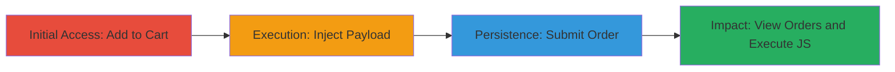

---
tags:
  - xss
  - stored-xss
  - expressionengine
  - javascript-injection
type: attack_chain
tools: []
tactics:
  - '[[Execution]]'
  - '[[Collection]]'
commands: []
platforms:
  - Web
complexity: medium
procedures:
  - '[[procedures/Add-Product-to-Cart-and-Proceed-to-Billing]]'
  - '[[procedures/Inject-XSS-Payload-into-Address-Fields]]'
  - '[[procedures/Submit-Order-to-Store-Payload]]'
  - '[[procedures/Observe-Stored-XSS-Execution]]'
step_count: 4
techniques:
  - '[[JavaScript]]'
description: >-
  Multi-stage attack exploiting a stored XSS vulnerability in the
  ExpressionEngine store's billing form to inject and execute JavaScript when
  viewing order details.
skill_level: intermediate
impact_level: high
id: 7b492caf-689e-4606-a011-431821a9a3aa
created_at: '2025-12-14T03:15:35.910Z'
updated_at: '2025-12-14T03:15:35.910Z'
verified: false
validated: true
submitted: true
mitre_tactics:
  - '[[Execution]]'
  - '[[Collection]]'
mitre_techniques:
  - '[[JavaScript]]'
---
# Stored XSS in ExpressionEngine Billing Form for Arbitrary JavaScript Execution

## Overview

This attack chain demonstrates the exploitation of a stored Cross-Site Scripting (XSS) vulnerability in the billing form of the ExpressionEngine store at https://store.ellislab.com/billing. By injecting a malicious JavaScript payload into address fields during checkout, the attacker stores the payload in the backend. When an administrator or user views the affected order details, the payload executes in their browser context, enabling arbitrary JavaScript execution. Potential impacts include credential theft from non-HTTPOnly cookies, session hijacking, phishing, keystroke logging, or site defacement. The vulnerability stems from insufficient input validation and output encoding for user-supplied data in order details.

## Attack Flow Visualization

## Prerequisites & Requirements

### Required Tools

- Web browser (e.g., Chrome, Firefox) for manual testing

### Target Environment

- Web platform running ExpressionEngine CMS with PHP backend
- Access to the public store checkout at https://store.ellislab.com/billing
- No special services or ports required beyond standard HTTPS (443)

### Initial Access Requirements

- No credentials needed; attack is unauthenticated
- Direct network access to the target store URL
- No prior access; exploitable during normal checkout flow

## Detailed Attack Procedures

### Step 1: Add Product to Cart and Proceed to Billing
procedure: [[procedures/Add-Product-to-Cart-and-Proceed-to-Billing]]

**Objective**: Initiate the checkout process to access the vulnerable billing form.

**Instructions**: Navigate to the ExpressionEngine store, select a product, and add it to the shopping cart. Then proceed to the billing information page.

**Expected Output**: Redirect to the billing form at https://store.ellislab.com/billing, ready for input.

**Success Indicators**:
- Product added to cart successfully
- Billing form loaded with input fields visible

### Step 2: Inject XSS Payload into Address Fields
procedure: [[procedures/Inject-XSS-Payload-into-Address-Fields]]

**Objective**: Insert the malicious payload into multiple address fields to ensure storage and reflection.

**Instructions**: In the First Name, Last Name, Street Address, Apt/Suite/#, and City fields, enter the payload `'>`. Provide valid but incomplete card details (e.g., invalid CVV) to potentially trigger error pages that display the fields.

**Expected Output**: Form fields populated with the payload; no immediate execution.

**Success Indicators**:
- Payload entered without form rejection
- Fields accept HTML/JS characters

### Step 3: Submit Order to Store Payload
procedure: [[procedures/Submit-Order-to-Store-Payload]]

**Objective**: Persist the injected payload in the backend by completing the order submission.

**Instructions**: Enter remaining details (e.g., ZIP Code if not already injected) and click 'Place Order'. The payload is stored server-side in the order database.

**Expected Output**: Order confirmation page or error page that may reflect the stored data.

**Success Indicators**:
- Order submitted successfully (even if payment fails)
- No sanitization errors on submission

### Step 4: Observe Stored XSS Execution
procedure: [[procedures/Observe-Stored-XSS-Execution]]

**Objective**: Trigger the payload execution by viewing the affected order details, simulating admin access.

**Instructions**: As an admin or when the order is viewed, the payload executes on page load or interaction (e.g., mouseover). Test with alternative payloads like ` onmouseover = " prompt(0)` for interaction-based triggers.

**Expected Output**: JavaScript alert or prompt (e.g., `prompt(0)`) fires in up to 5 locations on the order details page.

**Success Indicators**:
- Arbitrary JS executes in browser context
- Alert box appears confirming payload activation

## Attack Chain Summary

### Key Achievements

1. Successful injection and storage of XSS payload in billing fields without detection.
2. Persistence of the vulnerability across order confirmation and details views.
3. Arbitrary JavaScript execution enabling potential credential theft or session hijacking for viewers.

## Technique & Tactic Coverage

### MITRE ATT&CK Techniques

- [[JavaScript]]

### MITRE ATT&CK Tactics

- [[Execution]]
- [[Collection]]

---
*Last updated: 2023-10-01*
