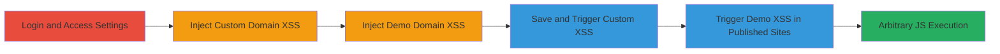

---
tags:
  - xss
  - stored-xss
  - javascript
  - web
  - ruby
type: attack_chain
tools: []
tactics:
  - '[[Initial Access]]'
  - '[[Execution]]'
  - '[[Collection]]'
verified: false
platforms:
  - Web
submitted: true
complexity: medium
created_at: '2023-10-01T00:00:00Z'
procedures:
  - '[[procedures/Login-and-Navigate-to-Site-Settings]]'
  - '[[procedures/Inject-XSS-into-Custom-Domain]]'
  - '[[procedures/Inject-XSS-into-Demo-Domain]]'
  - '[[procedures/Save-Settings-and-Trigger-Custom-XSS]]'
  - '[[procedures/Trigger-Demo-XSS-via-Published-Sites]]'
step_count: 5
techniques:
  - '[[JavaScript]]'
updated_at: '2025-12-14T03:47:12.674Z'
description: >-
  Multi-stage stored XSS attack exploiting unsanitized input in Federalist admin
  panel's Custom Domain and Demo Domain fields, leading to arbitrary JavaScript
  execution in the admin context.
skill_level: intermediate
impact_level: high
id: 8cac8a5c-673f-4728-aa7a-6845bcdf4a77
validated: true
mitre_tactics:
  - '[[Initial Access]]'
  - '[[Execution]]'
  - '[[Collection]]'
mitre_techniques:
  - '[[JavaScript]]'
---
# Stored XSS in Federalist Admin Panel via Custom and Demo Domain Fields

Multi-stage attack chain demonstrating a stored XSS vulnerability in the Federalist admin panel, where attackers inject javascript: payloads into Custom Domain and Demo Domain fields. This allows arbitrary JavaScript execution when admins interact with the 'View Website' button or published sites view, potentially leading to session theft, CSRF bypass, or data exfiltration against other administrators.

## Chain Metrics Dashboard

| Metric | Value |
|--------|-------|
| Chain Status | Unverified |
| Total Steps | 5 |
| Execution Time | ~5 minutes |
| Skill Level | Intermediate |
| Complexity | Medium |
| Impact Level | High |

## Attack Flow Visualization



## Prerequisites & Requirements

### Required Tools

- Browser with developer tools (e.g., Chrome DevTools for payload testing)

### Target Environment

- Federalist application running locally or remotely (Ruby-based web app)
- Port 1337 open for admin access
- Valid admin credentials for the target site

### Initial Access Requirements

- Administrative login to Federalist
- Network access to http://localhost:1337 or equivalent
- No prior access beyond login; assumes authenticated session

## Detailed Attack Procedures

### Step 1: Login and Navigate to Site Settings
procedure: [[procedures/Login-and-Navigate-to-Site-Settings]]

**Objective**: Gain authenticated access to the Federalist admin panel and reach the site settings page to prepare for payload injection.

**Instructions**: Log in to the Federalist admin interface and navigate to the specific site's settings. Use the browser to access http://localhost:1337/sites/<siteid>/settings, replacing </siteid> with the target site's ID.

**Expected Output**: Site settings form loaded, with fields like Custom Domain and Demo Domain visible.

**Success Indicators**:
- Successful login and redirection to dashboard
- Site settings page accessible without errors

### Step 2: Inject XSS Payload into Custom Domain
procedure: [[procedures/Inject-XSS-into-Custom-Domain]]

**Objective**: Inject a javascript: payload into the Custom Domain field to store the XSS without immediate validation failures.

**Instructions**: In the Custom Domain field, enter the payload [[commands/javascript-alert-domain]]:

```javascript
javascript:alert(document.domain)
```

This payload will be stored upon saving.

**Expected Output**: Payload accepted in the form field without sanitization errors.

**Success Indicators**:
- Payload entered successfully
- No immediate alert or block during input

### Step 3: Inject XSS Payload into Demo Domain
procedure: [[procedures/Inject-XSS-into-Demo-Domain]]

**Objective**: Inject a variant javascript: payload into the Demo Domain field, using a semicolon to bypass any duplicate detection from the Custom Domain.

**Instructions**: In the Demo Domain field, enter the payload [[commands/javascript-alert-domain-semicolon]]:

```javascript
javascript:alert(document.domain);
```

The semicolon differentiates it from the Custom Domain payload.

**Expected Output**: Payload accepted, bypassing any duplicate checks.

**Success Indicators**:
- Payload entered without duplicate rejection
- Form remains editable

### Step 4: Save Settings and Trigger Custom XSS
procedure: [[procedures/Save-Settings-and-Trigger-Custom-XSS]]

**Objective**: Persist the payloads by saving the settings and trigger the first stored XSS via the 'View Website' button.

**Instructions**: Submit the form to save the settings. Then, click the 'View Website' button, which executes the javascript: payload from the Custom Domain field using [[commands/javascript-alert-domain]]:

```javascript
javascript:alert(document.domain)
```

**Expected Output**: Alert box displaying the admin domain (e.g., localhost).

**Success Indicators**:
- Settings saved successfully
- JavaScript alert triggered on button click

### Step 5: Trigger Demo XSS via Published Sites
procedure: [[procedures/Trigger-Demo-XSS-via-Published-Sites]]

**Objective**: Navigate to the published sites view and trigger the second stored XSS from the Demo Domain payload.

**Instructions**: After saving, go to http://localhost:1337/sites/<siteid>/published and click 'view' on the demo site. This executes [[commands/javascript-alert-domain-semicolon]]:

```javascript
javascript:alert(document.domain);
```

**Expected Output**: Second alert box showing the document domain.

**Success Indicators**:
- Page loads with demo site view
- JavaScript alert executes on interaction

## Attack Chain Summary

### Key Achievements

1. Successful injection and storage of XSS payloads in admin fields without sanitization.
2. Triggering of arbitrary JavaScript in the admin context via user interactions like button clicks.
3. Potential for session hijacking, CSRF bypass, or exfiltration against other admins viewing the affected site.

## Technique & Tactic Coverage

### MITRE ATT&CK Techniques

- [[JavaScript]]

### MITRE ATT&CK Tactics

- [[Initial Access]]
- [[Execution]]
- [[Collection]]

---
*Last updated: 2023-10-01T00:00:00Z*
