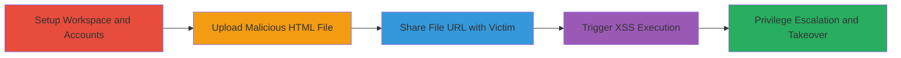

# Stored XSS in File Upload Leading to Privilege Escalation and Workspace Takeover

Multi-stage attack chain demonstrating a complete attack workflow exploiting stored XSS in Dust's file upload to achieve arbitrary JavaScript execution, impersonation, and full workspace takeover.

## Chain Metrics Dashboard

| Metric | Value |
|--------|-------|
| Chain Status | Unverified |
| Total Steps | 5 |
| Execution Time | ~10 minutes |
| Skill Level | Intermediate |
| Complexity | Medium |
| Impact Level | High |

## Attack Flow Visualization



## Prerequisites & Requirements

### Required Tools

- [[tools/requests]]
- [[tools/requests-toolbelt]]

### Target Environment

- Dust platform (web-based workspaces, conversations, assistants)
- Required services: Dust API endpoints (e.g., https://dust.tt/api/w/<workspace_sid>/files)
- Network access: Internet access to Dust.tt with authenticated sessions

### Initial Access Requirements

- Attacker account with member access to a Dust workspace
- Victim account with admin privileges
- Dummy/low-privilege account for simulation
- Malicious HTML file containing JavaScript payload (e.g., xss.html with fetch calls for escalation)

## Detailed Attack Procedures

### Step 1: Setup Workspace and Accounts
procedure: [[procedures/Setup-Workspace-and-Accounts-for-Testing]]

**Objective**: Prepare the testing environment by creating or accessing a workspace and adding accounts to simulate attacker and victim roles.

**Instructions**: Create a new workspace or use an existing one where the attacker has admin privileges. Then, invite a dummy account with normal member role to represent the low-privilege attacker.

**Expected Output**: Workspace SID available; dummy account added as member.

**Success Indicators**:
- Workspace created/accessed successfully
- Dummy account invited and joined

### Step 2: Upload Malicious HTML File
procedure: [[procedures/Upload-Malicious-HTML-File-via-API]]

**Objective**: Use the dummy account to upload a malicious HTML file disguised as an image via the file upload API, bypassing content validation.

**Instructions**: Authenticate as the dummy account and use [[commands/request-upload-url]] to initiate the upload, followed by [[commands/upload-html-file-multipart]] to send the file content. The file is named 'xss_poc.png' but has contentType 'text/html' and contains JavaScript for later execution.

```python
# Example using requests (full script in procedure)
response = requests.post('https://dust.tt/api/w/<workspace_sid>/files', cookies=cookies, json=json_data)
upload_url = response.json()['file']['uploadUrl']
requests.post(upload_url, headers=headers, cookies=cookies, data=m)
```

**Expected Output**: JSON response with 'downloadUrl' for the uploaded file.

**Success Indicators**:
- Upload URL obtained
- File uploaded successfully without rejection
- downloadUrl returned

### Step 3: Share Malicious File URL
procedure: [[procedures/Share-Malicious-File-URL-with-Victim]]

**Objective**: Distribute the malicious file's view URL to the victim (admin) to lure them into opening it.

**Instructions**: Extract the 'downloadUrl?action=view' from the upload response and share it via workspace conversation, email, or direct message to the admin account.

**Expected Output**: Victim receives and clicks the URL.

**Success Indicators**:
- URL shared successfully
- Victim accesses the file view endpoint

### Step 4: Trigger XSS Execution
procedure: [[procedures/Trigger-XSS-for-Privilege-Escalation]]

**Objective**: When the victim views the file, execute the embedded JavaScript to fetch user data and escalate the dummy account's privileges.

**Instructions**: The malicious HTML renders in the browser, running [[commands/fetch-user-data-javascript]] to get workspaceId and user details, then [[commands/promote-user-role-fetch]] to POST role change for the attacker.

```javascript
// Embedded in HTML (full payload in procedure)
fetch('https://dust.tt/api/user', {method: 'GET', credentials: 'include'}).then(r => r.json()).then(user => {
  const workspaceId = user.workspaces[0].sId;
  fetch(`https://dust.tt/api/w/${workspaceId}/members/${attackerUserId}`, {
    method: 'POST',
    body: JSON.stringify({role: 'admin'}),
    credentials: 'include'
  });
});
```

**Expected Output**: Successful role update; dummy account promoted to admin.

**Success Indicators**:
- JavaScript executes in victim's session
- Attacker account role changed to admin
- Access to secrets and settings granted

### Step 5: Achieve Full Takeover

**Objective**: With elevated privileges, access secrets, modify settings, and control the workspace.

**Instructions**: Use the new admin session to query secrets, delete data, or alter configurations via Dust API.

**Expected Output**: Full access to workspace resources.

**Success Indicators**:
- Secrets retrieved
- Workspace settings modified
- Complete control verified

## Attack Chain Summary

### Key Achievements

1. Successful upload of unsanitized HTML file mimicking an image
2. Arbitrary JavaScript execution in admin's authenticated session
3. Privilege escalation from member to admin
4. Full workspace takeover including secret access and data manipulation

## Technique & Tactic Coverage

### MITRE ATT&CK Techniques

- [[JavaScript]] JavaScript
- [[Drive-by Compromise]] Drive-by Compromise

### MITRE ATT&CK Tactics

- [[Initial Access]] Initial Access
- [[Privilege Escalation]] Privilege Escalation

---

*Last updated: 2023-10-01T00:00:00Z*
