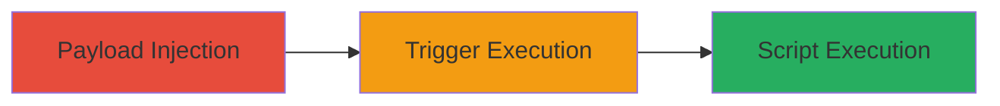

# Stored XSS in Flickr Group Photo Map via Unescaped Group Names

Multi-stage attack chain demonstrating a complete attack workflow for exploiting Stored XSS in Flickr's group photo mapping feature.

## Chain Metrics Dashboard

| Metric | Value |
|--------|-------|
| Chain Status | Unverified |
| Total Steps | 2 |
| Execution Time | ~5 minutes |
| Skill Level | Intermediate |
| Complexity | Medium |
| Impact Level | High |

## Attack Flow Visualization

## Prerequisites & Requirements

### Required Tools

- Web browser (e.g., Chrome with developer tools)

### Target Environment

- Flickr web application
- Access to create groups (requires Flickr account)
- Victim users browsing group photo maps

### Initial Access Requirements

- Valid Flickr user account for injection
- No special privileges needed beyond group creation
- Network access to Flickr.com

## Detailed Attack Procedures

### Step 1: Payload Injection
procedure: [[procedures/Inject-Malicious-Payload-into-Flickr-Group-Name]]

**Objective**: Create a Flickr group with a name containing a malicious JavaScript payload that will be stored and later reflected unescaped on the photo map page.

**Instructions**: Log in to your Flickr account, navigate to group creation, and enter a group name with an XSS payload such as ``. Complete group setup without adding photos initially.

**Expected Output**: Group created successfully, payload stored in the group name.

**Success Indicators**:
- Group appears in your account dashboard
- Group name includes the injected payload when viewed in account settings

### Step 2: Trigger Execution
procedure: [[procedures/Trigger-XSS-on-Group-Photo-Map-Page]]

**Objective**: Direct a victim to view the group's photo map page, causing the unescaped group name to render the malicious script in their browser.

**Instructions**: Add at least one photo to the group to enable the map feature, then share the group photo map URL (e.g., https://www.flickr.com/groups/[group-id]/map) with a victim. When the victim loads the page, the payload executes.

**Expected Output**: Alert box or other script effects appear in the victim's browser upon loading the map page.

**Success Indicators**:
- Script executes (e.g., alert pops up)
- Browser console shows JavaScript errors or execution logs confirming payload run

## Attack Chain Summary

### Key Achievements

1. Successful storage of XSS payload in group metadata
2. Remote code execution for any user viewing the affected map page
3. Potential for data theft, session hijacking, or further exploitation via advanced payloads

## Technique & Tactic Coverage

### MITRE ATT&CK Techniques

- [[JavaScript]]

### MITRE ATT&CK Tactics

- [[Execution]]

---
*Last updated: 2023-10-01T12:00:00Z*
