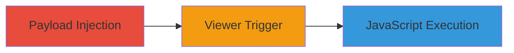

---
tags:
  - xss
  - stored-xss
  - gitlab
  - openapi
  - swagger
type: attack_chain
tools: []
tactics:
  - '[[Execution]]'
verified: false
platforms:
  - Web
  - GitLab
submitted: true
complexity: medium
created_at: '2023-10-01T00:00:00Z'
procedures:
  - '[[procedures/Inject-Malicious-Payload-into-OpenAPI-JSON-File]]'
  - '[[procedures/Trigger-Stored-XSS-in-GitLab-Blob-Viewer]]'
step_count: 2
techniques:
  - '[[JavaScript]]'
updated_at: '2025-12-13T23:52:33.714Z'
description: >-
  A multi-stage attack exploiting a stored XSS vulnerability in GitLab's blob
  viewer when rendering OpenAPI JSON files, allowing arbitrary JavaScript
  execution on behalf of viewing users.
skill_level: intermediate
impact_level: high
id: 04b9ba80-1ba2-4e15-8754-ae84a6df5a99
validated: true
mitre_tactics:
  - '[[Execution]]'
mitre_techniques:
  - '[[JavaScript]]'
---
# Stored XSS in GitLab Blob Viewer via Malicious OpenAPI Description

Multi-stage attack chain demonstrating a complete attack workflow exploiting insufficient sanitization in SwaggerUIBundle for rendering OpenAPI descriptions in GitLab's blob viewer.

## Chain Metrics Dashboard

| Metric | Value |
|--------|-------|
| Chain Status | Unverified |
| Total Steps | 2 |
| Execution Time | ~5 minutes |
| Skill Level | Intermediate |
| Complexity | Medium |
| Impact Level | High |

## Attack Flow Visualization

## Prerequisites & Requirements

### Required Tools

- GitLab project access for file upload

### Target Environment

- GitLab instance (self-hosted or SaaS)
- Web browser for viewing
- Required services/ports: HTTPS (443)
- Network access requirements: Ability to access GitLab repository

### Initial Access Requirements

- Valid GitLab user credentials with write access to a project repository
- No special privileges needed beyond repository contributor role
- Public or private repository where victims can view files

## Detailed Attack Procedures

### Step 1: Payload Injection
procedure: [[procedures/Inject-Malicious-Payload-into-OpenAPI-JSON-File]]

**Objective**: Create and commit a malicious OpenAPI JSON file to a GitLab project, embedding XSS payload in the description field to be rendered unsafely by SwaggerUIBundle.

**Instructions**: Use GitLab's web interface or Git CLI to create and push the file. The payload targets HTML attributes like class, style, and data-* to interact with jQuery-ujs upon rendering.

**Expected Output**: File committed to repository, visible in project files.

**Success Indicators**:
- File 'xss-openapi.json' appears in repository
- Payload intact in 'info.description' field

### Step 2: Viewer Trigger
procedure: [[procedures/Trigger-Stored-XSS-in-GitLab-Blob-Viewer]]

**Objective**: Lure a victim to view the malicious file in GitLab's blob viewer, where clicking triggers JavaScript execution via bypassed CSP and jQuery.globalEval.

**Instructions**: Share the repository link with the victim or wait for them to access the blob viewer URL (e.g., /-/blob/master/xss-openapi.json). Upon rendering, any click executes the payload, enabling UI manipulation or HTTP requests.

**Expected Output**: Alert popup or network requests on victim click.

**Success Indicators**:
- SwaggerUI renders the description with injected attributes
- Click event triggers JavaScript, e.g., alert(0) or unauthorized requests

## Attack Chain Summary

### Key Achievements

1. Persistent storage of XSS payload in project file
2. Bypassing CSP via attribute injection and jQuery handling
3. Execution of arbitrary client-side actions impersonating the victim

## Technique & Tactic Coverage

### MITRE ATT&CK Techniques

- [[JavaScript]]

### MITRE ATT&CK Tactics

- [[Execution]]

---
*Last updated: 2023-10-01T00:00:00Z*
