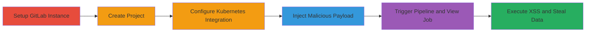

---
tags:
  - xss
  - stored-xss
  - gitlab
  - kubernetes
  - cicd
type: attack_chain
tools:
  - '[[tools/Docker]]'
tactics:
  - '[[Execution]]'
  - '[[Collection]]'
verified: false
platforms:
  - Web
  - Kubernetes
submitted: true
created_at: '2023-10-01T00:00:00Z'
procedures:
  - '[[procedures/Set-Up-GitLab-Instance-with-Docker]]'
  - '[[procedures/Create-New-Project-in-GitLab]]'
  - '[[procedures/Configure-Kubernetes-Cluster-Integration]]'
  - '[[procedures/Inject-Malicious-Payload-in-GitLab-CI-YML]]'
  - '[[procedures/Trigger-and-Exploit-XSS-in-CI-Job-Page]]'
step_count: 5
techniques:
  - '[[JavaScript]]'
updated_at: '2025-12-13T23:52:44.277Z'
description: >-
  A multi-stage attack exploiting a stored XSS vulnerability in GitLab's CI/CD
  job page by injecting a malicious payload into the Kubernetes namespace field
  of a .gitlab-ci.yml file, allowing arbitrary JavaScript execution when users
  view the job details.
id: 4a5aa71c-03ea-4577-8cd5-82c1ec5d27fb
validated: true
mitre_tactics:
  - '[[Execution]]'
  - '[[Collection]]'
mitre_techniques:
  - '[[JavaScript]]'
---
# Stored XSS in GitLab CI/CD Job Page via Kubernetes Namespace Injection

Multi-stage attack chain demonstrating a complete workflow to exploit a stored XSS vulnerability in GitLab's CI/CD system by injecting unsanitized JavaScript into the Kubernetes namespace field, leading to arbitrary code execution in the browser of any user viewing the affected job page.

## Chain Metrics Dashboard

| Metric | Value |
|--------|-------|
| Chain Status | Unverified |
| Total Steps | 5 |
| Execution Time | ~30 minutes |
| Skill Level | Intermediate |
| Complexity | Medium |
| Impact Level | High |

## Attack Flow Visualization



## Prerequisites & Requirements

### Required Tools

- [[tools/Docker]]

### Target Environment

- GitLab CE instance (latest version vulnerable to this issue)
- Required services/ports: HTTP (80), HTTPS (443), SSH (22)
- Kubernetes cluster integration (can be mock with invalid API URL for testing)
- Network access: Localhost or accessible GitLab hostname

### Initial Access Requirements

- Administrative access to run Docker and set up GitLab
- User account in GitLab for project creation and pipeline triggering
- No prior access to victim accounts needed, as it's stored XSS affecting viewers

## Detailed Attack Procedures

### Step 1: Set Up GitLab Instance

procedure: [[procedures/Set-Up-GitLab-Instance-with-Docker]]

**Objective**: Deploy a local GitLab Community Edition instance using Docker to serve as the test environment for reproducing the vulnerability.

**Instructions**: Use [[commands/Docker-Run-GitLab-Instance]] to start the container:

```bash
docker run --detach --hostname gitlab.example.com --publish 443:443 --publish 80:80 --publish 22:22 --name gitlab gitlab/gitlab-ce:latest
```

Wait for GitLab to initialize (may take several minutes), then access it at http://gitlab.example.com and complete the initial root password setup.

**Expected Output**: A running GitLab instance with the container ID printed, accessible via web browser.

**Success Indicators**:
- Docker container is running without errors
- GitLab UI loads at the specified hostname

### Step 2: Create New Project

procedure: [[procedures/Create-New-Project-in-GitLab]]

**Objective**: Initialize a new repository in GitLab to host the malicious CI/CD configuration.

**Instructions**: Log in to the GitLab UI, navigate to "New Project", select "Create blank project", name it (e.g., "xss-test"), initialize with a README.md, and create it. This sets up the master branch.

**Expected Output**: A new project repository with an initial commit containing README.md.

**Success Indicators**:
- Project dashboard accessible
- Master branch exists with README.md

### Step 3: Configure Kubernetes Cluster Integration

procedure: [[procedures/Configure-Kubernetes-Cluster-Integration]]

**Objective**: Enable Kubernetes integration in the project to allow the use of kubernetes: namespace in CI jobs, setting the stage for payload injection.

**Instructions**: In the project, go to Operations > Kubernetes, click "Add Kubernetes cluster", choose "Add existing cluster", enter name "cluster-example", API URL "https://google.com/" (mock for testing), service token "token-example", uncheck "GitLab-managed cluster", and submit.

**Expected Output**: Kubernetes cluster added successfully, visible in the integrations list.

**Success Indicators**:
- Cluster integration status shows as connected (even if mock)
- No errors in the setup form submission

### Step 4: Inject Malicious Payload

procedure: [[procedures/Inject-Malicious-Payload-in-GitLab-CI-YML]]

**Objective**: Commit a .gitlab-ci.yml file containing a deploy job with the XSS payload in the kubernetes: namespace field to store the malicious script.

**Instructions**: In the project repository, create and commit a .gitlab-ci.yml file to the master branch with content including stages: [deploy], a deploy job with script: [echo 'Deploying'], environment: name: production, kubernetes: namespace: '', and only: - master.

**Expected Output**: File committed successfully, triggering an initial pipeline run.

**Success Indicators**:
- .gitlab-ci.yml visible in the repository
- Pipeline triggered on commit

### Step 5: Trigger and Exploit XSS

procedure: [[procedures/Trigger-and-Exploit-XSS-in-CI-Job-Page]]

**Objective**: Run the pipeline to process the malicious YAML, then view the job details page to trigger the stored XSS payload, executing JavaScript in the viewer's context.

**Instructions**: Push a commit to master to trigger the pipeline, navigate to CI/CD > Pipelines, select the latest pipeline, go to Jobs, and open the deploy job details. The unsanitized namespace renders the payload, firing alert(1) on load.

**Expected Output**: JavaScript alert box pops up displaying "1" when the job page loads.

**Success Indicators**:
- Pipeline completes the deploy stage
- Alert executes on job page view
- Potential for further payload to steal session data or perform actions

## Attack Chain Summary

### Key Achievements

1. Successful setup of vulnerable GitLab environment
2. Injection and storage of XSS payload via CI configuration
3. Arbitrary JavaScript execution impacting any job page viewer, enabling data theft or session hijacking

## Technique & Tactic Coverage

### MITRE ATT&CK Techniques

- [[JavaScript]]

### MITRE ATT&CK Tactics

- [[Execution]]
- [[Collection]]

---

*Last updated: 2023-10-01T00:00:00Z*
