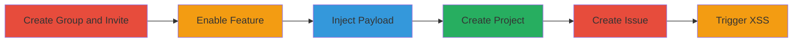

---
tags:
  - xss
  - stored-xss
  - gitlab
  - web-vulnerability
type: attack_chain
tools: []
tactics:
  - '[[Initial Access]]'
  - '[[Execution]]'
commands:
  - '[[commands//add_contacts]]'
  - '[[commands//remove_contacts]]'
platforms:
  - Web
  - Linux
complexity: medium
procedures:
  - '[[procedures/Create-GitLab-Group-and-Invite-Victim]]'
  - '[[procedures/Enable-Customer-Relations-in-Group]]'
  - '[[procedures/Create-Malicious-Contact-with-XSS-Payload]]'
  - '[[procedures/Create-Project-in-Group]]'
  - '[[procedures/Victim-Creates-New-Issue]]'
  - '[[procedures/Victim-Triggers-Quick-Action-to-Execute-XSS]]'
step_count: 6
techniques:
  - '[[JavaScript]]'
description: >-
  Multi-stage attack chain exploiting a stored XSS vulnerability in GitLab
  15.0.0's Customer Relations feature to execute arbitrary JavaScript in an
  authenticated user's context.
skill_level: intermediate
impact_level: high
id: 66c92eca-97a4-48a3-ae16-cd69a03e8ea0
created_at: '2025-12-11T03:47:49.844Z'
updated_at: '2025-12-11T03:47:49.844Z'
verified: false
validated: true
submitted: true
mitre_tactics:
  - '[[TA0001]]'
  - '[[TA0002]]'
mitre_techniques:
  - '[[T1059.007]]'
---
# Stored XSS in GitLab Customer Relations via Contact Names Leading to Script Execution

Multi-stage attack chain demonstrating a stored XSS vulnerability in GitLab 15.0.0, where malicious scripts injected into contact names are executed when using quick actions in issue descriptions.

## Chain Metrics Dashboard

| Metric | Value |
|--------|-------|
| Chain Status | Unverified |
| Total Steps | 6 |
| Execution Time | ~10 minutes |
| Skill Level | Intermediate |
| Complexity | Medium |
| Impact Level | High |

## Attack Flow Visualization

## Prerequisites & Requirements

### Required Tools

- None

### Target Environment

- GitLab 15.0.0-ee on Linux
- Required services: PostgreSQL, Redis, Sidekiq
- Network access: Authenticated access to GitLab instance

### Initial Access Requirements

- Attacker must have a GitLab account with permissions to create groups and invite members
- Victim must be an authenticated GitLab user who can be invited to the group

## Detailed Attack Procedures

### Step 1: Create Group and Invite Victim - [[procedures/Create-GitLab-Group-and-Invite-Victim]]

**Objective**: Set up a group to host the vulnerable feature and involve the victim.

**Instructions**: Create a new group in GitLab and invite the victim user under the 'Invite Members (optional)' section.

**Expected Output**: Group created and victim invited successfully.

**Success Indicators**:
- Group appears in GitLab dashboard
- Victim receives invitation and accepts

### Step 2: Enable Customer Relations - [[procedures/Enable-Customer-Relations-in-Group]]

**Objective**: Activate the feature containing the vulnerability.

**Instructions**: Navigate to group Settings -> General, expand 'Permissions and group features', and enable 'Customer Relations'.

**Expected Output**: Feature enabled in group settings.

**Success Indicators**:
- Confirmation message in settings
- Customer Relations options become available

### Step 3: Create Malicious Contact - [[procedures/Create-Malicious-Contact-with-XSS-Payload]]

**Objective**: Inject the XSS payload into contact fields.

**Instructions**: Create a new contact, setting First name and Last name to '', provide a valid email, and save changes.

**Expected Output**: Contact saved with malicious payload.

**Success Indicators**:
- Contact appears in the group's contact list without escaping

### Step 4: Create Project - [[procedures/Create-Project-in-Group]]

**Objective**: Set up a project where the issue can be created to trigger the vulnerability.

**Instructions**: Go to https://gitlab.com/projects/new#blank_project, select the group, name the project, and create it.

**Expected Output**: New project created in the group.

**Success Indicators**:
- Project visible in group dashboard

### Step 5: Victim Creates New Issue - [[procedures/Victim-Creates-New-Issue]]

**Objective**: Have the victim prepare an issue where quick actions can be used.

**Instructions**: Victim navigates to the project, selects 'Issues' then 'New Issue'.

**Expected Output**: New issue creation page loads.

**Success Indicators**:
- Issue description pane is available for input

### Step 6: Victim Triggers Quick Action - [[procedures/Victim-Triggers-Quick-Action-to-Execute-XSS]]

**Objective**: Trigger the XSS by loading the unescaped contact names.

**Instructions**: In the issue description pane, type [[commands//add_contacts]] or [[commands//remove_contacts]], press enter to load the contact list and trigger the XSS payload.

**Expected Output**: Popup with contact list loads, executing the injected script (e.g., alert box).

**Success Indicators**:
- Script executes in victim's browser context
- Potential for session hijacking or data theft

## Attack Chain Summary

### Key Achievements

1. Successful injection of XSS payload into contact fields
2. Execution of arbitrary JavaScript in authenticated user's context
3. Potential for client-side attacks like session compromise

## Technique & Tactic Coverage

### MITRE ATT&CK Techniques

- [[JavaScript]]

### MITRE ATT&CK Tactics

- [[Initial Access]]
- [[Execution]]

*Last updated: 2023-10-01*
