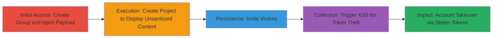

# Stored XSS in GitLab Group Default Branch Name Leading to Token Theft and Account Takeover

Multi-stage attack chain demonstrating exploitation of a stored XSS vulnerability in GitLab, allowing arbitrary JavaScript injection via the group 'Default initial branch name' setting. The payload is unsanitized when displayed on new blank project pages, enabling theft of personal access tokens, session hijacking, and potential instance compromise if an admin is targeted.

## Chain Metrics Dashboard

| Metric | Value |
|--------|-------|
| Chain Status | Unverified |
| Total Steps | 5 |
| Execution Time | ~10 minutes |
| Skill Level | Intermediate |
| Complexity | Medium |
| Impact Level | High |

## Attack Flow Visualization

## Prerequisites & Requirements

### Required Tools

- [[tools/Python]]

### Target Environment

- GitLab instance (self-hosted or GitLab.com)
- Web browser for UI interactions
- API access for scripted invites (optional)

### Initial Access Requirements

- Valid attacker account on the GitLab instance
- Group creation permissions (Owner role)
- Victim account with access to invited projects

## Detailed Attack Procedures

### Step 1: Create Attacker Account and Group
procedure: [[procedures/Create-Attacker-Account-and-Group-in-GitLab]]

**Objective**: Establish a foothold by registering an attacker account and creating a group to host the malicious settings.

**Instructions**: Register a new user account named 'attacker01' via the GitLab sign-up page. Log in and navigate to create a new group named 'attack_group' at https://gitlab.domain.com/groups/new.

**Expected Output**: Successful group creation with Owner permissions for the attacker.

**Success Indicators**:
- Attacker account active
- Group 'attack_group' visible in dashboard

### Step 2: Inject Malicious Payload into Default Branch Name
procedure: [[procedures/Inject-Malicious-Payload-into-Default-Branch-Name]]

**Objective**: Store the XSS payload in the group's default initial branch name setting, which will be rendered unsanitized on project pages.

**Instructions**: In the group settings at https://gitlab.domain.com/groups/attack_group/-/settings/repository, expand the 'Default initial branch name' section, enter the payload ``, and save changes.

**Expected Output**: Settings updated without validation errors; payload stored.

**Success Indicators**:
- Payload visible in group settings
- No immediate execution (stored, not reflected)

### Step 3: Create Blank Project to Host XSS Payload
procedure: [[procedures/Create-Blank-Project-to-Host-XSS-Payload]]

**Objective**: Generate a new blank project that interpolates the malicious branch name in its setup instructions, triggering the XSS when loaded.

**Instructions**: From the group page https://gitlab.domain.com/groups/attack_group, select 'New project', choose 'Create blank project', name it 'attacking_project', and create without an initial repository.

**Expected Output**: Project created; visiting the main page displays setup instructions with the injected script executing.

**Success Indicators**:
- Script alert pops up on project load
- Unsanitized branch name appears in Git commands on the page

### Step 4: Invite Victim and Trigger XSS Execution
procedure: [[procedures/Invite-Victim-and-Trigger-XSS-Execution]]

**Objective**: Lure the victim to the project page to execute the payload, enabling data exfiltration like token theft.

**Instructions**: On the project page, click 'Invite members' and add 'victim01' as a Developer. Have the victim log in and visit https://gitlab.domain.com/attack_group/attacking-project, where the XSS triggers in the displayed Git setup commands.

**Expected Output**: Victim's browser executes the JavaScript, potentially sending tokens to attacker-controlled server.

**Success Indicators**:
- Victim reports alert or unexpected behavior
- Attacker receives exfiltrated data (e.g., via payload)

### Step 5: Bypass CSP Using Job Artifacts
procedure: [[procedures/Bypass-CSP-Using-GitLab-Job-Artifacts]]

**Objective**: Circumvent Content Security Policy restrictions on GitLab.com by hosting external scripts in job artifacts.

**Instructions**: Create a CI/CD job in a repository to upload a malicious .js file as an artifact. Reference it in the payload via ``.

**Expected Output**: Script loads and executes despite CSP, allowing advanced payloads.

**Success Indicators**:
- External JS executes without CSP blocks
- Enhanced payload (e.g., token theft) succeeds

## Attack Chain Summary

### Key Achievements

1. Successful injection and storage of XSS payload in group settings.
2. Triggering of arbitrary JavaScript on victim project visits.
3. Theft of personal access tokens leading to account takeover.
4. Potential full instance compromise via admin targeting.
5. CSP bypass for more sophisticated attacks.

## Technique & Tactic Coverage

### MITRE ATT&CK Techniques

- [[JavaScript]] JavaScript
- [[Credentials In Files]] Credentials from Web Browsers

### MITRE ATT&CK Tactics

- [[Initial Access]] Initial Access
- [[Execution]] Execution
- [[Collection]] Collection

---

*Last updated: 2023-10-01T00:00:00Z*
