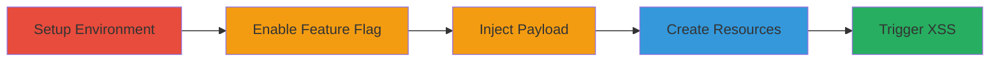

---
tags:
  - xss
  - stored-xss
  - gitlab
  - vue.js
  - javascript-injection
type: attack_chain
tools:
  - '[[tools/Docker]]'
  - '[[tools/GitLab-Rails-Console]]'
tactics:
  - '[[Execution]]'
  - '[[Collection]]'
verified: false
platforms:
  - Web
  - Linux
submitted: true
complexity: medium
created_at: '2023-10-01T00:00:00Z'
procedures:
  - '[[procedures/Setup-Local-GitLab-Instance-with-Docker]]'
  - '[[procedures/Enable-Vue-Issuables-List-Feature-Flag]]'
  - '[[procedures/Inject-XSS-Payload-into-User-Full-Name]]'
  - '[[procedures/Create-Group-Project-and-Issue-in-GitLab]]'
  - '[[procedures/Trigger-Stored-XSS-in-Group-Issue-List]]'
step_count: 5
techniques:
  - '[[JavaScript]]'
updated_at: '2025-12-13T23:52:24.535Z'
description: >-
  A multi-stage attack demonstrating stored XSS in GitLab when the
  vue_issuables_list feature flag is enabled, injecting malicious JavaScript via
  the user full name to execute in victims' browsers on the group issue list
  page.
skill_level: intermediate
impact_level: high
id: b2dc594c-9163-401e-bc96-0ccb5d762cd2
validated: true
mitre_tactics:
  - '[[Execution]]'
  - '[[Collection]]'
mitre_techniques:
  - '[[JavaScript]]'
---
# Stored XSS in GitLab Group Issue List via User Full Name Injection

Multi-stage attack chain demonstrating a complete stored XSS workflow in GitLab, exploiting insufficient sanitization of the user full name in the Vue-based group issue list when the vue_issuables_list feature flag is enabled. An attacker injects HTML attributes into their full name, which is rendered unsafely, leading to JavaScript execution in victims' browsers. This allows arbitrary actions as the victim, data theft, and credential exfiltration.

## Chain Metrics Dashboard

| Metric | Value |
|--------|-------|
| Chain Status | Unverified |
| Total Steps | 5 |
| Execution Time | ~15 minutes |
| Skill Level | Intermediate |
| Complexity | Medium |
| Impact Level | High |

## Attack Flow Visualization



## Prerequisites & Requirements

### Required Tools

- [[tools/Docker]]
- [[tools/GitLab-Rails-Console]]

### Target Environment

- GitLab CE latest (e.g., version 12.10.1 or similar)
- Linux host with Docker installed
- Ports 80, 443, 22 available
- Required services: PostgreSQL, Redis, Git

### Initial Access Requirements

- Administrative access to a GitLab instance (local setup for reproduction)
- Valid user account in GitLab
- No prior network access needed beyond local host

## Detailed Attack Procedures

### Step 1: Setup Local GitLab Instance
procedure: [[procedures/Setup-Local-GitLab-Instance-with-Docker]]

**Objective**: Deploy a local GitLab Community Edition instance using Docker to reproduce the vulnerability.

**Instructions**: Run the Docker command to start the GitLab container with necessary port mappings for HTTP, HTTPS, and SSH access.

Use [[commands/docker-run-gitlab-instance]]:

```bash
docker run --detach --hostname gitlab.example.com --publish 443:443 --publish 80:80 --publish 22:22 --name gitlab gitlab/gitlab-ce:latest
```

Wait for GitLab to initialize (check logs with `docker logs gitlab`).

**Expected Output**: Container starts successfully, GitLab accessible at http://localhost.

**Success Indicators**:
- Container ID returned and running (`docker ps`)
- GitLab web interface loads without errors

### Step 2: Enable Vulnerable Feature Flag
procedure: [[procedures/Enable-Vue-Issuables-List-Feature-Flag]]

**Objective**: Activate the vue_issuables_list feature flag required for the vulnerable rendering path.

**Instructions**: Access the container shell, launch Rails console, and enable the flag.

First, exec into the container using [[commands/docker-exec-bash-gitlab]]:

```bash
docker exec -it gitlab /bin/bash
```

Then start Rails console with [[commands/gitlab-rails-console]]:

```bash
gitlab-rails console
```

Enable the feature using [[commands/feature-enable-vue-issuables-list]]:

```ruby
Feature.enable(:vue_issuables_list)
```

Exit the console and shell.

**Expected Output**: Feature enabled confirmation (e.g., `true` in Rails console).

**Success Indicators**:
- No errors in console
- Feature flag active (verify with `Feature.enabled?(:vue_issuables_list)` returning true)

### Step 3: Inject XSS Payload
procedure: [[procedures/Inject-XSS-Payload-into-User-Full-Name]]

**Objective**: Set the attacker's full name to a malicious payload that injects executable HTML attributes.

**Instructions**: Log in to GitLab UI, navigate to user profile settings, and update the full name field.

Enter payload: `foo style=animation-name:gl-spinner-rotate onanimationend=alert(1)`

Save the profile.

**Expected Output**: Profile updates successfully without errors.

**Success Indicators**:
- Full name saved and visible in profile
- No immediate JavaScript execution (payload is stored, not triggered yet)

### Step 4: Create Test Resources
procedure: [[procedures/Create-Group-Project-and-Issue-in-GitLab]]

**Objective**: Establish a group, project, and issue to host the vulnerable rendering context.

**Instructions**: Use GitLab UI to create a new group, add a project to it, and create an issue in the project.

- Navigate to Groups > New Group
- Name it (e.g., "TestGroup")
- Create a project inside the group (e.g., "TestProject")
- In the project, create a new issue with any title/description

**Expected Output**: Group, project, and issue created successfully.

**Success Indicators**:
- Resources visible in GitLab dashboard
- Issue listed under the group

### Step 5: Trigger the XSS
procedure: [[procedures/Trigger-Stored-XSS-in-Group-Issue-List]]

**Objective**: View the group issue list as a victim to execute the injected JavaScript.

**Instructions**: Navigate to the group's issues page in the GitLab UI.

The full name renders in the Vue component, triggering the `onanimationend=alert(1)` payload.

**Expected Output**: Alert box pops up with "1" in the browser.

**Success Indicators**:
- JavaScript alert executes
- Potential for further payloads to steal data or perform actions as the victim

## Attack Chain Summary

### Key Achievements

1. Local GitLab environment setup for safe reproduction
2. Feature flag enabled to expose the vulnerable path
3. Stored XSS payload injected via user profile
4. Attack resources created to store and display the payload
5. XSS triggered, enabling browser-based exploitation

## Technique & Tactic Coverage

### MITRE ATT&CK Techniques

- [[JavaScript]]

### MITRE ATT&CK Tactics

- [[Execution]]
- [[Collection]]

---

*Last updated: 2023-10-01T00:00:00Z*
