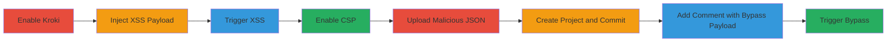

---
tags:
  - xss
  - stored-xss
  - csp-bypass
  - gitlab
  - javascript-execution
type: attack_chain
tools:
  - '[[tools/Nokogiri]]'
  - '[[tools/Axios]]'
  - '[[tools/jQuery]]'
tactics:
  - '[[Initial Access]]'
  - '[[Execution]]'
commands:
  - '[[commands/gitlab-env-info]]'
platforms:
  - Web
  - Linux
complexity: medium
procedures:
  - '[[procedures/Enable-and-Exploit-Stored-XSS-in-GitLab-Kroki]]'
  - '[[procedures/Bypass-CSP-in-GitLab-Using-Data-Attribute-Injection]]'
step_count: 8
techniques:
  - '[[Exploit Public-Facing Application]]'
  - '[[JavaScript]]'
description: >-
  Multi-stage attack chain exploiting a stored XSS vulnerability in GitLab's
  Kroki diagram feature, enabling arbitrary JavaScript execution and bypassing
  Content Security Policy for session hijacking or client-side attacks.
skill_level: intermediate
impact_level: high
id: 7cc5809c-44f1-4723-974e-4d45affc928d
created_at: '2025-12-14T00:11:16.652Z'
updated_at: '2025-12-14T00:11:16.652Z'
verified: false
validated: true
submitted: true
mitre_tactics:
  - '[[Initial Access]]'
  - '[[Execution]]'
mitre_techniques:
  - '[[Exploit Public-Facing Application]]'
  - '[[JavaScript]]'
---
# Stored XSS in GitLab Kroki Leading to JavaScript Execution and CSP Bypass

Multi-stage attack chain demonstrating exploitation of a stored XSS vulnerability in GitLab's Kroki diagram feature by injecting malicious attributes, leading to arbitrary JavaScript execution. The chain includes a CSP bypass using data attributes to load and execute malicious JSON, potentially enabling session hijacking or other client-side attacks.

## Chain Metrics Dashboard

| Metric | Value |
|--------|-------|
| Chain Status | Unverified |
| Total Steps | 8 |
| Execution Time | ~15 minutes |
| Skill Level | Intermediate |
| Complexity | Medium |
| Impact Level | High |

## Attack Flow Visualization



## Prerequisites & Requirements

### Required Tools

- [[tools/Nokogiri]]
- [[tools/Axios]]
- [[tools/jQuery]]

### Target Environment

- Self-hosted GitLab instance on Linux
- Services: GitLab, PostgreSQL, Redis, Sidekiq
- Tech Stack: Ruby on Rails, Ruby 2.7.6, PostgreSQL 12.12, Redis 6.2.7, Sidekiq 6.5.7

### Initial Access Requirements

- Administrative access to GitLab instance for configuration
- Ability to create issues, snippets, projects, and comments

## Detailed Attack Procedures

### Step 1: Enable Kroki Integration
procedure: [[procedures/Enable-and-Exploit-Stored-XSS-in-GitLab-Kroki]]

**Objective**: Configure the GitLab instance to enable the Kroki feature for diagram rendering, setting up the environment for exploitation.

**Instructions**: Access the admin settings at /admin/application_settings/general and enable Kroki integration. Verify the environment using [[commands/gitlab-env-info]]:

```bash
sudo gitlab-rake gitlab:env:info
```

**Expected Output**: System information including GitLab version and components.

**Success Indicators**:
- Kroki integration enabled
- Environment details confirmed

### Step 2: Create Issue and Insert XSS Payload
procedure: [[procedures/Enable-and-Exploit-Stored-XSS-in-GitLab-Kroki]]

**Objective**: Inject the stored XSS payload into an issue using a crafted Markdown block to override language attributes and inject malicious code.

**Instructions**: Create a new issue and insert the Markdown payload: <a><pre lang='f/" onerror=alert(1) onload=alert(1) '><code lang="wavedrom">xss</code></pre></a>.

**Expected Output**: The payload is stored in the issue description.

**Success Indicators**:
- Payload successfully inserted without errors

### Step 3: Trigger the XSS by Viewing the Issue
procedure: [[procedures/Enable-and-Exploit-Stored-XSS-in-GitLab-Kroki]]

**Objective**: Load the affected issue to execute the injected JavaScript.

**Instructions**: Reload or visit the issue page. If CSP is not enabled, an alert will appear; otherwise, a CSP violation occurs.

**Expected Output**: JavaScript alert or CSP violation report.

**Success Indicators**:
- Alert box appears or CSP violation logged

### Step 4: Enable Content Security Policy
procedure: [[procedures/Bypass-CSP-in-GitLab-Using-Data-Attribute-Injection]]

**Objective**: Configure CSP on the GitLab instance to demonstrate the bypass technique.

**Instructions**: Enable CSP via omnibus settings as per GitLab documentation: https://docs.gitlab.com/omnibus/settings/configuration.html#set-a-content-security-policy.

**Expected Output**: CSP headers applied to responses.

**Success Indicators**:
- CSP enabled and verified in browser developer tools

### Step 5: Upload Malicious JSON Snippet
procedure: [[procedures/Bypass-CSP-in-GitLab-Using-Data-Attribute-Injection]]

**Objective**: Create a public snippet containing malicious JSON that will be loaded to bypass CSP.

**Instructions**: Upload a file named aaa.json with content: {"html":"<script>alert(document.domain)</script>"} and note the raw path.

**Expected Output**: Snippet created and accessible via raw URL.

**Success Indicators**:
- JSON file uploaded and raw path obtained

### Step 6: Create Project and Commit README
procedure: [[procedures/Bypass-CSP-in-GitLab-Using-Data-Attribute-Injection]]

**Objective**: Set up a project with a commit to enable commenting for payload injection.

**Instructions**: Create a new project and commit a README file to generate a commit page.

**Expected Output**: Project created with commit history.

**Success Indicators**:
- Commit page available for commenting

### Step 7: Add Comment with CSP Bypass Payload
procedure: [[procedures/Bypass-CSP-in-GitLab-Using-Data-Attribute-Injection]]

**Objective**: Inject a payload into a commit comment that uses data-diff-for-path to load malicious JSON and style attributes for interaction.

**Instructions**: Add a comment to the commit with the bypass payload injecting data-diff-for-path and style attributes.

**Expected Output**: Comment stored with injected attributes.

**Success Indicators**:
- Payload comment visible on commit page

### Step 8: Trigger CSP Bypass by Interacting with Page
procedure: [[procedures/Bypass-CSP-in-GitLab-Using-Data-Attribute-Injection]]

**Objective**: Interact with the page to load and execute the malicious JSON via axios and jQuery, bypassing CSP.

**Instructions**: Reload the commit page and click twice on the overlaid elements to trigger the XSS.

**Expected Output**: Alert box from executed script despite CSP.

**Success Indicators**:
- Script executes and alert appears

## Attack Chain Summary

### Key Achievements

1. Successful stored XSS injection and execution in Kroki feature
2. CSP bypass enabling script execution in restricted environments
3. Potential for session hijacking or data exfiltration

## Technique & Tactic Coverage

### MITRE ATT&CK Techniques

- [[Exploit Public-Facing Application]]
- [[JavaScript]]

### MITRE ATT&CK Tactics

- [[Initial Access]]
- [[Execution]]

*Last updated: 2023-10-01*
